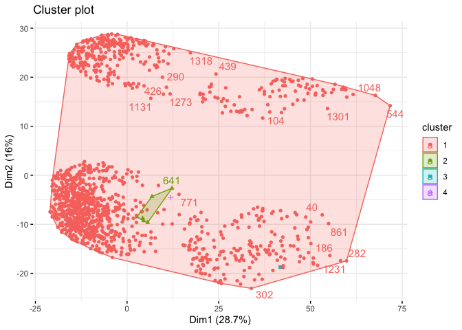
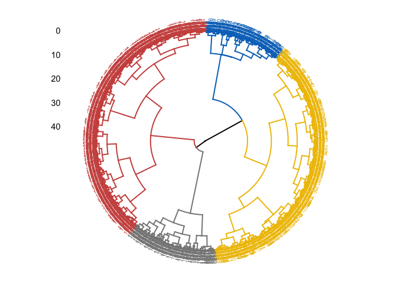
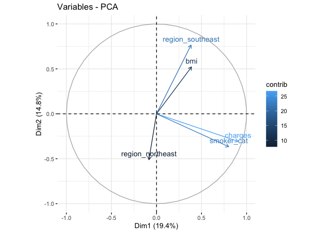
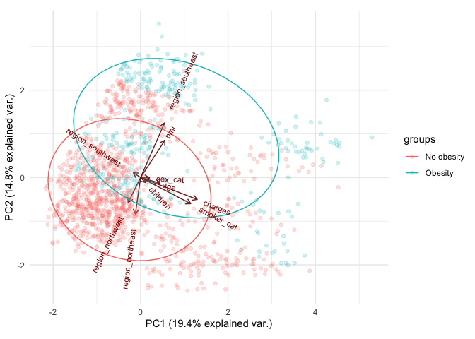
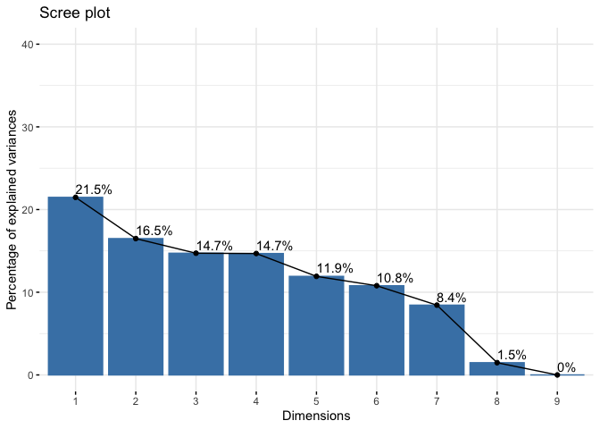

```r
devtools::install_github("ropensci/plotly")
```

```
## Downloading GitHub repo ropensci/plotly@HEAD
```

```
## 
##   
   checking for file ‘/private/var/folders/md/d3tjc99n06z74xxpmw6c9_y40000gn/T/Rtmp7V5URY/remotes1ea957c43e21/plotly-plotly.R-2db78b7/DESCRIPTION’ ...
  
✔  checking for file ‘/private/var/folders/md/d3tjc99n06z74xxpmw6c9_y40000gn/T/Rtmp7V5URY/remotes1ea957c43e21/plotly-plotly.R-2db78b7/DESCRIPTION’
## 
  
─  preparing ‘plotly’:
## 
  
   checking DESCRIPTION meta-information ...
  
✔  checking DESCRIPTION meta-information
## 
  
─  checking for LF line-endings in source and make files and shell scripts
## 
  
─  checking for empty or unneeded directories
## 
  
─  building ‘plotly_4.10.0.9001.tar.gz’
## 
  
   
## 
```

```r
library(plotly)
```

```
## Loading required package: ggplot2
```

```
## 
## Attaching package: 'plotly'
```

```
## The following object is masked from 'package:ggplot2':
## 
##     last_plot
```

```
## The following object is masked from 'package:stats':
## 
##     filter
```

```
## The following object is masked from 'package:graphics':
## 
##     layout
```


```r
library(dplyr)
```

```
## 
## Attaching package: 'dplyr'
```

```
## The following objects are masked from 'package:stats':
## 
##     filter, lag
```

```
## The following objects are masked from 'package:base':
## 
##     intersect, setdiff, setequal, union
```

```r
library(magrittr)
library(tidyr)
```

```
## 
## Attaching package: 'tidyr'
```

```
## The following object is masked from 'package:magrittr':
## 
##     extract
```

```r
library(ggplot2)
library(ggpubr)
library(skimr)
library(tibble)
install.packages (c('dplyr', 'magrittr', 'tidyr', 'ggplot2', 'ggpubr', "skimr", "plotly", "tibble", 'fastDummies', "pheatmap", "FactoMineR",
"ggbiplot"), repos = "http://cran.us.r-project.org")
```

```
## Warning: package 'ggbiplot' is not available for this version of R
## 
## A version of this package for your version of R might be available elsewhere,
## see the ideas at
## https://cran.r-project.org/doc/manuals/r-patched/R-admin.html#Installing-packages
```

```
## 
## The downloaded binary packages are in
## 	/var/folders/md/d3tjc99n06z74xxpmw6c9_y40000gn/T//Rtmp7V5URY/downloaded_packages
```

# 1. Загрузите датасет insurance_cost.csv.


```r
df <-read.csv ("insurance_cost.csv", stringsAsFactors = TRUE)

summary(df)
```

```
##       age            sex           bmi           children     smoker    
##  Min.   :18.00   female:662   Min.   :15.96   Min.   :0.000   no :1064  
##  1st Qu.:27.00   male  :676   1st Qu.:26.30   1st Qu.:0.000   yes: 274  
##  Median :39.00                Median :30.40   Median :1.000             
##  Mean   :39.21                Mean   :30.66   Mean   :1.095             
##  3rd Qu.:51.00                3rd Qu.:34.69   3rd Qu.:2.000             
##  Max.   :64.00                Max.   :53.13   Max.   :5.000             
##        region       charges     
##  northeast:324   Min.   : 1122  
##  northwest:325   1st Qu.: 4740  
##  southeast:364   Median : 9382  
##  southwest:325   Mean   :13270  
##                  3rd Qu.:16640  
##                  Max.   :63770
```

```r
sum(is.na(df))
```

```
## [1] 0
```
# 2. Сделайте интерактивный plotly график отношения индекса массы тела и трат на страховку. Раскрасьте его по колонке smoker
Plotly не всегда корректно ведёт себя во время knit – для него нужно настраивать .Rmd документ. Если вы столкнулись с тем, что у вас не-“нитится” из-за plotly – просто отмените выполнение чанка при сохранении кода в его настройках (eval=FALSE)


```r
pal <- c("#CC99FF", "#99CCFF")
pal <- setNames(pal, levels(df$smoker))

plot_ly(
  data = df, 
  x = ~bmi, 
  y = ~charges, 
  color = ~smoker,# Развивка по цвету по smoker
  text = ~charges,
  size = ~charges,
  hoverinfo = "text",
  colors = pal, alpha = 0.7, #Новая палетка и прозрачность
  marker = list(
    line = list(color = '#999999',  # Цвет окружности
                width = 1))) %>%
    layout(
    title = 'Отношение индекса массы тела и трат на страховку в зависимости от курения',
    yaxis = list(title = 'Индекс массы тела',
                 zeroline = FALSE), 
    xaxis = list(title = 'Траты на страховку',
                 zeroline = FALSE)) 
```

```
## No trace type specified:
##   Based on info supplied, a 'scatter' trace seems appropriate.
##   Read more about this trace type -> https://plotly.com/r/reference/#scatter
```

```
## No scatter mode specifed:
##   Setting the mode to markers
##   Read more about this attribute -> https://plotly.com/r/reference/#scatter-mode
```

```
## Warning: `line.width` does not currently support multiple values.

## Warning: `line.width` does not currently support multiple values.
```

```{=html}
<div id="htmlwidget-c4768cdc107ad993527b" style="width:672px;height:480px;" class="plotly html-widget"></div>
<script type="application/json" data-for="htmlwidget-c4768cdc107ad993527b">{"x":{"visdat":{"1ea940526786":["function () ","plotlyVisDat"]},"cur_data":"1ea940526786","attrs":{"1ea940526786":{"x":{},"y":{},"text":{},"hoverinfo":"text","marker":{"line":{"color":"#999999","width":1}},"color":{},"size":{},"colors":["#CC99FF","#99CCFF"],"alpha":0.7,"alpha_stroke":1,"sizes":[10,100],"spans":[1,20]}},"layout":{"margin":{"b":40,"l":60,"t":25,"r":10},"title":"Отношение индекса массы тела и трат на страховку в зависимости от курения","yaxis":{"domain":[0,1],"automargin":true,"title":"Индекс массы тела","zeroline":false},"xaxis":{"domain":[0,1],"automargin":true,"title":"Траты на страховку","zeroline":false},"hovermode":"closest","showlegend":true},"source":"A","config":{"modeBarButtonsToAdd":["hoverclosest","hovercompare"],"showSendToCloud":false},"data":[{"x":[33.77,33,22.705,28.88,25.74,33.44,27.74,29.83,25.84,26.22,34.4,39.82,24.6,30.78,23.845,40.3,36.005,32.4,34.1,28.025,27.72,23.085,32.775,17.385,26.315,28.6,28.31,20.425,32.965,20.8,26.6,36.63,21.78,30.8,37.05,37.3,38.665,34.77,24.53,35.625,33.63,28.69,31.825,37.335,27.36,33.66,24.7,25.935,28.9,39.1,26.315,36.19,28.5,28.1,32.01,27.4,34.01,29.59,35.53,39.805,32.965,26.885,38.285,41.23,27.2,27.74,26.98,39.49,24.795,34.77,37.62,30.8,38.28,31.6,25.46,30.115,27.5,28.4,30.875,27.94,33.63,29.7,30.8,35.72,32.205,28.595,49.06,27.17,23.37,37.1,23.75,28.975,33.915,28.785,37.4,34.7,26.505,22.04,35.9,25.555,28.785,28.05,34.1,25.175,31.9,36,22.42,32.49,29.735,38.83,37.73,37.43,28.4,24.13,29.7,37.145,25.46,39.52,27.83,39.6,29.8,29.64,28.215,37,33.155,31.825,18.905,41.47,30.3,15.96,34.8,33.345,27.835,29.2,28.9,33.155,28.595,38.28,19.95,26.41,30.69,29.92,30.9,32.2,32.11,31.57,26.2,25.74,26.6,34.43,30.59,32.8,28.6,18.05,39.33,32.11,32.23,24.035,22.3,28.88,26.4,31.8,41.23,33,30.875,28.5,26.73,30.9,37.1,26.6,23.1,29.92,23.21,33.7,33.25,30.8,33.88,38.06,41.91,31.635,25.46,36.195,27.83,17.8,27.5,24.51,26.73,38.39,38.06,22.135,26.8,35.3,30.02,38.06,35.86,20.9,28.975,30.3,25.365,40.15,24.415,25.2,38.06,32.395,30.2,25.84,29.37,37.05,27.455,27.55,26.6,20.615,24.3,31.79,21.56,27.645,32.395,31.2,26.62,48.07,26.22,26.4,33.4,29.64,28.82,26.8,22.99,28.88,27.55,37.51,33,38,33.345,27.5,33.33,34.865,33.06,26.6,24.7,35.86,33.25,32.205,32.775,27.645,37.335,25.27,29.64,40.945,27.2,34.105,23.21,36.7,31.16,28.785,35.72,34.5,25.74,27.55,27.72,27.6,30.02,27.55,36.765,41.47,29.26,35.75,33.345,29.92,27.835,23.18,25.6,27.7,35.245,38.28,27.6,43.89,29.83,41.91,20.79,32.3,30.5,26.4,21.89,30.78,32.3,24.985,32.015,30.4,21.09,22.23,33.155,33.33,30.115,31.46,33,43.34,22.135,34.4,39.05,25.365,22.61,30.21,35.625,37.43,31.445,31.35,32.3,19.855,34.4,31.02,25.6,38.17,20.6,47.52,32.965,32.3,20.4,38.38,24.31,23.6,21.12,30.03,17.48,23.9,35.15,35.64,34.1,39.16,30.59,30.2,24.31,27.265,29.165,16.815,30.4,33.1,20.235,26.9,30.5,28.595,33.11,31.73,28.9,46.75,29.45,32.68,43.01,36.52,33.1,29.64,25.65,29.6,38.6,29.6,24.13,23.4,29.735,46.53,37.4,30.14,30.495,39.6,33,36.63,38.095,25.935,25.175,28.7,33.82,24.32,24.09,32.67,30.115,29.8,33.345,35.625,36.85,32.56,41.325,37.51,31.35,39.5,34.3,31.065,21.47,28.7,31.16,32.9,25.08,25.08,43.4,27.93,23.6,28.7,23.98,39.2,26.03,28.93,30.875,31.35,23.75,25.27,28.7,32.11,33.66,22.42,30.4,35.7,35.31,30.495,31,30.875,27.36,44.22,33.915,37.73,33.88,30.59,25.8,39.425,25.46,31.73,29.7,36.19,40.48,28.025,38.9,30.2,28.05,31.35,38,31.79,36.3,30.21,35.435,46.7,28.595,30.8,28.93,21.4,31.73,41.325,23.8,33.44,34.21,35.53,19.95,32.68,30.5,44.77,32.12,30.495,40.565,30.59,31.9,29.1,37.29,43.12,36.86,34.295,27.17,26.84,30.2,23.465,25.46,30.59,45.43,23.65,20.7,28.27,20.235,35.91,30.69,29,19.57,31.13,40.26,33.725,29.48,33.25,32.6,37.525,39.16,31.635,25.3,39.05,34.1,25.175,26.98,29.37,34.8,33.155,19,33,28.595,37.1,31.4,21.3,28.785,26.03,28.88,42.46,38,36.1,29.3,35.53,22.705,39.7,38.19,24.51,38.095,33.66,42.4,33.915,34.96,35.31,30.78,26.22,23.37,28.5,32.965,42.68,39.6,31.13,36.3,35.2,42.4,33.155,35.91,28.785,46.53,23.98,31.54,33.66,28.7,29.81,31.57,31.16,29.7,31.02,21.375,40.81,36.1,23.18,17.4,20.3,24.32,18.5,26.41,26.125,41.69,24.1,27.36,36.2,32.395,23.655,34.8,40.185,32.3,33.725,39.27,34.87,44.745,41.47,26.41,29.545,32.9,28.69,30.495,27.74,35.2,23.54,30.685,40.47,22.6,28.9,22.61,24.32,36.67,33.44,40.66,36.6,37.4,35.4,27.075,28.405,40.28,36.08,21.4,30.1,27.265,32.1,34.77,23.7,24.035,26.62,26.41,30.115,27,21.755,36,30.875,28.975,37.905,22.77,33.63,27.645,22.8,37.43,34.58,35.2,26.03,25.175,31.825,32.3,29,39.7,19.475,36.1,26.7,36.48,34.2,33.33,32.3,39.805,34.32,28.88,41.14,35.97,29.26,27.7,36.955,36.86,22.515,29.92,41.8,27.6,23.18,31.92,44.22,22.895,33.1,26.18,35.97,22.3,26.51,35.815,41.42,36.575,30.14,25.84,30.8,42.94,21.01,22.515,34.43,31.46,24.225,37.1,33.7,17.67,31.13,29.81,24.32,31.825,21.85,33.1,25.84,23.845,34.39,33.82,35.97,31.5,28.31,23.465,31.35,31.1,24.7,30.495,34.2,50.38,24.1,32.775,32.3,23.75,29.6,32.23,28.1,28,33.535,19.855,25.4,29.9,37.29,43.7,23.655,24.3,36.2,29.48,24.86,30.1,21.85,28.12,27.1,33.44,28.8,29.5,34.8,27.36,22.135,26.695,30.02,39.5,33.63,29.04,24.035,32.11,44,25.555,40.26,22.515,22.515,27.265,36.85,35.1,29.355,32.585,32.34,39.8,28.31,26.695,27.5,24.605,33.99,28.2,34.21,25,33.2,31,35.815,23.2,32.11,23.4,20.1,39.16,34.21,46.53,32.5,25.8,35.3,37.18,27.5,29.735,24.225,26.18,29.48,23.21,46.09,40.185,22.61,39.93,35.8,35.8,31.255,18.335,28.405,39.49,26.79,36.67,39.615,25.9,35.2,24.795,36.765,27.1,25.365,25.745,34.32,28.16,23.56,20.235,40.5,35.42,40.15,29.15,39.995,29.92,25.46,21.375,30.59,30.115,25.8,30.115,27.645,34.675,19.8,27.835,31.6,28.27,23.275,34.1,36.85,36.29,26.885,25.8,29.6,19.19,31.73,29.26,24.985,27.74,22.8,33.33,32.3,27.6,25.46,24.605,34.2,35.815,32.68,37,23.32,45.32,34.6,18.715,31.6,17.29,27.93,38.38,23,28.88,27.265,23.085,25.8,35.245,25.08,22.515,36.955,26.41,29.83,21.47,27.645,28.9,31.79,39.49,33.82,32.01,27.94,28.595,25.6,25.3,37.29,42.655,21.66,31.9,31.445,31.255,28.88,18.335,29.59,32,26.03,33.66,21.78,27.835,19.95,31.5,30.495,28.975,31.54,47.74,22.1,29.83,32.7,33.7,31.35,33.77,30.875,33.99,28.6,38.94,36.08,29.8,31.24,29.925,26.22,30,20.35,32.3,26.315,24.51,32.67,29.64,19.95,38.17,32.395,25.08,29.9,35.86,32.8,18.6,23.87,45.9,40.28,18.335,33.82,28.12,25,22.23,30.25,37.07,32.6,24.86,32.34,32.3,32.775,31.92,21.5,34.1,30.305,36.48,35.815,27.93,22.135,23.18,30.59,41.1,34.58,42.13,38.83,28.215,28.31,26.125,40.37,24.6,35.2,34.105,41.91,29.26,32.11,27.1,27.4,34.865,41.325,29.925,30.3,27.36,23.56,32.68,28,32.775,21.755,32.395,36.575,21.755,27.93,33.55,29.355,25.8,24.32,40.375,32.11,32.3,17.86,34.8,37.1,30.875,34.1,21.47,33.3,31.255,39.14,25.08,37.29,30.21,21.945,24.97,25.3,23.94,39.82,16.815,37.18,34.43,30.305,24.605,23.3,27.83,31.065,21.66,28.215,22.705,42.13,21.28,33.11,33.33,24.3,25.7,29.4,39.82,19.8,29.3,27.72,37.9,36.385,27.645,37.715,23.18,20.52,37.1,28.05,29.9,33.345,30.5,33.3,27.5,33.915,34.485,25.52,27.61,23.7,30.4,29.735,26.79,33.33,30.03,24.32,17.29,25.9,34.32,19.95,23.21,25.745,25.175,22,26.125,26.51,27.455,25.745,20.8,27.72,32.2,26.315,26.695,42.9,28.31,20.6,53.13,39.71,26.315,31.065,38.83,25.935,33.535,32.87,30.03,24.225,38.6,25.74,33.4,44.7,30.97,31.92,36.85,25.8],"y":[1725.5523,4449.462,21984.47061,3866.8552,3756.6216,8240.5896,7281.5056,6406.4107,28923.13692,2721.3208,1826.843,11090.7178,1837.237,10797.3362,2395.17155,10602.385,13228.84695,4149.736,1137.011,6203.90175,14001.1338,14451.83515,12268.63225,2775.19215,2198.18985,4687.797,13770.0979,1625.43375,15612.19335,2302.3,3046.062,4949.7587,6272.4772,6313.759,6079.6715,20630.28351,3393.35635,3556.9223,12629.8967,2211.13075,3579.8287,8059.6791,13607.36875,5989.52365,8606.2174,4504.6624,30166.61817,4133.64165,1743.214,14235.072,6389.37785,5920.1041,6799.458,11741.726,11946.6259,7726.854,11356.6609,3947.4131,1532.4697,2755.02095,6571.02435,4441.21315,7935.29115,11033.6617,11073.176,8026.6666,11082.5772,2026.9741,10942.13205,5729.0053,3766.8838,12105.32,10226.2842,6186.127,3645.0894,21344.8467,5003.853,2331.519,3877.30425,2867.1196,10825.2537,11881.358,4646.759,2404.7338,11488.31695,30259.99556,11381.3254,8601.3293,6686.4313,7740.337,1705.6245,2257.47525,10115.00885,3385.39915,9634.538,6082.405,12815.44495,13616.3586,11163.568,1632.56445,2457.21115,2155.6815,1261.442,2045.68525,27322.73386,2166.732,27375.90478,3490.5491,18157.876,5138.2567,9877.6077,10959.6947,1842.519,5125.2157,7789.635,6334.34355,7077.1894,6948.7008,19749.38338,10450.552,5152.134,5028.1466,10407.08585,4830.63,6128.79745,2719.27975,4827.90495,13405.3903,8116.68,1694.7964,5246.047,2855.43755,6455.86265,10436.096,8823.279,8538.28845,11735.87905,1631.8212,4005.4225,7419.4779,7731.4271,3981.9768,5325.651,6775.961,4922.9159,12557.6053,4883.866,2137.6536,12044.342,1137.4697,1639.5631,5649.715,8516.829,9644.2525,14901.5167,2130.6759,8871.1517,13012.20865,7147.105,4337.7352,11743.299,13880.949,6610.1097,1980.07,8162.71625,3537.703,5002.7827,8520.026,7371.772,10355.641,2483.736,3392.9768,25081.76784,5012.471,10564.8845,5253.524,11987.1682,2689.4954,24227.33724,7358.17565,9225.2564,7443.64305,14001.2867,1727.785,12333.828,6710.1919,1615.7667,4463.2051,7152.6714,5354.07465,35160.13457,7196.867,24476.47851,12648.7034,1986.9334,1832.094,4040.55825,4260.744,13047.33235,5400.9805,11520.09985,11837.16,20462.99766,14590.63205,7441.053,9282.4806,1719.4363,7265.7025,9617.66245,2523.1695,9715.841,2803.69785,2150.469,12928.7911,9855.1314,4237.12655,11879.10405,9625.92,7742.1098,9432.9253,14256.1928,25992.82104,3172.018,20277.80751,2156.7518,3906.127,1704.5681,9249.4952,6746.7425,12265.5069,4349.462,12646.207,19442.3535,20177.67113,4151.0287,11944.59435,7749.1564,8444.474,1737.376,8124.4084,9722.7695,8835.26495,10435.06525,7421.19455,4667.60765,4894.7533,24671.66334,11566.30055,2866.091,6600.20595,3561.8889,9144.565,13429.0354,11658.37915,19144.57652,13822.803,12142.5786,13937.6665,8232.6388,18955.22017,13352.0998,13217.0945,13981.85035,10977.2063,6184.2994,4889.9995,8334.45755,5478.0368,1635.73365,11830.6072,8932.084,3554.203,12404.8791,14133.03775,24603.04837,8944.1151,9620.3307,1837.2819,1607.5101,10043.249,4751.07,2597.779,3180.5101,9778.3472,13430.265,8017.06115,8116.26885,3481.868,13415.0381,12029.2867,7639.41745,1391.5287,16455.70785,27000.98473,20781.48892,5846.9176,8302.53565,1261.859,11856.4115,30284.64294,3176.8159,4618.0799,10736.87075,2138.0707,8964.06055,9290.1395,9411.005,7526.70645,8522.003,16586.49771,14988.432,1631.6683,9264.797,8083.9198,14692.66935,10269.46,3260.199,11396.9002,4185.0979,8539.671,6652.5288,4074.4537,1621.3402,5080.096,2134.9015,7345.7266,9140.951,14418.2804,2727.3951,8968.33,9788.8659,6555.07035,7323.734819,3167.45585,18804.7524,23082.95533,4906.40965,5969.723,12638.195,4243.59005,13919.8229,2254.7967,5926.846,12592.5345,2897.3235,4738.2682,1149.3959,28287.89766,7345.084,12730.9996,11454.0215,5910.944,4762.329,7512.267,4032.2407,1969.614,1769.53165,4686.3887,21797.0004,11881.9696,11840.77505,10601.412,7682.67,10381.4787,15230.32405,11165.41765,1632.03625,13224.693,12643.3778,23288.9284,2201.0971,2497.0383,2203.47185,1744.465,20878.78443,2534.39375,1534.3045,1824.2854,15555.18875,9304.7019,1622.1885,9880.068,9563.029,4347.02335,12475.3513,1253.936,10461.9794,1748.774,24513.09126,2196.4732,12574.049,1967.0227,4931.647,8027.968,8211.1002,13470.86,6837.3687,5974.3847,6796.86325,2643.2685,3077.0955,3044.2133,11455.28,11763.0009,2498.4144,9361.3268,1256.299,11362.755,27724.28875,8413.46305,5240.765,3857.75925,25656.57526,3994.1778,9866.30485,5397.6167,11482.63485,24059.68019,9861.025,8342.90875,1708.0014,14043.4767,12925.886,19214.70553,13831.1152,6067.12675,5972.378,8825.086,8233.0975,27346.04207,6196.448,3056.3881,13887.204,10231.4999,3268.84665,11538.421,3213.62205,13390.559,3972.9247,12957.118,11187.6567,17878.90068,3847.674,8334.5896,3935.1799,1646.4297,9193.8385,10923.9332,2494.022,9058.7303,2801.2588,2128.43105,6373.55735,7256.7231,11552.904,3761.292,2219.4451,4753.6368,31620.00106,13224.05705,12222.8983,1664.9996,9724.53,3206.49135,12913.9924,1639.5631,6356.2707,17626.23951,1242.816,4779.6023,3861.20965,13635.6379,5976.8311,11842.442,8428.0693,2566.4707,5709.1644,8823.98575,7640.3092,5594.8455,7441.501,33471.97189,1633.0444,9174.13565,11070.535,16085.1275,9283.562,3558.62025,4435.0942,8547.6913,6571.544,2207.69745,6753.038,1880.07,11658.11505,10713.644,3659.346,9182.17,12129.61415,3736.4647,6748.5912,11326.71487,11365.952,10085.846,1977.815,3366.6697,7173.35995,9391.346,14410.9321,2709.1119,24915.04626,12949.1554,6666.243,13143.86485,4466.6214,18806.14547,10141.1362,6123.5688,8252.2843,1712.227,12430.95335,9800.8882,10579.711,8280.6227,8527.532,12244.531,3410.324,4058.71245,26392.26029,14394.39815,6435.6237,22192.43711,5148.5526,1136.3994,8703.456,6500.2359,4837.5823,3943.5954,4399.731,6185.3208,7222.78625,12485.8009,12363.547,10156.7832,2585.269,1242.26,9863.4718,4766.022,11244.3769,7729.64575,5438.7491,26236.57997,2104.1134,8068.185,2362.22905,2352.96845,3577.999,3201.24515,29186.48236,10976.24575,3500.6123,2020.5523,9541.69555,9504.3103,5385.3379,8930.93455,5375.038,10264.4421,6113.23105,5469.0066,1727.54,10107.2206,8310.83915,1984.4533,2457.502,12146.971,9566.9909,13112.6048,10848.1343,12231.6136,9875.6804,11264.541,12979.358,1263.249,10106.13425,6664.68595,2217.6012,6781.3542,10065.413,4234.927,9447.25035,14007.222,9583.8933,3484.331,8604.48365,3757.8448,8827.2099,9910.35985,11737.84884,1627.28245,8556.907,3062.50825,1906.35825,14210.53595,11833.7823,17128.42608,5031.26955,7985.815,5428.7277,3925.7582,2416.955,3070.8087,9095.06825,11842.62375,8062.764,7050.642,14319.031,6933.24225,27941.28758,11150.78,12797.20962,7261.741,10560.4917,6986.697,7448.40395,5934.3798,9869.8102,1146.7966,9386.1613,4350.5144,6414.178,12741.16745,1917.3184,5209.57885,13457.9608,5662.225,1252.407,2731.9122,7209.4918,4266.1658,4719.52405,11848.141,7046.7222,14313.8463,2103.08,1815.8759,7731.85785,28476.73499,2136.88225,1131.5066,3309.7926,9414.92,6360.9936,11013.7119,4428.88785,5584.3057,1877.9294,2842.76075,3597.596,7445.918,2680.9493,1621.8827,8219.2039,12523.6048,16069.08475,6117.4945,13393.756,5266.3656,4719.73655,11743.9341,5377.4578,7160.3303,4402.233,11657.7189,6402.29135,12622.1795,1526.312,12323.936,10072.05505,9872.701,2438.0552,2974.126,10601.63225,14119.62,11729.6795,1875.344,18218.16139,10965.446,7151.092,12269.68865,5458.04645,8782.469,6600.361,1141.4451,11576.13,13129.60345,4391.652,8457.818,3392.3652,5966.8874,6849.026,8891.1395,2690.1138,26140.3603,6653.7886,6282.235,6311.952,3443.064,2789.0574,2585.85065,4877.98105,5272.1758,1682.597,11945.1327,7243.8136,10422.91665,13555.0049,13063.883,2221.56445,1634.5734,2117.33885,8688.85885,4661.28635,8125.7845,12644.589,4564.19145,4846.92015,7633.7206,15170.069,2639.0429,14382.70905,7626.993,5257.50795,2473.3341,13041.921,5245.2269,13451.122,13462.52,5488.262,4320.41085,6250.435,25333.33284,2913.569,12032.326,13470.8044,6289.7549,2927.0647,6238.298,10096.97,7348.142,4673.3922,12233.828,32108.66282,8965.79575,2304.0022,9487.6442,1121.8739,9549.5651,2217.46915,1628.4709,12982.8747,11674.13,7160.094,6358.77645,11534.87265,4527.18295,3875.7341,12609.88702,28468.91901,2730.10785,3353.284,14474.675,9500.57305,26467.09737,4746.344,7518.02535,3279.86855,8596.8278,10702.6424,4992.3764,2527.81865,1759.338,2322.6218,7804.1605,2902.9065,9704.66805,4889.0368,25517.11363,4500.33925,16796.41194,4915.05985,7624.63,8410.04685,28340.18885,4518.82625,3378.91,7144.86265,10118.424,5484.4673,7986.47525,7418.522,13887.9685,6551.7501,5267.81815,1972.95,21232.18226,8627.5411,4433.3877,4438.2634,23241.47453,9957.7216,8269.044,36580.28216,8765.249,5383.536,12124.9924,2709.24395,3987.926,12495.29085,26018.95052,8798.593,1711.0268,8569.8618,2020.177,21595.38229,9850.432,6877.9801,4137.5227,12950.0712,12094.478,2250.8352,22493.65964,1704.70015,3161.454,11394.06555,7325.0482,3594.17085,8023.13545,14394.5579,9288.0267,3353.4703,10594.50155,8277.523,17929.30337,2480.9791,4462.7218,1981.5819,11554.2236,6548.19505,5708.867,7045.499,8978.1851,5757.41345,14349.8544,10928.849,13974.45555,1909.52745,12096.6512,13204.28565,4562.8421,8551.347,2102.2647,15161.5344,11884.04858,4454.40265,5855.9025,4076.497,15019.76005,10796.35025,11353.2276,9748.9106,10577.087,11286.5387,3591.48,11299.343,4561.1885,1674.6323,23045.56616,3227.1211,11253.421,3471.4096,11363.2832,20420.60465,10338.9316,8988.15875,10493.9458,2904.088,8605.3615,11512.405,5312.16985,2396.0959,10807.4863,9222.4026,5693.4305,8347.1643,18903.49141,14254.6082,10214.636,5836.5204,14358.36437,1728.897,8582.3023,3693.428,20709.02034,9991.03765,19673.33573,11085.5868,7623.518,3176.2877,3704.3545,9048.0273,7954.517,27117.99378,6338.0756,9630.397,11289.10925,2261.5688,10791.96,5979.731,2203.73595,12235.8392,5630.45785,11015.1747,7228.21565,14426.07385,2459.7201,3989.841,7727.2532,5124.1887,18963.17192,2200.83085,7153.5539,5227.98875,10982.5013,4529.477,4670.64,6112.35295,11093.6229,6457.8434,4433.9159,2154.361,6496.886,2899.48935,7650.77375,2850.68375,2632.992,9447.3824,8603.8234,13844.7972,13126.67745,5327.40025,13725.47184,13019.16105,8671.19125,4134.08245,18838.70366,5699.8375,6393.60345,4934.705,6198.7518,8733.22925,2055.3249,9964.06,5116.5004,36910.60803,12347.172,5373.36425,23563.01618,1702.4553,10806.839,3956.07145,12890.05765,5415.6612,4058.1161,7537.1639,4718.20355,6593.5083,8442.667,6858.4796,4795.6568,6640.54485,7162.0122,10594.2257,11938.25595,12479.70895,11345.519,8515.7587,2699.56835,14449.8544,12224.35085,6985.50695,3238.4357,4296.2712,3171.6149,1135.9407,5615.369,9101.798,6059.173,1633.9618,1241.565,15828.82173,4415.1588,6474.013,11436.73815,11305.93455,30063.58055,10197.7722,4544.2348,3277.161,6770.1925,7337.748,10370.91255,10704.47,1880.487,8615.3,3292.52985,3021.80915,14478.33015,4747.0529,10959.33,2741.948,4357.04365,4189.1131,8283.6807,1720.3537,8534.6718,3732.6251,5472.449,7147.4728,7133.9025,1515.3449,9301.89355,11931.12525,1964.78,1708.92575,4340.4409,5261.46945,2710.82855,3208.787,2464.6188,6875.961,6940.90985,4571.41305,4536.259,11272.33139,1731.677,1163.4627,19496.71917,7201.70085,5425.02335,12981.3457,4239.89265,13143.33665,7050.0213,9377.9047,22395.74424,10325.206,12629.1656,10795.93733,11411.685,10600.5483,2205.9808,1629.8335,2007.945],"text":[1725.5523,4449.462,21984.47061,3866.8552,3756.6216,8240.5896,7281.5056,6406.4107,28923.13692,2721.3208,1826.843,11090.7178,1837.237,10797.3362,2395.17155,10602.385,13228.84695,4149.736,1137.011,6203.90175,14001.1338,14451.83515,12268.63225,2775.19215,2198.18985,4687.797,13770.0979,1625.43375,15612.19335,2302.3,3046.062,4949.7587,6272.4772,6313.759,6079.6715,20630.28351,3393.35635,3556.9223,12629.8967,2211.13075,3579.8287,8059.6791,13607.36875,5989.52365,8606.2174,4504.6624,30166.61817,4133.64165,1743.214,14235.072,6389.37785,5920.1041,6799.458,11741.726,11946.6259,7726.854,11356.6609,3947.4131,1532.4697,2755.02095,6571.02435,4441.21315,7935.29115,11033.6617,11073.176,8026.6666,11082.5772,2026.9741,10942.13205,5729.0053,3766.8838,12105.32,10226.2842,6186.127,3645.0894,21344.8467,5003.853,2331.519,3877.30425,2867.1196,10825.2537,11881.358,4646.759,2404.7338,11488.31695,30259.99556,11381.3254,8601.3293,6686.4313,7740.337,1705.6245,2257.47525,10115.00885,3385.39915,9634.538,6082.405,12815.44495,13616.3586,11163.568,1632.56445,2457.21115,2155.6815,1261.442,2045.68525,27322.73386,2166.732,27375.90478,3490.5491,18157.876,5138.2567,9877.6077,10959.6947,1842.519,5125.2157,7789.635,6334.34355,7077.1894,6948.7008,19749.38338,10450.552,5152.134,5028.1466,10407.08585,4830.63,6128.79745,2719.27975,4827.90495,13405.3903,8116.68,1694.7964,5246.047,2855.43755,6455.86265,10436.096,8823.279,8538.28845,11735.87905,1631.8212,4005.4225,7419.4779,7731.4271,3981.9768,5325.651,6775.961,4922.9159,12557.6053,4883.866,2137.6536,12044.342,1137.4697,1639.5631,5649.715,8516.829,9644.2525,14901.5167,2130.6759,8871.1517,13012.20865,7147.105,4337.7352,11743.299,13880.949,6610.1097,1980.07,8162.71625,3537.703,5002.7827,8520.026,7371.772,10355.641,2483.736,3392.9768,25081.76784,5012.471,10564.8845,5253.524,11987.1682,2689.4954,24227.33724,7358.17565,9225.2564,7443.64305,14001.2867,1727.785,12333.828,6710.1919,1615.7667,4463.2051,7152.6714,5354.07465,35160.13457,7196.867,24476.47851,12648.7034,1986.9334,1832.094,4040.55825,4260.744,13047.33235,5400.9805,11520.09985,11837.16,20462.99766,14590.63205,7441.053,9282.4806,1719.4363,7265.7025,9617.66245,2523.1695,9715.841,2803.69785,2150.469,12928.7911,9855.1314,4237.12655,11879.10405,9625.92,7742.1098,9432.9253,14256.1928,25992.82104,3172.018,20277.80751,2156.7518,3906.127,1704.5681,9249.4952,6746.7425,12265.5069,4349.462,12646.207,19442.3535,20177.67113,4151.0287,11944.59435,7749.1564,8444.474,1737.376,8124.4084,9722.7695,8835.26495,10435.06525,7421.19455,4667.60765,4894.7533,24671.66334,11566.30055,2866.091,6600.20595,3561.8889,9144.565,13429.0354,11658.37915,19144.57652,13822.803,12142.5786,13937.6665,8232.6388,18955.22017,13352.0998,13217.0945,13981.85035,10977.2063,6184.2994,4889.9995,8334.45755,5478.0368,1635.73365,11830.6072,8932.084,3554.203,12404.8791,14133.03775,24603.04837,8944.1151,9620.3307,1837.2819,1607.5101,10043.249,4751.07,2597.779,3180.5101,9778.3472,13430.265,8017.06115,8116.26885,3481.868,13415.0381,12029.2867,7639.41745,1391.5287,16455.70785,27000.98473,20781.48892,5846.9176,8302.53565,1261.859,11856.4115,30284.64294,3176.8159,4618.0799,10736.87075,2138.0707,8964.06055,9290.1395,9411.005,7526.70645,8522.003,16586.49771,14988.432,1631.6683,9264.797,8083.9198,14692.66935,10269.46,3260.199,11396.9002,4185.0979,8539.671,6652.5288,4074.4537,1621.3402,5080.096,2134.9015,7345.7266,9140.951,14418.2804,2727.3951,8968.33,9788.8659,6555.07035,7323.734819,3167.45585,18804.7524,23082.95533,4906.40965,5969.723,12638.195,4243.59005,13919.8229,2254.7967,5926.846,12592.5345,2897.3235,4738.2682,1149.3959,28287.89766,7345.084,12730.9996,11454.0215,5910.944,4762.329,7512.267,4032.2407,1969.614,1769.53165,4686.3887,21797.0004,11881.9696,11840.77505,10601.412,7682.67,10381.4787,15230.32405,11165.41765,1632.03625,13224.693,12643.3778,23288.9284,2201.0971,2497.0383,2203.47185,1744.465,20878.78443,2534.39375,1534.3045,1824.2854,15555.18875,9304.7019,1622.1885,9880.068,9563.029,4347.02335,12475.3513,1253.936,10461.9794,1748.774,24513.09126,2196.4732,12574.049,1967.0227,4931.647,8027.968,8211.1002,13470.86,6837.3687,5974.3847,6796.86325,2643.2685,3077.0955,3044.2133,11455.28,11763.0009,2498.4144,9361.3268,1256.299,11362.755,27724.28875,8413.46305,5240.765,3857.75925,25656.57526,3994.1778,9866.30485,5397.6167,11482.63485,24059.68019,9861.025,8342.90875,1708.0014,14043.4767,12925.886,19214.70553,13831.1152,6067.12675,5972.378,8825.086,8233.0975,27346.04207,6196.448,3056.3881,13887.204,10231.4999,3268.84665,11538.421,3213.62205,13390.559,3972.9247,12957.118,11187.6567,17878.90068,3847.674,8334.5896,3935.1799,1646.4297,9193.8385,10923.9332,2494.022,9058.7303,2801.2588,2128.43105,6373.55735,7256.7231,11552.904,3761.292,2219.4451,4753.6368,31620.00106,13224.05705,12222.8983,1664.9996,9724.53,3206.49135,12913.9924,1639.5631,6356.2707,17626.23951,1242.816,4779.6023,3861.20965,13635.6379,5976.8311,11842.442,8428.0693,2566.4707,5709.1644,8823.98575,7640.3092,5594.8455,7441.501,33471.97189,1633.0444,9174.13565,11070.535,16085.1275,9283.562,3558.62025,4435.0942,8547.6913,6571.544,2207.69745,6753.038,1880.07,11658.11505,10713.644,3659.346,9182.17,12129.61415,3736.4647,6748.5912,11326.71487,11365.952,10085.846,1977.815,3366.6697,7173.35995,9391.346,14410.9321,2709.1119,24915.04626,12949.1554,6666.243,13143.86485,4466.6214,18806.14547,10141.1362,6123.5688,8252.2843,1712.227,12430.95335,9800.8882,10579.711,8280.6227,8527.532,12244.531,3410.324,4058.71245,26392.26029,14394.39815,6435.6237,22192.43711,5148.5526,1136.3994,8703.456,6500.2359,4837.5823,3943.5954,4399.731,6185.3208,7222.78625,12485.8009,12363.547,10156.7832,2585.269,1242.26,9863.4718,4766.022,11244.3769,7729.64575,5438.7491,26236.57997,2104.1134,8068.185,2362.22905,2352.96845,3577.999,3201.24515,29186.48236,10976.24575,3500.6123,2020.5523,9541.69555,9504.3103,5385.3379,8930.93455,5375.038,10264.4421,6113.23105,5469.0066,1727.54,10107.2206,8310.83915,1984.4533,2457.502,12146.971,9566.9909,13112.6048,10848.1343,12231.6136,9875.6804,11264.541,12979.358,1263.249,10106.13425,6664.68595,2217.6012,6781.3542,10065.413,4234.927,9447.25035,14007.222,9583.8933,3484.331,8604.48365,3757.8448,8827.2099,9910.35985,11737.84884,1627.28245,8556.907,3062.50825,1906.35825,14210.53595,11833.7823,17128.42608,5031.26955,7985.815,5428.7277,3925.7582,2416.955,3070.8087,9095.06825,11842.62375,8062.764,7050.642,14319.031,6933.24225,27941.28758,11150.78,12797.20962,7261.741,10560.4917,6986.697,7448.40395,5934.3798,9869.8102,1146.7966,9386.1613,4350.5144,6414.178,12741.16745,1917.3184,5209.57885,13457.9608,5662.225,1252.407,2731.9122,7209.4918,4266.1658,4719.52405,11848.141,7046.7222,14313.8463,2103.08,1815.8759,7731.85785,28476.73499,2136.88225,1131.5066,3309.7926,9414.92,6360.9936,11013.7119,4428.88785,5584.3057,1877.9294,2842.76075,3597.596,7445.918,2680.9493,1621.8827,8219.2039,12523.6048,16069.08475,6117.4945,13393.756,5266.3656,4719.73655,11743.9341,5377.4578,7160.3303,4402.233,11657.7189,6402.29135,12622.1795,1526.312,12323.936,10072.05505,9872.701,2438.0552,2974.126,10601.63225,14119.62,11729.6795,1875.344,18218.16139,10965.446,7151.092,12269.68865,5458.04645,8782.469,6600.361,1141.4451,11576.13,13129.60345,4391.652,8457.818,3392.3652,5966.8874,6849.026,8891.1395,2690.1138,26140.3603,6653.7886,6282.235,6311.952,3443.064,2789.0574,2585.85065,4877.98105,5272.1758,1682.597,11945.1327,7243.8136,10422.91665,13555.0049,13063.883,2221.56445,1634.5734,2117.33885,8688.85885,4661.28635,8125.7845,12644.589,4564.19145,4846.92015,7633.7206,15170.069,2639.0429,14382.70905,7626.993,5257.50795,2473.3341,13041.921,5245.2269,13451.122,13462.52,5488.262,4320.41085,6250.435,25333.33284,2913.569,12032.326,13470.8044,6289.7549,2927.0647,6238.298,10096.97,7348.142,4673.3922,12233.828,32108.66282,8965.79575,2304.0022,9487.6442,1121.8739,9549.5651,2217.46915,1628.4709,12982.8747,11674.13,7160.094,6358.77645,11534.87265,4527.18295,3875.7341,12609.88702,28468.91901,2730.10785,3353.284,14474.675,9500.57305,26467.09737,4746.344,7518.02535,3279.86855,8596.8278,10702.6424,4992.3764,2527.81865,1759.338,2322.6218,7804.1605,2902.9065,9704.66805,4889.0368,25517.11363,4500.33925,16796.41194,4915.05985,7624.63,8410.04685,28340.18885,4518.82625,3378.91,7144.86265,10118.424,5484.4673,7986.47525,7418.522,13887.9685,6551.7501,5267.81815,1972.95,21232.18226,8627.5411,4433.3877,4438.2634,23241.47453,9957.7216,8269.044,36580.28216,8765.249,5383.536,12124.9924,2709.24395,3987.926,12495.29085,26018.95052,8798.593,1711.0268,8569.8618,2020.177,21595.38229,9850.432,6877.9801,4137.5227,12950.0712,12094.478,2250.8352,22493.65964,1704.70015,3161.454,11394.06555,7325.0482,3594.17085,8023.13545,14394.5579,9288.0267,3353.4703,10594.50155,8277.523,17929.30337,2480.9791,4462.7218,1981.5819,11554.2236,6548.19505,5708.867,7045.499,8978.1851,5757.41345,14349.8544,10928.849,13974.45555,1909.52745,12096.6512,13204.28565,4562.8421,8551.347,2102.2647,15161.5344,11884.04858,4454.40265,5855.9025,4076.497,15019.76005,10796.35025,11353.2276,9748.9106,10577.087,11286.5387,3591.48,11299.343,4561.1885,1674.6323,23045.56616,3227.1211,11253.421,3471.4096,11363.2832,20420.60465,10338.9316,8988.15875,10493.9458,2904.088,8605.3615,11512.405,5312.16985,2396.0959,10807.4863,9222.4026,5693.4305,8347.1643,18903.49141,14254.6082,10214.636,5836.5204,14358.36437,1728.897,8582.3023,3693.428,20709.02034,9991.03765,19673.33573,11085.5868,7623.518,3176.2877,3704.3545,9048.0273,7954.517,27117.99378,6338.0756,9630.397,11289.10925,2261.5688,10791.96,5979.731,2203.73595,12235.8392,5630.45785,11015.1747,7228.21565,14426.07385,2459.7201,3989.841,7727.2532,5124.1887,18963.17192,2200.83085,7153.5539,5227.98875,10982.5013,4529.477,4670.64,6112.35295,11093.6229,6457.8434,4433.9159,2154.361,6496.886,2899.48935,7650.77375,2850.68375,2632.992,9447.3824,8603.8234,13844.7972,13126.67745,5327.40025,13725.47184,13019.16105,8671.19125,4134.08245,18838.70366,5699.8375,6393.60345,4934.705,6198.7518,8733.22925,2055.3249,9964.06,5116.5004,36910.60803,12347.172,5373.36425,23563.01618,1702.4553,10806.839,3956.07145,12890.05765,5415.6612,4058.1161,7537.1639,4718.20355,6593.5083,8442.667,6858.4796,4795.6568,6640.54485,7162.0122,10594.2257,11938.25595,12479.70895,11345.519,8515.7587,2699.56835,14449.8544,12224.35085,6985.50695,3238.4357,4296.2712,3171.6149,1135.9407,5615.369,9101.798,6059.173,1633.9618,1241.565,15828.82173,4415.1588,6474.013,11436.73815,11305.93455,30063.58055,10197.7722,4544.2348,3277.161,6770.1925,7337.748,10370.91255,10704.47,1880.487,8615.3,3292.52985,3021.80915,14478.33015,4747.0529,10959.33,2741.948,4357.04365,4189.1131,8283.6807,1720.3537,8534.6718,3732.6251,5472.449,7147.4728,7133.9025,1515.3449,9301.89355,11931.12525,1964.78,1708.92575,4340.4409,5261.46945,2710.82855,3208.787,2464.6188,6875.961,6940.90985,4571.41305,4536.259,11272.33139,1731.677,1163.4627,19496.71917,7201.70085,5425.02335,12981.3457,4239.89265,13143.33665,7050.0213,9377.9047,22395.74424,10325.206,12629.1656,10795.93733,11411.685,10600.5483,2205.9808,1629.8335,2007.945],"hoverinfo":["text","text","text","text","text","text","text","text","text","text","text","text","text","text","text","text","text","text","text","text","text","text","text","text","text","text","text","text","text","text","text","text","text","text","text","text","text","text","text","text","text","text","text","text","text","text","text","text","text","text","text","text","text","text","text","text","text","text","text","text","text","text","text","text","text","text","text","text","text","text","text","text","text","text","text","text","text","text","text","text","text","text","text","text","text","text","text","text","text","text","text","text","text","text","text","text","text","text","text","text","text","text","text","text","text","text","text","text","text","text","text","text","text","text","text","text","text","text","text","text","text","text","text","text","text","text","text","text","text","text","text","text","text","text","text","text","text","text","text","text","text","text","text","text","text","text","text","text","text","text","text","text","text","text","text","text","text","text","text","text","text","text","text","text","text","text","text","text","text","text","text","text","text","text","text","text","text","text","text","text","text","text","text","text","text","text","text","text","text","text","text","text","text","text","text","text","text","text","text","text","text","text","text","text","text","text","text","text","text","text","text","text","text","text","text","text","text","text","text","text","text","text","text","text","text","text","text","text","text","text","text","text","text","text","text","text","text","text","text","text","text","text","text","text","text","text","text","text","text","text","text","text","text","text","text","text","text","text","text","text","text","text","text","text","text","text","text","text","text","text","text","text","text","text","text","text","text","text","text","text","text","text","text","text","text","text","text","text","text","text","text","text","text","text","text","text","text","text","text","text","text","text","text","text","text","text","text","text","text","text","text","text","text","text","text","text","text","text","text","text","text","text","text","text","text","text","text","text","text","text","text","text","text","text","text","text","text","text","text","text","text","text","text","text","text","text","text","text","text","text","text","text","text","text","text","text","text","text","text","text","text","text","text","text","text","text","text","text","text","text","text","text","text","text","text","text","text","text","text","text","text","text","text","text","text","text","text","text","text","text","text","text","text","text","text","text","text","text","text","text","text","text","text","text","text","text","text","text","text","text","text","text","text","text","text","text","text","text","text","text","text","text","text","text","text","text","text","text","text","text","text","text","text","text","text","text","text","text","text","text","text","text","text","text","text","text","text","text","text","text","text","text","text","text","text","text","text","text","text","text","text","text","text","text","text","text","text","text","text","text","text","text","text","text","text","text","text","text","text","text","text","text","text","text","text","text","text","text","text","text","text","text","text","text","text","text","text","text","text","text","text","text","text","text","text","text","text","text","text","text","text","text","text","text","text","text","text","text","text","text","text","text","text","text","text","text","text","text","text","text","text","text","text","text","text","text","text","text","text","text","text","text","text","text","text","text","text","text","text","text","text","text","text","text","text","text","text","text","text","text","text","text","text","text","text","text","text","text","text","text","text","text","text","text","text","text","text","text","text","text","text","text","text","text","text","text","text","text","text","text","text","text","text","text","text","text","text","text","text","text","text","text","text","text","text","text","text","text","text","text","text","text","text","text","text","text","text","text","text","text","text","text","text","text","text","text","text","text","text","text","text","text","text","text","text","text","text","text","text","text","text","text","text","text","text","text","text","text","text","text","text","text","text","text","text","text","text","text","text","text","text","text","text","text","text","text","text","text","text","text","text","text","text","text","text","text","text","text","text","text","text","text","text","text","text","text","text","text","text","text","text","text","text","text","text","text","text","text","text","text","text","text","text","text","text","text","text","text","text","text","text","text","text","text","text","text","text","text","text","text","text","text","text","text","text","text","text","text","text","text","text","text","text","text","text","text","text","text","text","text","text","text","text","text","text","text","text","text","text","text","text","text","text","text","text","text","text","text","text","text","text","text","text","text","text","text","text","text","text","text","text","text","text","text","text","text","text","text","text","text","text","text","text","text","text","text","text","text","text","text","text","text","text","text","text","text","text","text","text","text","text","text","text","text","text","text","text","text","text","text","text","text","text","text","text","text","text","text","text","text","text","text","text","text","text","text","text","text","text","text","text","text","text","text","text","text","text","text","text","text","text","text","text","text","text","text","text","text","text","text","text","text","text","text","text","text","text","text","text","text","text","text","text","text","text","text","text","text","text","text","text","text","text","text","text","text","text","text","text","text","text","text","text","text","text","text","text","text","text","text","text","text","text","text","text","text","text","text","text","text","text","text","text","text","text","text","text","text","text","text","text","text","text","text","text","text","text","text","text","text","text","text","text","text","text","text","text","text","text","text","text","text","text","text","text","text","text","text","text","text","text","text","text","text","text","text","text","text","text","text","text","text","text","text","text","text","text","text","text","text","text","text","text","text","text","text","text","text","text","text","text","text","text","text","text","text","text","text","text","text","text","text","text","text","text","text","text","text","text","text","text","text","text","text","text","text","text","text","text","text","text","text","text","text","text","text","text","text","text","text","text","text","text","text","text","text","text","text","text","text","text","text","text","text","text","text","text","text","text","text","text","text","text","text","text","text","text","text","text","text","text","text","text","text","text","text","text","text","text","text","text","text","text","text","text","text","text","text","text","text","text","text","text","text"],"marker":{"color":"rgba(204,153,255,0.7)","size":[10.8672355934122,14.7803645791116,39.9709024505689,13.9434001392311,13.7850401556538,20.2266432498198,18.8488371499624,17.5916885673836,49.9388893701636,12.29774211145,11.0127483371539,24.321095893525,11.0276802061059,23.8996281617456,11.8292008511288,23.6195641084046,27.3927010763377,14.3497825747347,10.0217457373016,17.3007671605144,28.5021571122737,29.1496281046413,26.0132706293355,12.3751329079157,11.5462198110736,15.1227531673995,28.1702543046927,10.7234067432813,30.816581787509,11.695782935604,12.7642605876575,15.4990835286494,17.3992816527909,17.4585864851654,17.1222997934884,38.0254969941875,13.2631785905394,13.498155051036,26.532257874323,11.5648105194554,13.5310620515133,19.9667498615157,27.9364799788833,16.9927947056973,20.7518988198401,14.8596646694421,51.7252564154988,14.3266616660309,10.8926081342885,28.8382293217461,17.5672194232545,16.89306759166,18.1563345915822,25.256324787988,25.5506809987893,19.4886181723564,24.703145876003,14.0591284445846,10.5898559436043,12.3461552559046,17.8281701384345,14.7685144013933,19.7880559449674,24.2391299316134,24.2958955992416,19.9193245850315,24.3094012261794,11.3002537593601,24.1076397700761,16.6185378400268,13.7997826826462,25.7786586305623,23.0792631791834,17.2752322136553,13.6248146222381,39.0520280612427,15.5767946118366,11.7377585252622,13.9584110922109,12.5071945431368,23.9397340354676,25.4569180846495,15.0637985745526,11.8429378401499,24.8922810391098,51.8594010133971,24.7385785373236,20.7448766466033,17.9939620812424,19.5079876536994,10.8386076062945,11.6313883528828,22.9194066327351,13.2517473929615,22.2291692104305,17.1262266997593,26.7988137867018,27.9493946664047,24.4257514293653,10.7336506030019,11.9183260365273,11.4851529348408,10.2005014988525,11.3271339248152,47.6397736531896,11.5010279221271,47.7161582221231,13.4028042790212,34.4736723900746,15.7698770088981,22.5783595997504,24.1328700171657,11.0352682503433,15.7511424983149,19.5788084421922,17.4881579497637,18.5553194740762,18.3707346234874,36.7600087027771,23.4014430329205,15.7898129358759,15.6116944436214,23.3390001951635,15.3279449740201,17.192873417458,12.2948099687595,15.324030206896,27.6463206805843,20.0486365239116,10.8230521156077,15.9247269832961,12.4904122803226,17.6627305182032,23.3806757539548,21.0637263516567,20.6543130800437,25.2479251448122,10.7325828608816,14.142463903386,19.0470461457869,19.4951878211831,14.1087821523867,16.0390849298086,18.1225791437503,15.4605215532882,26.4284051024206,15.4044230359333,11.4592543163803,25.6910585242555,10.022404699038,10.7437047616166,16.5046305503634,20.6234847468533,22.2431249195832,29.7956340671882,11.4492302542304,21.1324995749371,27.0814816511334,18.6557592063157,14.6198594861713,25.2585845368683,28.3295013797725,17.8843195827429,11.2328720127265,20.1147715298804,13.470544884695,15.5752570344516,20.6280775104707,18.9785125449562,23.2650952732419,11.9564312495511,13.2626333345397,44.4204345213419,15.5891751050661,23.5656914365138,15.9354683325508,25.6089234762389,12.2520222055289,43.1929719710494,18.9589802266547,21.6412012273973,19.0817614481733,28.5023767661858,10.8704430577001,26.1069298938366,18.0280962129933,10.7095192001072,14.8001077163248,18.6637558154493,16.0799179312456,58.8988693166186,18.7272465704476,43.5508846893641,26.5592753055159,11.2427318731618,11.0202918472431,14.1929394098829,14.5092550500684,27.1319398467758,16.1473021919037,24.9379398901502,25.3934238818461,37.7851765795525,29.3490217088108,19.0780406200822,21.7234086793196,10.8584494369267,18.826134646765,22.2049260411894,12.0130808410767,22.3459679155874,12.4160837811872,11.4776647332907,26.961645214257,22.5460704746662,14.4753265655216,25.4536800929211,22.2167887172009,19.5105344323485,21.9395353432523,28.8685711552809,45.7292402737625,12.9452071419881,37.519135108416,11.4866905122258,13.9998174348928,10.837089997447,21.6760223343006,18.0806042723849,26.0087807970641,14.6367060361834,26.5556890136502,36.3189340508149,37.375280643967,14.3516396487191,25.5477625036604,19.5206574752344,20.5195406081176,10.8842213485524,20.0597390307433,22.3559212977342,21.0809451927828,23.3791949935235,19.0495122601641,15.0937494413628,15.4200635724776,43.831284372159,25.0043111425928,12.5057168713642,17.8700919997976,13.5052899962291,21.525281137889,27.6802888867183,25.1365899177015,35.8911519801714,28.2459696834015,25.8321837924377,28.4109809138578,20.2152212463886,35.6191254068194,27.5697643247652,27.3758176779094,28.4744547889774,24.1580269265691,17.2726067101248,15.4132343326638,20.3614925790663,16.2580001497181,10.7382034295444,25.3840102248451,21.2200340292897,13.4942485442782,26.2090008688311,28.6916484049084,43.7327131060264,21.237317732248,22.208759210261,11.0277447087917,10.6976578888518,22.8163174778177,15.2136502372664,12.1202637616627,12.9574067691121,22.4357634117472,27.6820553121621,19.9055255355198,20.0480458718124,13.3903331372511,27.660180569489,25.6694302996421,19.3630080986397,10.3873821566159,32.028362427597,47.1775535411475,38.2427164830221,16.7879289321399,20.3156340426513,10.2011005549766,25.4210803062379,51.8948090803751,12.9520997352193,15.0225985973677,23.8127643773006,11.4598535161628,21.2659710750984,21.734411343464,21.9080449596668,19.20108911832,20.6309176398644,32.2162532347708,29.9204953207499,10.7323632069695,21.6980046772224,20.0015736979313,29.4956070072341,23.141288904361,13.0718866817276,24.7609530680675,14.4005829650264,20.656299231229,17.9452582437261,14.2416331194718,10.7175260089973,15.6863241947213,11.4553006896203,18.9410961028163,21.5200893181476,29.1014238397081,12.3064683623231,21.2721045047595,22.4508744229021,17.8052508544957,18.9095030306678,12.9386532237719,35.4029656008609,41.5489695936097,15.4368089150462,16.964349380417,26.5441790911908,14.4846119354438,28.3853470580919,11.6275403869812,16.9027529069657,26.4785838821971,12.5505850257842,15.1952593579178,10.0395377041847,49.0263139051399,18.9401729530195,26.6775008273212,24.8430126953492,16.8799083254693,15.2298247526147,19.1803456148431,14.1809905387456,11.2178510754779,10.9304156868115,15.1207300241394,39.7015854784585,25.457796700298,25.3986172100022,23.6181663107819,19.425144081749,23.302213336588,30.267993915239,24.4284086096045,10.7328917985782,27.3867335722938,26.5516246261537,41.8448675047961,11.5503963240629,11.9755411399071,11.5538078553111,10.8944053026605,38.3824897950227,12.0292054350813,10.59249179055,11.00907412626,30.734689809747,21.7553314751193,10.718744664417,22.581894030882,22.126440422968,14.6332027071263,26.3102402045205,10.1897184886204,23.417859469255,10.9005955492753,43.6034820325401,11.5437536966964,26.4520278822441,11.214128451655,15.4730645243298,19.9211941573092,20.1842792074615,27.7403734976638,18.210796550816,16.9710463107127,18.1526070115395,12.185613314548,12.8088428615771,12.7616047721744,24.8448206381119,25.2868879993374,11.9775180251163,21.8366779813939,10.1931131399898,24.7119005712676,48.2166415572204,20.4749907291994,15.9171389390586,13.9303330299956,45.246194485557,14.1263099312094,22.562122090131,16.1424698058367,24.8841182170421,42.952118295903,22.5545371345522,20.3736334498463,10.8420222262014,28.5629863054472,26.9574717899264,35.9918982941073,28.2579108688068,17.1042781884244,16.9681635147318,21.0663222615274,20.215880208125,47.6732578880582,17.2900592118709,12.7790949124588,28.3384872216327,23.0867559778069,13.0843097697151,24.9642597872879,13.0049749140172,27.625014251107,14.0957780374223,27.0023392260537,24.4603569047956,34.0729005102333,13.9158447067949,20.3616822801723,14.0415544077111,10.7535692191253,21.5960667300387,24.0814955673364,11.9712079672767,21.4019722585422,12.4125798774959,11.4460053354294,17.5444919234705,18.8132349715613,24.9850658540601,13.7917495842427,11.5767547935194,15.2173376647463,53.8131650984403,27.38581997579,25.947569903142,10.7802464668885,22.3584504063824,12.9947310542966,26.9403856174646,10.7437047616166,17.5196581739594,33.709931154866,10.1737436586467,15.2546393237103,13.9352898243608,27.9770910278714,16.9745607733069,25.4010119260835,20.4959738551259,12.0752867140672,16.5900346921829,21.0647416584089,19.3642891736963,16.4258058261514,19.0786842103546,56.4736794082733,10.7343400921787,21.5677619028134,24.2921015771229,31.4959920964088,21.7249622028029,13.5005943012657,14.7597240069808,20.6678210773474,17.8289166600528,11.5598782907011,18.0896482959549,11.0892134697983,25.1362105154896,23.7793971666811,13.6452954460692,21.5793039329571,25.8135592524691,13.7560830468143,18.083260087868,24.6601258456402,24.716493334885,22.8775117073488,11.2296325125835,13.224840937993,18.6934766849322,21.8798031267126,29.0908673789982,12.2802029836024,44.1809247287671,26.9909002709145,17.9649598636204,27.270617029728,14.8050155231268,35.4049668649248,22.9569408030509,17.1853620150532,20.2434436854396,10.8480926615914,26.2464587564605,22.4681454839086,23.5869909703811,20.2841542179687,20.6388605207029,25.978647124758,13.2875540692985,14.2190194690832,46.3030688801957,29.0671149473397,17.6336555375292,40.2696640942477,15.7846679488195,10.020867121653,20.8915903757639,17.7264764826031,15.3379325469001,14.0536439923913,14.708921749128,17.2740740384822,18.7644817873355,26.3252519476223,26.1496237762094,22.9794190552629,12.1022920779424,10.1729449171481,22.5580521717806,15.235130062605,24.5418403176616,19.4926287597286,16.2015600123481,46.0794208008578,11.4110709537651,19.9789693135186,11.7818761356247,11.7685724925983,13.5284335311534,12.9871944398175,50.3172075921354,24.156647014435,13.4172609255132,11.2910282950503,22.0957930995417,22.0420859941216,16.1248302606676,21.2183827461681,16.1100335744045,23.1340802623354,17.1705109540317,16.2450274959746,10.8700910942699,22.9082181462655,20.3275627297634,11.2391689976387,11.9187438673994,25.8384938502773,22.1321320307802,27.2257092973793,23.9726039720408,25.9600901761338,22.5755908686525,24.5708077699161,27.0342888860009,10.2030974087233,22.9066575116844,17.9627230282777,11.5741058736463,18.1303269362875,22.8481579572723,14.4721667240406,21.960114501356,28.5109033316842,22.1564137723401,13.3938714471634,20.7494081398521,13.7867973869509,21.0693734253207,22.625410861218,25.250754916425,10.7260625587645,20.6810602176881,12.7878870307738,11.1269787867096,28.802981189824,25.3885715272416,32.9947796348272,15.6161808280877,19.8606377717087,16.1871634151271,14.0280193307721,11.8604946379983,12.7998113363003,21.4541748280422,25.4012730254853,19.9711815839065,18.5171818660509,28.9588435978032,18.3485270957996,48.5283789145697,24.4073803748956,26.7726171773256,18.8204436135869,23.5593808040401,18.4253194107755,19.0886008877436,16.9135758542728,22.5671578248656,10.0358035876784,21.8723548622374,14.6382178986892,17.6028469573885,26.6921078124783,11.1427239785024,15.8723373703732,27.7218426948944,16.5226022340837,10.187521949499,12.3129575623657,18.7453831741752,14.5170439289489,15.1683317851436,25.409199026445,18.5115507384852,28.951395333328,11.4095863863824,10.9969931610924,19.4958066303567,49.2975948619223,11.4581462062094,10.0138381964646,13.1431321248732,21.9136691916225,17.5264430232834,24.2104703396163,14.7508080550017,16.4106645030439,11.0861383150284,12.4722009741527,13.556586295811,19.0850296081957,12.2397450027917,10.7183053565927,20.1959208648048,26.3795604795323,31.4729453155132,17.1766357641801,27.6296070147244,15.9539163879995,15.1686370595473,25.2594969122744,16.1135098238263,18.6747584795936,14.712516085872,25.1356414121718,17.5857707691955,26.5211714572482,10.5810098815064,26.0927191907702,22.8576998295229,22.5713107060245,11.8908068778732,12.6609183782167,23.6184827187227,28.6723726607647,25.2390189616141,11.0824241670595,34.5602775029471,24.1411322509451,18.6614868724223,26.014788238183,16.2292823041818,21.0050993002877,17.8703147423684,10.0281157007536,25.0184319872406,27.2501293102868,14.6973155754448,20.538710404086,13.2617547188911,16.9602757987737,18.2275432581408,21.1612137571805,12.2529105899584,45.9411930249255,17.9470680540499,17.4132995660927,17.4559905752947,13.3345878762532,12.3950515240391,12.1031276678574,15.3959688025113,15.9622632366607,10.8055266353217,25.5485358894263,18.794689371962,23.3617424917774,27.8612548349522,27.155716269411,11.5797994208489,10.7365366313001,11.4300704425308,20.8706203227649,15.0846683538887,20.0617159159525,26.5533646184257,14.9451832352911,15.3513471661509,19.3548240869369,30.1814323883683,12.1795428791581,29.0503225565983,19.3451593148029,15.9411916170718,11.9414880315743,27.1241659802131,15.9235488395855,27.7120181744606,27.7283923751836,16.2726895230496,14.5949715773895,17.3676161494416,44.7818291348592,12.5739230743756,25.6737965137373,27.7402936235139,17.4241025448624,12.5933108003536,17.3501803120864,22.8934922836641,18.9445660312622,15.1020594416078,25.9632713509084,54.5151694627035,21.2684638381353,11.6982282913217,22.0181437176986,10,22.1070983804067,11.5739161725404,10.7277698687179,27.0393409259801,25.1592173593103,18.6744190144566,17.5232578978988,24.9591622793799,14.8920173634315,13.9561554375991,26.5035122595904,49.2863665389388,12.3103654594464,13.2056112364123,29.1824395003583,22.036717115226,46.4105787388937,15.2068609345276,19.1886179765498,13.1001436706581,20.7384098572933,23.7635924284223,15.5603074954989,12.0197597422253,10.9157716377503,11.7249769373807,19.5996755638452,12.5586054822359,22.3299170184153,15.4118513318711,45.0458459399551,14.8534540951435,32.5178129589877,15.4492356663265,19.3417646634335,20.4700830660559,49.1014346667737,14.8800122499747,13.2424251746231,18.6525378789784,22.9243127874639,16.2672381123211,19.8615862772383,19.0456729137751,28.3395854911934,17.8004810317242,15.9560031001648,11.22264352447,38.8901759683405,20.7825321365585,14.7572724739457,14.7642768335232,41.7766959665911,22.6934500611733,20.2675204262587,60.9390326518423,20.9803612991955,16.1222416773826,25.8069197137613,12.2803926847084,14.1173286864226,26.3388850715169,45.7667775040052,21.0282628037495,10.8463684717591,20.6996708946073,11.2904891445387,39.4119438393532,22.5393193850999,18.2691382963188,14.3322371259112,26.9922158958506,25.763083171338,11.6218493538031,40.7023959918171,10.837279698553,12.9300310535132,24.7568808511804,18.9113898146755,13.5516657752279,19.9142517863929,29.067344441862,21.731376125769,13.2058788722778,23.6082388590021,20.2797012341136,34.145308280284,11.9524707271812,14.7994134145868,11.235043986237,24.9869615721926,17.7953738986938,16.5896074516763,18.5097935071881,21.2862621978236,16.6593485743896,29.0031240451241,24.0885575339897,28.463831527045,11.1315316132521,25.7662051587929,27.3574166706335,14.9432447787421,20.6730728027013,11.408415138282,30.1691717063636,25.4607833326738,14.7874622449128,16.8008365085634,14.2445684944795,29.9655007409077,23.8982117603416,24.6982136472487,22.3934752210996,23.5832213702146,24.6024093452139,13.5478001393255,24.620803816026,14.9408692410762,10.7940846633531,41.4952568567747,13.0243674525564,24.5548329399425,13.3753087521975,24.7126593756914,37.7242753990831,23.2410907926699,21.3005901980904,23.4637819337216,12.5603028079206,20.7506692463712,24.9268855807597,16.0197181061486,11.8305287588703,23.9142096475114,21.6371014998992,16.5674316006972,20.3797469109698,35.5448126239286,28.8662947420096,23.062529544786,16.7729924661146,29.0153493440297,10.8720405406975,20.7175427356403,13.6942571506699,38.1386091769134,22.7413114131646,36.6507597568559,24.3137247736874,19.3401671804361,12.9513409307955,13.709954001363,21.3865964846926,19.815675520943,47.3456470374716,17.4935193584151,22.2232203101678,24.6061021598891,11.6372690871668,23.8919047911607,16.9787267273933,11.554187257523,25.9661606115238,16.4769660092639,24.2125717767822,18.7722815842653,29.112619796422,11.9219303575401,14.1200797475197,19.4891916572598,15.749667125079,35.6305487750067,11.5500138331924,18.6650236020906,15.8987847644677,24.1656336464171,14.8953129622356,15.0981056711893,17.1692494883662,24.3252693178556,17.6655760347922,14.7580312783694,11.4832559237814,17.7216640650735,12.5536964543363,19.3793223937503,12.4835830405089,12.170850244384,21.960304202462,20.7484596343224,28.2775662306502,27.2459258613207,16.0415978768708,28.1061451571304,27.0914693676719,20.8452393060345,14.3272949128881,35.4517394862826,16.5766358035426,17.5732898586444,15.4774576025726,17.2933688173829,20.9343621928963,11.3409821055485,22.7025557142583,15.7386222253231,61.4135739835992,26.126099689805,16.1076290895423,42.2386180158883,10.834054779752,23.913279745763,14.0715669040362,26.9060013043611,16.1683922716153,14.2181627613624,19.2161121386174,15.1664347740842,17.8604702533972,20.5169446982469,18.2411241621551,15.2777029844847,17.9280422757709,18.6771746726271,23.6078425769115,25.5386568505755,26.3165003410164,24.6871395848085,20.6219471694684,12.2664928587288,29.1467825880523,25.9496566153073,18.4236098022853,13.0406218420545,14.5602929079316,12.9446280544016,10.0202081599166,16.4552895872093,21.4638426888349,17.0928519470663,10.7356580156515,10.1719464902747,31.127786961786,14.7310851018139,17.6888050465495,24.81818368657,24.6302731407124,51.5772340719389,23.0383032554237,14.9165138026838,13.0962540437791,18.1142922007015,18.9296341623103,23.2870341594544,23.7662179319528,11.0898125259223,20.7649467506601,13.1183327097539,12.7294192967289,29.1876904355902,15.2078793299385,24.1323460944596,12.3273748464169,14.6475977241033,14.406351142842,20.2885472962115,10.8597673603995,20.6491174533509,13.7505671334,16.2499727976563,18.6562875824366,18.6367926871856,10.5652547054449,21.751297040429,25.5284129908549,11.2109066215128,10.8433501339429,14.6237464553673,15.9468826502499,12.2826690979796,12.9980289516374,11.9289677585825,18.2662376866785,18.3595422582371,14.9555576806272,14.905055884617,24.5819993306786,10.8760342481909,10.0597458641013,36.3970349801901,18.734190808925,16.1818417998921,27.0371443868587,14.4793003044775,27.2698582253042,18.5162901774749,21.860493550982,40.5617321548748,23.2213727957017,26.5312075867157,23.8976185654862,24.7821926963224,23.6169255319466,11.5574121763239,10.7297273600238,11.2729168315677],"sizemode":"area","line":{"color":"#999999","width":1}},"type":"scatter","mode":"markers","name":"no","textfont":{"color":"rgba(204,153,255,0.7)","size":[10.8672355934122,14.7803645791116,39.9709024505689,13.9434001392311,13.7850401556538,20.2266432498198,18.8488371499624,17.5916885673836,49.9388893701636,12.29774211145,11.0127483371539,24.321095893525,11.0276802061059,23.8996281617456,11.8292008511288,23.6195641084046,27.3927010763377,14.3497825747347,10.0217457373016,17.3007671605144,28.5021571122737,29.1496281046413,26.0132706293355,12.3751329079157,11.5462198110736,15.1227531673995,28.1702543046927,10.7234067432813,30.816581787509,11.695782935604,12.7642605876575,15.4990835286494,17.3992816527909,17.4585864851654,17.1222997934884,38.0254969941875,13.2631785905394,13.498155051036,26.532257874323,11.5648105194554,13.5310620515133,19.9667498615157,27.9364799788833,16.9927947056973,20.7518988198401,14.8596646694421,51.7252564154988,14.3266616660309,10.8926081342885,28.8382293217461,17.5672194232545,16.89306759166,18.1563345915822,25.256324787988,25.5506809987893,19.4886181723564,24.703145876003,14.0591284445846,10.5898559436043,12.3461552559046,17.8281701384345,14.7685144013933,19.7880559449674,24.2391299316134,24.2958955992416,19.9193245850315,24.3094012261794,11.3002537593601,24.1076397700761,16.6185378400268,13.7997826826462,25.7786586305623,23.0792631791834,17.2752322136553,13.6248146222381,39.0520280612427,15.5767946118366,11.7377585252622,13.9584110922109,12.5071945431368,23.9397340354676,25.4569180846495,15.0637985745526,11.8429378401499,24.8922810391098,51.8594010133971,24.7385785373236,20.7448766466033,17.9939620812424,19.5079876536994,10.8386076062945,11.6313883528828,22.9194066327351,13.2517473929615,22.2291692104305,17.1262266997593,26.7988137867018,27.9493946664047,24.4257514293653,10.7336506030019,11.9183260365273,11.4851529348408,10.2005014988525,11.3271339248152,47.6397736531896,11.5010279221271,47.7161582221231,13.4028042790212,34.4736723900746,15.7698770088981,22.5783595997504,24.1328700171657,11.0352682503433,15.7511424983149,19.5788084421922,17.4881579497637,18.5553194740762,18.3707346234874,36.7600087027771,23.4014430329205,15.7898129358759,15.6116944436214,23.3390001951635,15.3279449740201,17.192873417458,12.2948099687595,15.324030206896,27.6463206805843,20.0486365239116,10.8230521156077,15.9247269832961,12.4904122803226,17.6627305182032,23.3806757539548,21.0637263516567,20.6543130800437,25.2479251448122,10.7325828608816,14.142463903386,19.0470461457869,19.4951878211831,14.1087821523867,16.0390849298086,18.1225791437503,15.4605215532882,26.4284051024206,15.4044230359333,11.4592543163803,25.6910585242555,10.022404699038,10.7437047616166,16.5046305503634,20.6234847468533,22.2431249195832,29.7956340671882,11.4492302542304,21.1324995749371,27.0814816511334,18.6557592063157,14.6198594861713,25.2585845368683,28.3295013797725,17.8843195827429,11.2328720127265,20.1147715298804,13.470544884695,15.5752570344516,20.6280775104707,18.9785125449562,23.2650952732419,11.9564312495511,13.2626333345397,44.4204345213419,15.5891751050661,23.5656914365138,15.9354683325508,25.6089234762389,12.2520222055289,43.1929719710494,18.9589802266547,21.6412012273973,19.0817614481733,28.5023767661858,10.8704430577001,26.1069298938366,18.0280962129933,10.7095192001072,14.8001077163248,18.6637558154493,16.0799179312456,58.8988693166186,18.7272465704476,43.5508846893641,26.5592753055159,11.2427318731618,11.0202918472431,14.1929394098829,14.5092550500684,27.1319398467758,16.1473021919037,24.9379398901502,25.3934238818461,37.7851765795525,29.3490217088108,19.0780406200822,21.7234086793196,10.8584494369267,18.826134646765,22.2049260411894,12.0130808410767,22.3459679155874,12.4160837811872,11.4776647332907,26.961645214257,22.5460704746662,14.4753265655216,25.4536800929211,22.2167887172009,19.5105344323485,21.9395353432523,28.8685711552809,45.7292402737625,12.9452071419881,37.519135108416,11.4866905122258,13.9998174348928,10.837089997447,21.6760223343006,18.0806042723849,26.0087807970641,14.6367060361834,26.5556890136502,36.3189340508149,37.375280643967,14.3516396487191,25.5477625036604,19.5206574752344,20.5195406081176,10.8842213485524,20.0597390307433,22.3559212977342,21.0809451927828,23.3791949935235,19.0495122601641,15.0937494413628,15.4200635724776,43.831284372159,25.0043111425928,12.5057168713642,17.8700919997976,13.5052899962291,21.525281137889,27.6802888867183,25.1365899177015,35.8911519801714,28.2459696834015,25.8321837924377,28.4109809138578,20.2152212463886,35.6191254068194,27.5697643247652,27.3758176779094,28.4744547889774,24.1580269265691,17.2726067101248,15.4132343326638,20.3614925790663,16.2580001497181,10.7382034295444,25.3840102248451,21.2200340292897,13.4942485442782,26.2090008688311,28.6916484049084,43.7327131060264,21.237317732248,22.208759210261,11.0277447087917,10.6976578888518,22.8163174778177,15.2136502372664,12.1202637616627,12.9574067691121,22.4357634117472,27.6820553121621,19.9055255355198,20.0480458718124,13.3903331372511,27.660180569489,25.6694302996421,19.3630080986397,10.3873821566159,32.028362427597,47.1775535411475,38.2427164830221,16.7879289321399,20.3156340426513,10.2011005549766,25.4210803062379,51.8948090803751,12.9520997352193,15.0225985973677,23.8127643773006,11.4598535161628,21.2659710750984,21.734411343464,21.9080449596668,19.20108911832,20.6309176398644,32.2162532347708,29.9204953207499,10.7323632069695,21.6980046772224,20.0015736979313,29.4956070072341,23.141288904361,13.0718866817276,24.7609530680675,14.4005829650264,20.656299231229,17.9452582437261,14.2416331194718,10.7175260089973,15.6863241947213,11.4553006896203,18.9410961028163,21.5200893181476,29.1014238397081,12.3064683623231,21.2721045047595,22.4508744229021,17.8052508544957,18.9095030306678,12.9386532237719,35.4029656008609,41.5489695936097,15.4368089150462,16.964349380417,26.5441790911908,14.4846119354438,28.3853470580919,11.6275403869812,16.9027529069657,26.4785838821971,12.5505850257842,15.1952593579178,10.0395377041847,49.0263139051399,18.9401729530195,26.6775008273212,24.8430126953492,16.8799083254693,15.2298247526147,19.1803456148431,14.1809905387456,11.2178510754779,10.9304156868115,15.1207300241394,39.7015854784585,25.457796700298,25.3986172100022,23.6181663107819,19.425144081749,23.302213336588,30.267993915239,24.4284086096045,10.7328917985782,27.3867335722938,26.5516246261537,41.8448675047961,11.5503963240629,11.9755411399071,11.5538078553111,10.8944053026605,38.3824897950227,12.0292054350813,10.59249179055,11.00907412626,30.734689809747,21.7553314751193,10.718744664417,22.581894030882,22.126440422968,14.6332027071263,26.3102402045205,10.1897184886204,23.417859469255,10.9005955492753,43.6034820325401,11.5437536966964,26.4520278822441,11.214128451655,15.4730645243298,19.9211941573092,20.1842792074615,27.7403734976638,18.210796550816,16.9710463107127,18.1526070115395,12.185613314548,12.8088428615771,12.7616047721744,24.8448206381119,25.2868879993374,11.9775180251163,21.8366779813939,10.1931131399898,24.7119005712676,48.2166415572204,20.4749907291994,15.9171389390586,13.9303330299956,45.246194485557,14.1263099312094,22.562122090131,16.1424698058367,24.8841182170421,42.952118295903,22.5545371345522,20.3736334498463,10.8420222262014,28.5629863054472,26.9574717899264,35.9918982941073,28.2579108688068,17.1042781884244,16.9681635147318,21.0663222615274,20.215880208125,47.6732578880582,17.2900592118709,12.7790949124588,28.3384872216327,23.0867559778069,13.0843097697151,24.9642597872879,13.0049749140172,27.625014251107,14.0957780374223,27.0023392260537,24.4603569047956,34.0729005102333,13.9158447067949,20.3616822801723,14.0415544077111,10.7535692191253,21.5960667300387,24.0814955673364,11.9712079672767,21.4019722585422,12.4125798774959,11.4460053354294,17.5444919234705,18.8132349715613,24.9850658540601,13.7917495842427,11.5767547935194,15.2173376647463,53.8131650984403,27.38581997579,25.947569903142,10.7802464668885,22.3584504063824,12.9947310542966,26.9403856174646,10.7437047616166,17.5196581739594,33.709931154866,10.1737436586467,15.2546393237103,13.9352898243608,27.9770910278714,16.9745607733069,25.4010119260835,20.4959738551259,12.0752867140672,16.5900346921829,21.0647416584089,19.3642891736963,16.4258058261514,19.0786842103546,56.4736794082733,10.7343400921787,21.5677619028134,24.2921015771229,31.4959920964088,21.7249622028029,13.5005943012657,14.7597240069808,20.6678210773474,17.8289166600528,11.5598782907011,18.0896482959549,11.0892134697983,25.1362105154896,23.7793971666811,13.6452954460692,21.5793039329571,25.8135592524691,13.7560830468143,18.083260087868,24.6601258456402,24.716493334885,22.8775117073488,11.2296325125835,13.224840937993,18.6934766849322,21.8798031267126,29.0908673789982,12.2802029836024,44.1809247287671,26.9909002709145,17.9649598636204,27.270617029728,14.8050155231268,35.4049668649248,22.9569408030509,17.1853620150532,20.2434436854396,10.8480926615914,26.2464587564605,22.4681454839086,23.5869909703811,20.2841542179687,20.6388605207029,25.978647124758,13.2875540692985,14.2190194690832,46.3030688801957,29.0671149473397,17.6336555375292,40.2696640942477,15.7846679488195,10.020867121653,20.8915903757639,17.7264764826031,15.3379325469001,14.0536439923913,14.708921749128,17.2740740384822,18.7644817873355,26.3252519476223,26.1496237762094,22.9794190552629,12.1022920779424,10.1729449171481,22.5580521717806,15.235130062605,24.5418403176616,19.4926287597286,16.2015600123481,46.0794208008578,11.4110709537651,19.9789693135186,11.7818761356247,11.7685724925983,13.5284335311534,12.9871944398175,50.3172075921354,24.156647014435,13.4172609255132,11.2910282950503,22.0957930995417,22.0420859941216,16.1248302606676,21.2183827461681,16.1100335744045,23.1340802623354,17.1705109540317,16.2450274959746,10.8700910942699,22.9082181462655,20.3275627297634,11.2391689976387,11.9187438673994,25.8384938502773,22.1321320307802,27.2257092973793,23.9726039720408,25.9600901761338,22.5755908686525,24.5708077699161,27.0342888860009,10.2030974087233,22.9066575116844,17.9627230282777,11.5741058736463,18.1303269362875,22.8481579572723,14.4721667240406,21.960114501356,28.5109033316842,22.1564137723401,13.3938714471634,20.7494081398521,13.7867973869509,21.0693734253207,22.625410861218,25.250754916425,10.7260625587645,20.6810602176881,12.7878870307738,11.1269787867096,28.802981189824,25.3885715272416,32.9947796348272,15.6161808280877,19.8606377717087,16.1871634151271,14.0280193307721,11.8604946379983,12.7998113363003,21.4541748280422,25.4012730254853,19.9711815839065,18.5171818660509,28.9588435978032,18.3485270957996,48.5283789145697,24.4073803748956,26.7726171773256,18.8204436135869,23.5593808040401,18.4253194107755,19.0886008877436,16.9135758542728,22.5671578248656,10.0358035876784,21.8723548622374,14.6382178986892,17.6028469573885,26.6921078124783,11.1427239785024,15.8723373703732,27.7218426948944,16.5226022340837,10.187521949499,12.3129575623657,18.7453831741752,14.5170439289489,15.1683317851436,25.409199026445,18.5115507384852,28.951395333328,11.4095863863824,10.9969931610924,19.4958066303567,49.2975948619223,11.4581462062094,10.0138381964646,13.1431321248732,21.9136691916225,17.5264430232834,24.2104703396163,14.7508080550017,16.4106645030439,11.0861383150284,12.4722009741527,13.556586295811,19.0850296081957,12.2397450027917,10.7183053565927,20.1959208648048,26.3795604795323,31.4729453155132,17.1766357641801,27.6296070147244,15.9539163879995,15.1686370595473,25.2594969122744,16.1135098238263,18.6747584795936,14.712516085872,25.1356414121718,17.5857707691955,26.5211714572482,10.5810098815064,26.0927191907702,22.8576998295229,22.5713107060245,11.8908068778732,12.6609183782167,23.6184827187227,28.6723726607647,25.2390189616141,11.0824241670595,34.5602775029471,24.1411322509451,18.6614868724223,26.014788238183,16.2292823041818,21.0050993002877,17.8703147423684,10.0281157007536,25.0184319872406,27.2501293102868,14.6973155754448,20.538710404086,13.2617547188911,16.9602757987737,18.2275432581408,21.1612137571805,12.2529105899584,45.9411930249255,17.9470680540499,17.4132995660927,17.4559905752947,13.3345878762532,12.3950515240391,12.1031276678574,15.3959688025113,15.9622632366607,10.8055266353217,25.5485358894263,18.794689371962,23.3617424917774,27.8612548349522,27.155716269411,11.5797994208489,10.7365366313001,11.4300704425308,20.8706203227649,15.0846683538887,20.0617159159525,26.5533646184257,14.9451832352911,15.3513471661509,19.3548240869369,30.1814323883683,12.1795428791581,29.0503225565983,19.3451593148029,15.9411916170718,11.9414880315743,27.1241659802131,15.9235488395855,27.7120181744606,27.7283923751836,16.2726895230496,14.5949715773895,17.3676161494416,44.7818291348592,12.5739230743756,25.6737965137373,27.7402936235139,17.4241025448624,12.5933108003536,17.3501803120864,22.8934922836641,18.9445660312622,15.1020594416078,25.9632713509084,54.5151694627035,21.2684638381353,11.6982282913217,22.0181437176986,10,22.1070983804067,11.5739161725404,10.7277698687179,27.0393409259801,25.1592173593103,18.6744190144566,17.5232578978988,24.9591622793799,14.8920173634315,13.9561554375991,26.5035122595904,49.2863665389388,12.3103654594464,13.2056112364123,29.1824395003583,22.036717115226,46.4105787388937,15.2068609345276,19.1886179765498,13.1001436706581,20.7384098572933,23.7635924284223,15.5603074954989,12.0197597422253,10.9157716377503,11.7249769373807,19.5996755638452,12.5586054822359,22.3299170184153,15.4118513318711,45.0458459399551,14.8534540951435,32.5178129589877,15.4492356663265,19.3417646634335,20.4700830660559,49.1014346667737,14.8800122499747,13.2424251746231,18.6525378789784,22.9243127874639,16.2672381123211,19.8615862772383,19.0456729137751,28.3395854911934,17.8004810317242,15.9560031001648,11.22264352447,38.8901759683405,20.7825321365585,14.7572724739457,14.7642768335232,41.7766959665911,22.6934500611733,20.2675204262587,60.9390326518423,20.9803612991955,16.1222416773826,25.8069197137613,12.2803926847084,14.1173286864226,26.3388850715169,45.7667775040052,21.0282628037495,10.8463684717591,20.6996708946073,11.2904891445387,39.4119438393532,22.5393193850999,18.2691382963188,14.3322371259112,26.9922158958506,25.763083171338,11.6218493538031,40.7023959918171,10.837279698553,12.9300310535132,24.7568808511804,18.9113898146755,13.5516657752279,19.9142517863929,29.067344441862,21.731376125769,13.2058788722778,23.6082388590021,20.2797012341136,34.145308280284,11.9524707271812,14.7994134145868,11.235043986237,24.9869615721926,17.7953738986938,16.5896074516763,18.5097935071881,21.2862621978236,16.6593485743896,29.0031240451241,24.0885575339897,28.463831527045,11.1315316132521,25.7662051587929,27.3574166706335,14.9432447787421,20.6730728027013,11.408415138282,30.1691717063636,25.4607833326738,14.7874622449128,16.8008365085634,14.2445684944795,29.9655007409077,23.8982117603416,24.6982136472487,22.3934752210996,23.5832213702146,24.6024093452139,13.5478001393255,24.620803816026,14.9408692410762,10.7940846633531,41.4952568567747,13.0243674525564,24.5548329399425,13.3753087521975,24.7126593756914,37.7242753990831,23.2410907926699,21.3005901980904,23.4637819337216,12.5603028079206,20.7506692463712,24.9268855807597,16.0197181061486,11.8305287588703,23.9142096475114,21.6371014998992,16.5674316006972,20.3797469109698,35.5448126239286,28.8662947420096,23.062529544786,16.7729924661146,29.0153493440297,10.8720405406975,20.7175427356403,13.6942571506699,38.1386091769134,22.7413114131646,36.6507597568559,24.3137247736874,19.3401671804361,12.9513409307955,13.709954001363,21.3865964846926,19.815675520943,47.3456470374716,17.4935193584151,22.2232203101678,24.6061021598891,11.6372690871668,23.8919047911607,16.9787267273933,11.554187257523,25.9661606115238,16.4769660092639,24.2125717767822,18.7722815842653,29.112619796422,11.9219303575401,14.1200797475197,19.4891916572598,15.749667125079,35.6305487750067,11.5500138331924,18.6650236020906,15.8987847644677,24.1656336464171,14.8953129622356,15.0981056711893,17.1692494883662,24.3252693178556,17.6655760347922,14.7580312783694,11.4832559237814,17.7216640650735,12.5536964543363,19.3793223937503,12.4835830405089,12.170850244384,21.960304202462,20.7484596343224,28.2775662306502,27.2459258613207,16.0415978768708,28.1061451571304,27.0914693676719,20.8452393060345,14.3272949128881,35.4517394862826,16.5766358035426,17.5732898586444,15.4774576025726,17.2933688173829,20.9343621928963,11.3409821055485,22.7025557142583,15.7386222253231,61.4135739835992,26.126099689805,16.1076290895423,42.2386180158883,10.834054779752,23.913279745763,14.0715669040362,26.9060013043611,16.1683922716153,14.2181627613624,19.2161121386174,15.1664347740842,17.8604702533972,20.5169446982469,18.2411241621551,15.2777029844847,17.9280422757709,18.6771746726271,23.6078425769115,25.5386568505755,26.3165003410164,24.6871395848085,20.6219471694684,12.2664928587288,29.1467825880523,25.9496566153073,18.4236098022853,13.0406218420545,14.5602929079316,12.9446280544016,10.0202081599166,16.4552895872093,21.4638426888349,17.0928519470663,10.7356580156515,10.1719464902747,31.127786961786,14.7310851018139,17.6888050465495,24.81818368657,24.6302731407124,51.5772340719389,23.0383032554237,14.9165138026838,13.0962540437791,18.1142922007015,18.9296341623103,23.2870341594544,23.7662179319528,11.0898125259223,20.7649467506601,13.1183327097539,12.7294192967289,29.1876904355902,15.2078793299385,24.1323460944596,12.3273748464169,14.6475977241033,14.406351142842,20.2885472962115,10.8597673603995,20.6491174533509,13.7505671334,16.2499727976563,18.6562875824366,18.6367926871856,10.5652547054449,21.751297040429,25.5284129908549,11.2109066215128,10.8433501339429,14.6237464553673,15.9468826502499,12.2826690979796,12.9980289516374,11.9289677585825,18.2662376866785,18.3595422582371,14.9555576806272,14.905055884617,24.5819993306786,10.8760342481909,10.0597458641013,36.3970349801901,18.734190808925,16.1818417998921,27.0371443868587,14.4793003044775,27.2698582253042,18.5162901774749,21.860493550982,40.5617321548748,23.2213727957017,26.5312075867157,23.8976185654862,24.7821926963224,23.6169255319466,11.5574121763239,10.7297273600238,11.2729168315677]},"error_y":{"color":"rgba(204,153,255,0.7)","width":[]},"error_x":{"color":"rgba(204,153,255,0.7)","width":[]},"line":{"color":"rgba(204,153,255,0.7)"},"xaxis":"x","yaxis":"y","frame":null},{"x":[27.9,26.29,42.13,35.3,31.92,36.3,35.6,36.4,36.67,39.9,35.2,28,34.43,36.955,31.68,22.88,22.42,23.98,24.75,37.62,34.8,22.895,31.16,29.83,31.3,19.95,19.3,29.92,28.025,35.09,27.94,31.35,28.3,17.765,25.3,28.69,30.495,23.37,24.42,25.175,35.53,26.6,36.85,37.7,41.895,36.08,27.74,34.8,24.64,22.22,29.07,36.67,27.74,17.29,32.2,34.21,31.825,33.63,31.92,26.84,24.32,36.955,42.35,19.8,34.2,28.12,40.565,36.765,45.54,27.7,25.41,34.39,22.61,35.97,31.4,30.8,36.48,33.8,36.385,27.36,32.3,21.7,32.9,28.31,24.89,40.15,17.955,30.685,20.235,17.195,22.6,26.98,33.88,35.86,32.775,33.5,26.695,30,28.38,25.1,28.31,28.5,38.06,25.7,34.4,23.21,30.25,28.3,26.07,42.13,47.41,25.84,46.2,34.105,40.565,38.095,30.21,21.85,28.31,23.655,37.8,36.63,25.6,33.11,34.1,33.535,38.95,26.41,28.31,25.3,22.99,38.06,32.775,32.015,43.89,31.35,35.3,31.13,35.75,38.06,39.05,21.755,24.42,38.39,31.73,35.5,29.15,34.105,26.4,27.83,38.17,27.1,28.88,24.4,27.6,20.9,28.5,24.795,42.24,26.125,35.53,31.79,28.025,30.78,32.78,29.81,32.45,30.78,35.53,23.845,33.11,24.13,47.6,37.05,28.93,28.975,26.885,38.94,20.045,40.92,24.6,31.73,26.885,22.895,34.2,29.7,42.9,30.2,27.835,30.8,34.96,24.795,22.895,25.9,20.52,20.045,22.99,32.7,28.215,20.13,31.02,36.08,26.03,23.655,35.2,21.565,37.07,30.495,28.025,30.685,24.7,52.58,30.9,29.8,41.14,37.07,31.68,18.3,36.19,30.4,34.96,19.095,38.39,25.85,33.33,35.75,31.4,36.86,42.75,32.49,32.8,32.56,44.88,27.36,26.7,24.13,29.81,28.49,35.625,25.27,30.02,27.28,33.4,25.555,34.6,24.42,34.485,21.8,41.8,36.96,33.63,29.83,27.3,23.76,31.065,27.06,29.925,27.645,21.66,36.3,39.4,34.9,30.36,30.875,27.8,24.605,21.85,28.12,30.2,34.7,23.655,26.695,40.37,29.07],"y":[16884.924,27808.7251,39611.7577,36837.467,37701.8768,38711,35585.576,51194.55914,39774.2763,48173.361,38709.176,23568.272,37742.5757,47496.49445,34303.1672,23244.7902,14711.7438,17663.1442,16577.7795,37165.1638,39836.519,21098.55405,43578.9394,30184.9367,47291.055,22412.6485,15820.699,30942.1918,17560.37975,47055.5321,19107.7796,39556.4945,17081.08,32734.1863,18972.495,20745.9891,40720.55105,19964.7463,21223.6758,15518.18025,36950.2567,21348.706,36149.4835,48824.45,43753.33705,37133.8982,20984.0936,34779.615,19515.5416,19444.2658,17352.6803,38511.6283,29523.1656,12829.4551,47305.305,44260.7499,41097.16175,43921.1837,33750.2918,17085.2676,24869.8368,36219.40545,46151.1245,17179.522,42856.838,22331.5668,48549.17835,47896.79135,42112.2356,16297.846,21978.6769,38746.3551,24873.3849,42124.5153,34838.873,35491.64,42760.5022,47928.03,48517.56315,24393.6224,41919.097,13844.506,36085.219,18033.9679,21659.9301,38126.2465,15006.57945,42303.69215,19594.80965,14455.64405,18608.262,28950.4692,46889.2612,46599.1084,39125.33225,37079.372,26109.32905,22144.032,19521.9682,25382.297,28868.6639,35147.52848,48885.13561,17942.106,36197.699,22218.1149,32548.3405,21082.16,38245.59327,48675.5177,63770.42801,23807.2406,45863.205,39983.42595,45702.02235,58571.07448,43943.8761,15359.1045,17468.9839,25678.77845,39241.442,42969.8527,23306.547,34439.8559,40182.246,34617.84065,42983.4585,20149.3229,32787.45859,24667.419,27037.9141,42560.4304,40003.33225,45710.20785,46200.9851,46130.5265,40103.89,34806.4677,40273.6455,44400.4064,40932.4295,16657.71745,19361.9988,40419.0191,36189.1017,44585.45587,18246.4955,43254.41795,19539.243,23065.4207,36307.7983,19040.876,17748.5062,18259.216,24520.264,21195.818,18310.742,17904.52705,38792.6856,23401.30575,55135.40209,43813.8661,20773.62775,39597.4072,36021.0112,27533.9129,45008.9555,37270.1512,42111.6647,24106.91255,40974.1649,15817.9857,46113.511,46255.1125,19719.6947,27218.43725,29330.98315,44202.6536,19798.05455,48673.5588,17496.306,33732.6867,21774.32215,35069.37452,39047.285,19933.458,47462.894,38998.546,20009.63365,41999.52,41034.2214,23967.38305,16138.76205,19199.944,14571.8908,16420.49455,17361.7661,34472.841,24915.22085,18767.7377,35595.5898,42211.1382,16450.8947,21677.28345,44423.803,13747.87235,37484.4493,39725.51805,20234.85475,33475.81715,21880.82,44501.3982,39727.614,25309.489,48970.2476,39871.7043,34672.1472,19023.26,41676.0811,33907.548,44641.1974,16776.30405,41949.2441,24180.9335,36124.5737,38282.7495,34166.273,46661.4424,40904.1995,36898.73308,52590.82939,40941.2854,39722.7462,17178.6824,22478.6,23887.6627,19350.3689,18328.2381,37465.34375,21771.3423,33307.5508,18223.4512,38415.474,20296.86345,41661.602,26125.67477,60021.39897,20167.33603,47269.854,49577.6624,37607.5277,18648.4217,16232.847,26926.5144,34254.05335,17043.3414,22462.04375,24535.69855,14283.4594,47403.88,38344.566,34828.654,62592.87309,46718.16325,37829.7242,21259.37795,16115.3045,21472.4788,33900.653,36397.576,18765.87545,28101.33305,43896.3763,29141.3603],"text":[16884.924,27808.7251,39611.7577,36837.467,37701.8768,38711,35585.576,51194.55914,39774.2763,48173.361,38709.176,23568.272,37742.5757,47496.49445,34303.1672,23244.7902,14711.7438,17663.1442,16577.7795,37165.1638,39836.519,21098.55405,43578.9394,30184.9367,47291.055,22412.6485,15820.699,30942.1918,17560.37975,47055.5321,19107.7796,39556.4945,17081.08,32734.1863,18972.495,20745.9891,40720.55105,19964.7463,21223.6758,15518.18025,36950.2567,21348.706,36149.4835,48824.45,43753.33705,37133.8982,20984.0936,34779.615,19515.5416,19444.2658,17352.6803,38511.6283,29523.1656,12829.4551,47305.305,44260.7499,41097.16175,43921.1837,33750.2918,17085.2676,24869.8368,36219.40545,46151.1245,17179.522,42856.838,22331.5668,48549.17835,47896.79135,42112.2356,16297.846,21978.6769,38746.3551,24873.3849,42124.5153,34838.873,35491.64,42760.5022,47928.03,48517.56315,24393.6224,41919.097,13844.506,36085.219,18033.9679,21659.9301,38126.2465,15006.57945,42303.69215,19594.80965,14455.64405,18608.262,28950.4692,46889.2612,46599.1084,39125.33225,37079.372,26109.32905,22144.032,19521.9682,25382.297,28868.6639,35147.52848,48885.13561,17942.106,36197.699,22218.1149,32548.3405,21082.16,38245.59327,48675.5177,63770.42801,23807.2406,45863.205,39983.42595,45702.02235,58571.07448,43943.8761,15359.1045,17468.9839,25678.77845,39241.442,42969.8527,23306.547,34439.8559,40182.246,34617.84065,42983.4585,20149.3229,32787.45859,24667.419,27037.9141,42560.4304,40003.33225,45710.20785,46200.9851,46130.5265,40103.89,34806.4677,40273.6455,44400.4064,40932.4295,16657.71745,19361.9988,40419.0191,36189.1017,44585.45587,18246.4955,43254.41795,19539.243,23065.4207,36307.7983,19040.876,17748.5062,18259.216,24520.264,21195.818,18310.742,17904.52705,38792.6856,23401.30575,55135.40209,43813.8661,20773.62775,39597.4072,36021.0112,27533.9129,45008.9555,37270.1512,42111.6647,24106.91255,40974.1649,15817.9857,46113.511,46255.1125,19719.6947,27218.43725,29330.98315,44202.6536,19798.05455,48673.5588,17496.306,33732.6867,21774.32215,35069.37452,39047.285,19933.458,47462.894,38998.546,20009.63365,41999.52,41034.2214,23967.38305,16138.76205,19199.944,14571.8908,16420.49455,17361.7661,34472.841,24915.22085,18767.7377,35595.5898,42211.1382,16450.8947,21677.28345,44423.803,13747.87235,37484.4493,39725.51805,20234.85475,33475.81715,21880.82,44501.3982,39727.614,25309.489,48970.2476,39871.7043,34672.1472,19023.26,41676.0811,33907.548,44641.1974,16776.30405,41949.2441,24180.9335,36124.5737,38282.7495,34166.273,46661.4424,40904.1995,36898.73308,52590.82939,40941.2854,39722.7462,17178.6824,22478.6,23887.6627,19350.3689,18328.2381,37465.34375,21771.3423,33307.5508,18223.4512,38415.474,20296.86345,41661.602,26125.67477,60021.39897,20167.33603,47269.854,49577.6624,37607.5277,18648.4217,16232.847,26926.5144,34254.05335,17043.3414,22462.04375,24535.69855,14283.4594,47403.88,38344.566,34828.654,62592.87309,46718.16325,37829.7242,21259.37795,16115.3045,21472.4788,33900.653,36397.576,18765.87545,28101.33305,43896.3763,29141.3603],"hoverinfo":["text","text","text","text","text","text","text","text","text","text","text","text","text","text","text","text","text","text","text","text","text","text","text","text","text","text","text","text","text","text","text","text","text","text","text","text","text","text","text","text","text","text","text","text","text","text","text","text","text","text","text","text","text","text","text","text","text","text","text","text","text","text","text","text","text","text","text","text","text","text","text","text","text","text","text","text","text","text","text","text","text","text","text","text","text","text","text","text","text","text","text","text","text","text","text","text","text","text","text","text","text","text","text","text","text","text","text","text","text","text","text","text","text","text","text","text","text","text","text","text","text","text","text","text","text","text","text","text","text","text","text","text","text","text","text","text","text","text","text","text","text","text","text","text","text","text","text","text","text","text","text","text","text","text","text","text","text","text","text","text","text","text","text","text","text","text","text","text","text","text","text","text","text","text","text","text","text","text","text","text","text","text","text","text","text","text","text","text","text","text","text","text","text","text","text","text","text","text","text","text","text","text","text","text","text","text","text","text","text","text","text","text","text","text","text","text","text","text","text","text","text","text","text","text","text","text","text","text","text","text","text","text","text","text","text","text","text","text","text","text","text","text","text","text","text","text","text","text","text","text","text","text","text","text","text","text","text","text","text","text","text","text","text","text","text","text","text","text","text","text","text","text","text","text"],"marker":{"color":"rgba(153,204,255,0.7)","size":[32.6449680946994,48.3379415873322,65.2940062418306,61.3085006456185,62.5502991692269,63.9999908546972,59.5100522759694,81.9336900207991,65.5274780945778,77.5934807939017,63.9973705228741,42.2461684503192,62.6087666159547,76.6211041706035,57.6677624795066,41.7814592098014,29.5230090841757,33.7629478947922,32.2037287813154,61.7792650937208,65.616895050477,38.6982076289135,70.9932016673641,51.7515725487826,76.3259728501338,40.5860165684836,31.116117966222,52.839434191692,33.615317983274,75.9876240837316,35.8382900610569,65.2146159339351,32.9267629461656,55.4137873797452,35.6439421758907,38.191717958868,66.8868826125251,37.0693959356567,38.8779557118497,30.6815239378874,61.4705326852116,39.0575722753899,60.3201535739322,78.5288257644674,71.2437387902551,61.734349388323,38.5337754142144,58.3522204468,36.4240750088717,36.3216812331313,33.3169399797342,63.713576375466,50.8008818290028,26.8189405640538,76.3464441925011,71.9726806971954,67.4279160566568,71.4848648419988,56.8735097356583,32.9327787913093,44.1159774772654,60.4206024284891,74.6883653034399,33.068183288995,69.9558413176601,40.4695357796822,78.1333745229831,77.1961648645302,68.8861563592118,31.8015803940475,39.9625792912015,64.050781476208,44.121074626027,68.9037971973077,58.4373496261684,59.3751051870844,69.8174467110618,77.2410418539506,78.0879565873192,43.4318548090112,68.6086962606199,28.2771478969732,60.2278321296121,34.2956678190446,39.5046722826913,63.1599424968756,29.9465656829985,69.1612000492824,36.5379503345093,29.1550999148829,35.1206903552271,49.9781545253607,75.748761731478,75.3319324467327,64.5952145279287,61.6560178438889,45.8966139833231,40.2001260185189,36.4333073687916,44.8521703336722,49.8606342233427,58.8807595914044,78.6160058275605,34.1637003519984,60.3894192586977,40.3065524332178,55.1468040113719,38.6746561755565,63.3313943276895,78.314871792338,100,42.5894672591351,74.2747443449338,65.8279394343072,74.0431916984907,92.530684477117,71.5174644131943,30.4529980332853,33.4840200368672,45.2780912647946,64.7620161029763,70.1181965889747,41.8701781288405,57.8641274742741,66.1135614211863,58.1198177727585,70.1377424830084,37.334555989803,55.4903175753436,43.8251870151581,47.230605736002,69.5300264783717,65.8565365348382,74.0549508685221,74.7599943148951,74.6587745167675,66.0009963332895,58.3907966443569,66.24486461113,72.1733091901999,67.191264106574,32.318566475532,36.2034976596206,66.4537062066922,60.3770685027865,72.4391485624982,34.6009818725248,70.5269988808047,36.4581240947653,41.5237795996438,60.5475863088518,35.7421773241304,33.8855777002066,34.619255957478,43.6137862863121,38.8379356022779,34.6932774583072,34.1097149799807,64.1173391974393,42.0063071683874,87.5950475818571,71.3306939415333,38.231423240743,65.2733905226277,60.1355921396859,47.9431503850233,73.0475419602625,61.930088462819,68.8853362125902,43.0199716160696,67.2512205740992,31.1122200789767,74.6343302973956,74.83775294906,36.7173583776745,47.4899426629401,50.5247953215692,71.8892203991202,36.8299289964252,78.3120576651406,33.5232705676246,56.8482185055172,39.6690062349469,58.7684847512277,64.4830929857832,37.0244476197697,76.5728342537162,64.4130752485454,37.1338804486257,68.724230770599,67.3374968669329,42.8195255694146,31.5730427094449,35.9706920951954,29.3220983021343,31.9777755139,33.3299925076276,57.9115133883175,44.1811755422172,35.3497908221716,59.5244379551412,69.0282383932899,32.021447926438,39.5296018524505,72.2069204048547,28.1383254034049,62.2379459908017,65.4574327030706,37.4574297992526,56.4792034527611,39.8219994945068,72.3183925385569,65.4604437143011,44.7475754217371,78.7382764722517,65.6674417397819,58.1978337712031,35.7168704352082,68.2595831595961,57.0994217012425,72.5192260323021,32.4889262572001,68.652005145215,43.1263090343012,60.2843685182059,63.3847724263145,57.4711022664335,75.4214805628816,67.1507092999053,61.3965146034557,83.9395515172888,67.2039863634771,65.4534507037484,33.0669771318686,40.6807615324229,42.7050004761874,36.1867903147366,34.7184121006364,62.2104992360533,39.6647254258555,56.2374744661126,34.5678767669168,63.5754425091232,37.5465105941613,68.238782695507,45.9200960065062,94.6141995071816,37.3604333898968,76.2955158024476,79.6108797234618,62.414758626901,35.1783831950914,31.7082037777296,47.0705705501557,57.5972062382207,32.8725482232841,40.6569770649093,43.6359593359496,28.9077419555469,76.4880556011925,63.4735771095037,58.4226691596666,98.3083417597489,75.5029649095281,62.7339628812385,38.9292449003337,31.5393439349082,39.2353824764113,57.0895164447076,60.6765596445463,35.3471155409559,48.7582979047942,71.4492268926205,50.2523858982003],"sizemode":"area","line":{"color":"#999999","width":1}},"type":"scatter","mode":"markers","name":"yes","textfont":{"color":"rgba(153,204,255,0.7)","size":[32.6449680946994,48.3379415873322,65.2940062418306,61.3085006456185,62.5502991692269,63.9999908546972,59.5100522759694,81.9336900207991,65.5274780945778,77.5934807939017,63.9973705228741,42.2461684503192,62.6087666159547,76.6211041706035,57.6677624795066,41.7814592098014,29.5230090841757,33.7629478947922,32.2037287813154,61.7792650937208,65.616895050477,38.6982076289135,70.9932016673641,51.7515725487826,76.3259728501338,40.5860165684836,31.116117966222,52.839434191692,33.615317983274,75.9876240837316,35.8382900610569,65.2146159339351,32.9267629461656,55.4137873797452,35.6439421758907,38.191717958868,66.8868826125251,37.0693959356567,38.8779557118497,30.6815239378874,61.4705326852116,39.0575722753899,60.3201535739322,78.5288257644674,71.2437387902551,61.734349388323,38.5337754142144,58.3522204468,36.4240750088717,36.3216812331313,33.3169399797342,63.713576375466,50.8008818290028,26.8189405640538,76.3464441925011,71.9726806971954,67.4279160566568,71.4848648419988,56.8735097356583,32.9327787913093,44.1159774772654,60.4206024284891,74.6883653034399,33.068183288995,69.9558413176601,40.4695357796822,78.1333745229831,77.1961648645302,68.8861563592118,31.8015803940475,39.9625792912015,64.050781476208,44.121074626027,68.9037971973077,58.4373496261684,59.3751051870844,69.8174467110618,77.2410418539506,78.0879565873192,43.4318548090112,68.6086962606199,28.2771478969732,60.2278321296121,34.2956678190446,39.5046722826913,63.1599424968756,29.9465656829985,69.1612000492824,36.5379503345093,29.1550999148829,35.1206903552271,49.9781545253607,75.748761731478,75.3319324467327,64.5952145279287,61.6560178438889,45.8966139833231,40.2001260185189,36.4333073687916,44.8521703336722,49.8606342233427,58.8807595914044,78.6160058275605,34.1637003519984,60.3894192586977,40.3065524332178,55.1468040113719,38.6746561755565,63.3313943276895,78.314871792338,100,42.5894672591351,74.2747443449338,65.8279394343072,74.0431916984907,92.530684477117,71.5174644131943,30.4529980332853,33.4840200368672,45.2780912647946,64.7620161029763,70.1181965889747,41.8701781288405,57.8641274742741,66.1135614211863,58.1198177727585,70.1377424830084,37.334555989803,55.4903175753436,43.8251870151581,47.230605736002,69.5300264783717,65.8565365348382,74.0549508685221,74.7599943148951,74.6587745167675,66.0009963332895,58.3907966443569,66.24486461113,72.1733091901999,67.191264106574,32.318566475532,36.2034976596206,66.4537062066922,60.3770685027865,72.4391485624982,34.6009818725248,70.5269988808047,36.4581240947653,41.5237795996438,60.5475863088518,35.7421773241304,33.8855777002066,34.619255957478,43.6137862863121,38.8379356022779,34.6932774583072,34.1097149799807,64.1173391974393,42.0063071683874,87.5950475818571,71.3306939415333,38.231423240743,65.2733905226277,60.1355921396859,47.9431503850233,73.0475419602625,61.930088462819,68.8853362125902,43.0199716160696,67.2512205740992,31.1122200789767,74.6343302973956,74.83775294906,36.7173583776745,47.4899426629401,50.5247953215692,71.8892203991202,36.8299289964252,78.3120576651406,33.5232705676246,56.8482185055172,39.6690062349469,58.7684847512277,64.4830929857832,37.0244476197697,76.5728342537162,64.4130752485454,37.1338804486257,68.724230770599,67.3374968669329,42.8195255694146,31.5730427094449,35.9706920951954,29.3220983021343,31.9777755139,33.3299925076276,57.9115133883175,44.1811755422172,35.3497908221716,59.5244379551412,69.0282383932899,32.021447926438,39.5296018524505,72.2069204048547,28.1383254034049,62.2379459908017,65.4574327030706,37.4574297992526,56.4792034527611,39.8219994945068,72.3183925385569,65.4604437143011,44.7475754217371,78.7382764722517,65.6674417397819,58.1978337712031,35.7168704352082,68.2595831595961,57.0994217012425,72.5192260323021,32.4889262572001,68.652005145215,43.1263090343012,60.2843685182059,63.3847724263145,57.4711022664335,75.4214805628816,67.1507092999053,61.3965146034557,83.9395515172888,67.2039863634771,65.4534507037484,33.0669771318686,40.6807615324229,42.7050004761874,36.1867903147366,34.7184121006364,62.2104992360533,39.6647254258555,56.2374744661126,34.5678767669168,63.5754425091232,37.5465105941613,68.238782695507,45.9200960065062,94.6141995071816,37.3604333898968,76.2955158024476,79.6108797234618,62.414758626901,35.1783831950914,31.7082037777296,47.0705705501557,57.5972062382207,32.8725482232841,40.6569770649093,43.6359593359496,28.9077419555469,76.4880556011925,63.4735771095037,58.4226691596666,98.3083417597489,75.5029649095281,62.7339628812385,38.9292449003337,31.5393439349082,39.2353824764113,57.0895164447076,60.6765596445463,35.3471155409559,48.7582979047942,71.4492268926205,50.2523858982003]},"error_y":{"color":"rgba(153,204,255,0.7)","width":[]},"error_x":{"color":"rgba(153,204,255,0.7)","width":[]},"line":{"color":"rgba(153,204,255,0.7)"},"xaxis":"x","yaxis":"y","frame":null}],"highlight":{"on":"plotly_click","persistent":false,"dynamic":false,"selectize":false,"opacityDim":0.2,"selected":{"opacity":1},"debounce":0},"shinyEvents":["plotly_hover","plotly_click","plotly_selected","plotly_relayout","plotly_brushed","plotly_brushing","plotly_clickannotation","plotly_doubleclick","plotly_deselect","plotly_afterplot","plotly_sunburstclick"],"base_url":"https://plot.ly"},"evals":[],"jsHooks":[]}</script>
```


#3.Сделайте тоже самое через ggplotly
Plotly не всегда корректно ведёт себя во время knit – для него нужно настраивать .Rmd документ. Если вы столкнулись с тем, что у вас не-“нитится” из-за plotly – просто отмените выполнение чанка при сохранении кода в его настройках (eval=FALSE)


```r
plot <- df %>% 
  ggplot(aes(x=bmi, y=charges)) + 
  geom_point(color='#999999', shape=21, size=4, alpha = 0.7,
             aes(fill=factor(smoker))) + 
  scale_fill_manual(values=c('#CC99FF', '#99CCFF')) +
  xlab("BMI") + 
  ylab("Charges") +
  theme_light()+
  theme(plot.title = element_text(size = 14, hjust = 0.5),
        axis.text.x = element_text(size = 14))

ggplotly(plot)
```

```{=html}
<div id="htmlwidget-ee0441c27264c1aa91ec" style="width:672px;height:480px;" class="plotly html-widget"></div>
<script type="application/json" data-for="htmlwidget-ee0441c27264c1aa91ec">{"x":{"data":[{"x":[33.77,33,22.705,28.88,25.74,33.44,27.74,29.83,25.84,26.22,34.4,39.82,24.6,30.78,23.845,40.3,36.005,32.4,34.1,28.025,27.72,23.085,32.775,17.385,26.315,28.6,28.31,20.425,32.965,20.8,26.6,36.63,21.78,30.8,37.05,37.3,38.665,34.77,24.53,35.625,33.63,28.69,31.825,37.335,27.36,33.66,24.7,25.935,28.9,39.1,26.315,36.19,28.5,28.1,32.01,27.4,34.01,29.59,35.53,39.805,32.965,26.885,38.285,41.23,27.2,27.74,26.98,39.49,24.795,34.77,37.62,30.8,38.28,31.6,25.46,30.115,27.5,28.4,30.875,27.94,33.63,29.7,30.8,35.72,32.205,28.595,49.06,27.17,23.37,37.1,23.75,28.975,33.915,28.785,37.4,34.7,26.505,22.04,35.9,25.555,28.785,28.05,34.1,25.175,31.9,36,22.42,32.49,29.735,38.83,37.73,37.43,28.4,24.13,29.7,37.145,25.46,39.52,27.83,39.6,29.8,29.64,28.215,37,33.155,31.825,18.905,41.47,30.3,15.96,34.8,33.345,27.835,29.2,28.9,33.155,28.595,38.28,19.95,26.41,30.69,29.92,30.9,32.2,32.11,31.57,26.2,25.74,26.6,34.43,30.59,32.8,28.6,18.05,39.33,32.11,32.23,24.035,22.3,28.88,26.4,31.8,41.23,33,30.875,28.5,26.73,30.9,37.1,26.6,23.1,29.92,23.21,33.7,33.25,30.8,33.88,38.06,41.91,31.635,25.46,36.195,27.83,17.8,27.5,24.51,26.73,38.39,38.06,22.135,26.8,35.3,30.02,38.06,35.86,20.9,28.975,30.3,25.365,40.15,24.415,25.2,38.06,32.395,30.2,25.84,29.37,37.05,27.455,27.55,26.6,20.615,24.3,31.79,21.56,27.645,32.395,31.2,26.62,48.07,26.22,26.4,33.4,29.64,28.82,26.8,22.99,28.88,27.55,37.51,33,38,33.345,27.5,33.33,34.865,33.06,26.6,24.7,35.86,33.25,32.205,32.775,27.645,37.335,25.27,29.64,40.945,27.2,34.105,23.21,36.7,31.16,28.785,35.72,34.5,25.74,27.55,27.72,27.6,30.02,27.55,36.765,41.47,29.26,35.75,33.345,29.92,27.835,23.18,25.6,27.7,35.245,38.28,27.6,43.89,29.83,41.91,20.79,32.3,30.5,26.4,21.89,30.78,32.3,24.985,32.015,30.4,21.09,22.23,33.155,33.33,30.115,31.46,33,43.34,22.135,34.4,39.05,25.365,22.61,30.21,35.625,37.43,31.445,31.35,32.3,19.855,34.4,31.02,25.6,38.17,20.6,47.52,32.965,32.3,20.4,38.38,24.31,23.6,21.12,30.03,17.48,23.9,35.15,35.64,34.1,39.16,30.59,30.2,24.31,27.265,29.165,16.815,30.4,33.1,20.235,26.9,30.5,28.595,33.11,31.73,28.9,46.75,29.45,32.68,43.01,36.52,33.1,29.64,25.65,29.6,38.6,29.6,24.13,23.4,29.735,46.53,37.4,30.14,30.495,39.6,33,36.63,38.095,25.935,25.175,28.7,33.82,24.32,24.09,32.67,30.115,29.8,33.345,35.625,36.85,32.56,41.325,37.51,31.35,39.5,34.3,31.065,21.47,28.7,31.16,32.9,25.08,25.08,43.4,27.93,23.6,28.7,23.98,39.2,26.03,28.93,30.875,31.35,23.75,25.27,28.7,32.11,33.66,22.42,30.4,35.7,35.31,30.495,31,30.875,27.36,44.22,33.915,37.73,33.88,30.59,25.8,39.425,25.46,31.73,29.7,36.19,40.48,28.025,38.9,30.2,28.05,31.35,38,31.79,36.3,30.21,35.435,46.7,28.595,30.8,28.93,21.4,31.73,41.325,23.8,33.44,34.21,35.53,19.95,32.68,30.5,44.77,32.12,30.495,40.565,30.59,31.9,29.1,37.29,43.12,36.86,34.295,27.17,26.84,30.2,23.465,25.46,30.59,45.43,23.65,20.7,28.27,20.235,35.91,30.69,29,19.57,31.13,40.26,33.725,29.48,33.25,32.6,37.525,39.16,31.635,25.3,39.05,34.1,25.175,26.98,29.37,34.8,33.155,19,33,28.595,37.1,31.4,21.3,28.785,26.03,28.88,42.46,38,36.1,29.3,35.53,22.705,39.7,38.19,24.51,38.095,33.66,42.4,33.915,34.96,35.31,30.78,26.22,23.37,28.5,32.965,42.68,39.6,31.13,36.3,35.2,42.4,33.155,35.91,28.785,46.53,23.98,31.54,33.66,28.7,29.81,31.57,31.16,29.7,31.02,21.375,40.81,36.1,23.18,17.4,20.3,24.32,18.5,26.41,26.125,41.69,24.1,27.36,36.2,32.395,23.655,34.8,40.185,32.3,33.725,39.27,34.87,44.745,41.47,26.41,29.545,32.9,28.69,30.495,27.74,35.2,23.54,30.685,40.47,22.6,28.9,22.61,24.32,36.67,33.44,40.66,36.6,37.4,35.4,27.075,28.405,40.28,36.08,21.4,30.1,27.265,32.1,34.77,23.7,24.035,26.62,26.41,30.115,27,21.755,36,30.875,28.975,37.905,22.77,33.63,27.645,22.8,37.43,34.58,35.2,26.03,25.175,31.825,32.3,29,39.7,19.475,36.1,26.7,36.48,34.2,33.33,32.3,39.805,34.32,28.88,41.14,35.97,29.26,27.7,36.955,36.86,22.515,29.92,41.8,27.6,23.18,31.92,44.22,22.895,33.1,26.18,35.97,22.3,26.51,35.815,41.42,36.575,30.14,25.84,30.8,42.94,21.01,22.515,34.43,31.46,24.225,37.1,33.7,17.67,31.13,29.81,24.32,31.825,21.85,33.1,25.84,23.845,34.39,33.82,35.97,31.5,28.31,23.465,31.35,31.1,24.7,30.495,34.2,50.38,24.1,32.775,32.3,23.75,29.6,32.23,28.1,28,33.535,19.855,25.4,29.9,37.29,43.7,23.655,24.3,36.2,29.48,24.86,30.1,21.85,28.12,27.1,33.44,28.8,29.5,34.8,27.36,22.135,26.695,30.02,39.5,33.63,29.04,24.035,32.11,44,25.555,40.26,22.515,22.515,27.265,36.85,35.1,29.355,32.585,32.34,39.8,28.31,26.695,27.5,24.605,33.99,28.2,34.21,25,33.2,31,35.815,23.2,32.11,23.4,20.1,39.16,34.21,46.53,32.5,25.8,35.3,37.18,27.5,29.735,24.225,26.18,29.48,23.21,46.09,40.185,22.61,39.93,35.8,35.8,31.255,18.335,28.405,39.49,26.79,36.67,39.615,25.9,35.2,24.795,36.765,27.1,25.365,25.745,34.32,28.16,23.56,20.235,40.5,35.42,40.15,29.15,39.995,29.92,25.46,21.375,30.59,30.115,25.8,30.115,27.645,34.675,19.8,27.835,31.6,28.27,23.275,34.1,36.85,36.29,26.885,25.8,29.6,19.19,31.73,29.26,24.985,27.74,22.8,33.33,32.3,27.6,25.46,24.605,34.2,35.815,32.68,37,23.32,45.32,34.6,18.715,31.6,17.29,27.93,38.38,23,28.88,27.265,23.085,25.8,35.245,25.08,22.515,36.955,26.41,29.83,21.47,27.645,28.9,31.79,39.49,33.82,32.01,27.94,28.595,25.6,25.3,37.29,42.655,21.66,31.9,31.445,31.255,28.88,18.335,29.59,32,26.03,33.66,21.78,27.835,19.95,31.5,30.495,28.975,31.54,47.74,22.1,29.83,32.7,33.7,31.35,33.77,30.875,33.99,28.6,38.94,36.08,29.8,31.24,29.925,26.22,30,20.35,32.3,26.315,24.51,32.67,29.64,19.95,38.17,32.395,25.08,29.9,35.86,32.8,18.6,23.87,45.9,40.28,18.335,33.82,28.12,25,22.23,30.25,37.07,32.6,24.86,32.34,32.3,32.775,31.92,21.5,34.1,30.305,36.48,35.815,27.93,22.135,23.18,30.59,41.1,34.58,42.13,38.83,28.215,28.31,26.125,40.37,24.6,35.2,34.105,41.91,29.26,32.11,27.1,27.4,34.865,41.325,29.925,30.3,27.36,23.56,32.68,28,32.775,21.755,32.395,36.575,21.755,27.93,33.55,29.355,25.8,24.32,40.375,32.11,32.3,17.86,34.8,37.1,30.875,34.1,21.47,33.3,31.255,39.14,25.08,37.29,30.21,21.945,24.97,25.3,23.94,39.82,16.815,37.18,34.43,30.305,24.605,23.3,27.83,31.065,21.66,28.215,22.705,42.13,21.28,33.11,33.33,24.3,25.7,29.4,39.82,19.8,29.3,27.72,37.9,36.385,27.645,37.715,23.18,20.52,37.1,28.05,29.9,33.345,30.5,33.3,27.5,33.915,34.485,25.52,27.61,23.7,30.4,29.735,26.79,33.33,30.03,24.32,17.29,25.9,34.32,19.95,23.21,25.745,25.175,22,26.125,26.51,27.455,25.745,20.8,27.72,32.2,26.315,26.695,42.9,28.31,20.6,53.13,39.71,26.315,31.065,38.83,25.935,33.535,32.87,30.03,24.225,38.6,25.74,33.4,44.7,30.97,31.92,36.85,25.8],"y":[1725.5523,4449.462,21984.47061,3866.8552,3756.6216,8240.5896,7281.5056,6406.4107,28923.13692,2721.3208,1826.843,11090.7178,1837.237,10797.3362,2395.17155,10602.385,13228.84695,4149.736,1137.011,6203.90175,14001.1338,14451.83515,12268.63225,2775.19215,2198.18985,4687.797,13770.0979,1625.43375,15612.19335,2302.3,3046.062,4949.7587,6272.4772,6313.759,6079.6715,20630.28351,3393.35635,3556.9223,12629.8967,2211.13075,3579.8287,8059.6791,13607.36875,5989.52365,8606.2174,4504.6624,30166.61817,4133.64165,1743.214,14235.072,6389.37785,5920.1041,6799.458,11741.726,11946.6259,7726.854,11356.6609,3947.4131,1532.4697,2755.02095,6571.02435,4441.21315,7935.29115,11033.6617,11073.176,8026.6666,11082.5772,2026.9741,10942.13205,5729.0053,3766.8838,12105.32,10226.2842,6186.127,3645.0894,21344.8467,5003.853,2331.519,3877.30425,2867.1196,10825.2537,11881.358,4646.759,2404.7338,11488.31695,30259.99556,11381.3254,8601.3293,6686.4313,7740.337,1705.6245,2257.47525,10115.00885,3385.39915,9634.538,6082.405,12815.44495,13616.3586,11163.568,1632.56445,2457.21115,2155.6815,1261.442,2045.68525,27322.73386,2166.732,27375.90478,3490.5491,18157.876,5138.2567,9877.6077,10959.6947,1842.519,5125.2157,7789.635,6334.34355,7077.1894,6948.7008,19749.38338,10450.552,5152.134,5028.1466,10407.08585,4830.63,6128.79745,2719.27975,4827.90495,13405.3903,8116.68,1694.7964,5246.047,2855.43755,6455.86265,10436.096,8823.279,8538.28845,11735.87905,1631.8212,4005.4225,7419.4779,7731.4271,3981.9768,5325.651,6775.961,4922.9159,12557.6053,4883.866,2137.6536,12044.342,1137.4697,1639.5631,5649.715,8516.829,9644.2525,14901.5167,2130.6759,8871.1517,13012.20865,7147.105,4337.7352,11743.299,13880.949,6610.1097,1980.07,8162.71625,3537.703,5002.7827,8520.026,7371.772,10355.641,2483.736,3392.9768,25081.76784,5012.471,10564.8845,5253.524,11987.1682,2689.4954,24227.33724,7358.17565,9225.2564,7443.64305,14001.2867,1727.785,12333.828,6710.1919,1615.7667,4463.2051,7152.6714,5354.07465,35160.13457,7196.867,24476.47851,12648.7034,1986.9334,1832.094,4040.55825,4260.744,13047.33235,5400.9805,11520.09985,11837.16,20462.99766,14590.63205,7441.053,9282.4806,1719.4363,7265.7025,9617.66245,2523.1695,9715.841,2803.69785,2150.469,12928.7911,9855.1314,4237.12655,11879.10405,9625.92,7742.1098,9432.9253,14256.1928,25992.82104,3172.018,20277.80751,2156.7518,3906.127,1704.5681,9249.4952,6746.7425,12265.5069,4349.462,12646.207,19442.3535,20177.67113,4151.0287,11944.59435,7749.1564,8444.474,1737.376,8124.4084,9722.7695,8835.26495,10435.06525,7421.19455,4667.60765,4894.7533,24671.66334,11566.30055,2866.091,6600.20595,3561.8889,9144.565,13429.0354,11658.37915,19144.57652,13822.803,12142.5786,13937.6665,8232.6388,18955.22017,13352.0998,13217.0945,13981.85035,10977.2063,6184.2994,4889.9995,8334.45755,5478.0368,1635.73365,11830.6072,8932.084,3554.203,12404.8791,14133.03775,24603.04837,8944.1151,9620.3307,1837.2819,1607.5101,10043.249,4751.07,2597.779,3180.5101,9778.3472,13430.265,8017.06115,8116.26885,3481.868,13415.0381,12029.2867,7639.41745,1391.5287,16455.70785,27000.98473,20781.48892,5846.9176,8302.53565,1261.859,11856.4115,30284.64294,3176.8159,4618.0799,10736.87075,2138.0707,8964.06055,9290.1395,9411.005,7526.70645,8522.003,16586.49771,14988.432,1631.6683,9264.797,8083.9198,14692.66935,10269.46,3260.199,11396.9002,4185.0979,8539.671,6652.5288,4074.4537,1621.3402,5080.096,2134.9015,7345.7266,9140.951,14418.2804,2727.3951,8968.33,9788.8659,6555.07035,7323.734819,3167.45585,18804.7524,23082.95533,4906.40965,5969.723,12638.195,4243.59005,13919.8229,2254.7967,5926.846,12592.5345,2897.3235,4738.2682,1149.3959,28287.89766,7345.084,12730.9996,11454.0215,5910.944,4762.329,7512.267,4032.2407,1969.614,1769.53165,4686.3887,21797.0004,11881.9696,11840.77505,10601.412,7682.67,10381.4787,15230.32405,11165.41765,1632.03625,13224.693,12643.3778,23288.9284,2201.0971,2497.0383,2203.47185,1744.465,20878.78443,2534.39375,1534.3045,1824.2854,15555.18875,9304.7019,1622.1885,9880.068,9563.029,4347.02335,12475.3513,1253.936,10461.9794,1748.774,24513.09126,2196.4732,12574.049,1967.0227,4931.647,8027.968,8211.1002,13470.86,6837.3687,5974.3847,6796.86325,2643.2685,3077.0955,3044.2133,11455.28,11763.0009,2498.4144,9361.3268,1256.299,11362.755,27724.28875,8413.46305,5240.765,3857.75925,25656.57526,3994.1778,9866.30485,5397.6167,11482.63485,24059.68019,9861.025,8342.90875,1708.0014,14043.4767,12925.886,19214.70553,13831.1152,6067.12675,5972.378,8825.086,8233.0975,27346.04207,6196.448,3056.3881,13887.204,10231.4999,3268.84665,11538.421,3213.62205,13390.559,3972.9247,12957.118,11187.6567,17878.90068,3847.674,8334.5896,3935.1799,1646.4297,9193.8385,10923.9332,2494.022,9058.7303,2801.2588,2128.43105,6373.55735,7256.7231,11552.904,3761.292,2219.4451,4753.6368,31620.00106,13224.05705,12222.8983,1664.9996,9724.53,3206.49135,12913.9924,1639.5631,6356.2707,17626.23951,1242.816,4779.6023,3861.20965,13635.6379,5976.8311,11842.442,8428.0693,2566.4707,5709.1644,8823.98575,7640.3092,5594.8455,7441.501,33471.97189,1633.0444,9174.13565,11070.535,16085.1275,9283.562,3558.62025,4435.0942,8547.6913,6571.544,2207.69745,6753.038,1880.07,11658.11505,10713.644,3659.346,9182.17,12129.61415,3736.4647,6748.5912,11326.71487,11365.952,10085.846,1977.815,3366.6697,7173.35995,9391.346,14410.9321,2709.1119,24915.04626,12949.1554,6666.243,13143.86485,4466.6214,18806.14547,10141.1362,6123.5688,8252.2843,1712.227,12430.95335,9800.8882,10579.711,8280.6227,8527.532,12244.531,3410.324,4058.71245,26392.26029,14394.39815,6435.6237,22192.43711,5148.5526,1136.3994,8703.456,6500.2359,4837.5823,3943.5954,4399.731,6185.3208,7222.78625,12485.8009,12363.547,10156.7832,2585.269,1242.26,9863.4718,4766.022,11244.3769,7729.64575,5438.7491,26236.57997,2104.1134,8068.185,2362.22905,2352.96845,3577.999,3201.24515,29186.48236,10976.24575,3500.6123,2020.5523,9541.69555,9504.3103,5385.3379,8930.93455,5375.038,10264.4421,6113.23105,5469.0066,1727.54,10107.2206,8310.83915,1984.4533,2457.502,12146.971,9566.9909,13112.6048,10848.1343,12231.6136,9875.6804,11264.541,12979.358,1263.249,10106.13425,6664.68595,2217.6012,6781.3542,10065.413,4234.927,9447.25035,14007.222,9583.8933,3484.331,8604.48365,3757.8448,8827.2099,9910.35985,11737.84884,1627.28245,8556.907,3062.50825,1906.35825,14210.53595,11833.7823,17128.42608,5031.26955,7985.815,5428.7277,3925.7582,2416.955,3070.8087,9095.06825,11842.62375,8062.764,7050.642,14319.031,6933.24225,27941.28758,11150.78,12797.20962,7261.741,10560.4917,6986.697,7448.40395,5934.3798,9869.8102,1146.7966,9386.1613,4350.5144,6414.178,12741.16745,1917.3184,5209.57885,13457.9608,5662.225,1252.407,2731.9122,7209.4918,4266.1658,4719.52405,11848.141,7046.7222,14313.8463,2103.08,1815.8759,7731.85785,28476.73499,2136.88225,1131.5066,3309.7926,9414.92,6360.9936,11013.7119,4428.88785,5584.3057,1877.9294,2842.76075,3597.596,7445.918,2680.9493,1621.8827,8219.2039,12523.6048,16069.08475,6117.4945,13393.756,5266.3656,4719.73655,11743.9341,5377.4578,7160.3303,4402.233,11657.7189,6402.29135,12622.1795,1526.312,12323.936,10072.05505,9872.701,2438.0552,2974.126,10601.63225,14119.62,11729.6795,1875.344,18218.16139,10965.446,7151.092,12269.68865,5458.04645,8782.469,6600.361,1141.4451,11576.13,13129.60345,4391.652,8457.818,3392.3652,5966.8874,6849.026,8891.1395,2690.1138,26140.3603,6653.7886,6282.235,6311.952,3443.064,2789.0574,2585.85065,4877.98105,5272.1758,1682.597,11945.1327,7243.8136,10422.91665,13555.0049,13063.883,2221.56445,1634.5734,2117.33885,8688.85885,4661.28635,8125.7845,12644.589,4564.19145,4846.92015,7633.7206,15170.069,2639.0429,14382.70905,7626.993,5257.50795,2473.3341,13041.921,5245.2269,13451.122,13462.52,5488.262,4320.41085,6250.435,25333.33284,2913.569,12032.326,13470.8044,6289.7549,2927.0647,6238.298,10096.97,7348.142,4673.3922,12233.828,32108.66282,8965.79575,2304.0022,9487.6442,1121.8739,9549.5651,2217.46915,1628.4709,12982.8747,11674.13,7160.094,6358.77645,11534.87265,4527.18295,3875.7341,12609.88702,28468.91901,2730.10785,3353.284,14474.675,9500.57305,26467.09737,4746.344,7518.02535,3279.86855,8596.8278,10702.6424,4992.3764,2527.81865,1759.338,2322.6218,7804.1605,2902.9065,9704.66805,4889.0368,25517.11363,4500.33925,16796.41194,4915.05985,7624.63,8410.04685,28340.18885,4518.82625,3378.91,7144.86265,10118.424,5484.4673,7986.47525,7418.522,13887.9685,6551.7501,5267.81815,1972.95,21232.18226,8627.5411,4433.3877,4438.2634,23241.47453,9957.7216,8269.044,36580.28216,8765.249,5383.536,12124.9924,2709.24395,3987.926,12495.29085,26018.95052,8798.593,1711.0268,8569.8618,2020.177,21595.38229,9850.432,6877.9801,4137.5227,12950.0712,12094.478,2250.8352,22493.65964,1704.70015,3161.454,11394.06555,7325.0482,3594.17085,8023.13545,14394.5579,9288.0267,3353.4703,10594.50155,8277.523,17929.30337,2480.9791,4462.7218,1981.5819,11554.2236,6548.19505,5708.867,7045.499,8978.1851,5757.41345,14349.8544,10928.849,13974.45555,1909.52745,12096.6512,13204.28565,4562.8421,8551.347,2102.2647,15161.5344,11884.04858,4454.40265,5855.9025,4076.497,15019.76005,10796.35025,11353.2276,9748.9106,10577.087,11286.5387,3591.48,11299.343,4561.1885,1674.6323,23045.56616,3227.1211,11253.421,3471.4096,11363.2832,20420.60465,10338.9316,8988.15875,10493.9458,2904.088,8605.3615,11512.405,5312.16985,2396.0959,10807.4863,9222.4026,5693.4305,8347.1643,18903.49141,14254.6082,10214.636,5836.5204,14358.36437,1728.897,8582.3023,3693.428,20709.02034,9991.03765,19673.33573,11085.5868,7623.518,3176.2877,3704.3545,9048.0273,7954.517,27117.99378,6338.0756,9630.397,11289.10925,2261.5688,10791.96,5979.731,2203.73595,12235.8392,5630.45785,11015.1747,7228.21565,14426.07385,2459.7201,3989.841,7727.2532,5124.1887,18963.17192,2200.83085,7153.5539,5227.98875,10982.5013,4529.477,4670.64,6112.35295,11093.6229,6457.8434,4433.9159,2154.361,6496.886,2899.48935,7650.77375,2850.68375,2632.992,9447.3824,8603.8234,13844.7972,13126.67745,5327.40025,13725.47184,13019.16105,8671.19125,4134.08245,18838.70366,5699.8375,6393.60345,4934.705,6198.7518,8733.22925,2055.3249,9964.06,5116.5004,36910.60803,12347.172,5373.36425,23563.01618,1702.4553,10806.839,3956.07145,12890.05765,5415.6612,4058.1161,7537.1639,4718.20355,6593.5083,8442.667,6858.4796,4795.6568,6640.54485,7162.0122,10594.2257,11938.25595,12479.70895,11345.519,8515.7587,2699.56835,14449.8544,12224.35085,6985.50695,3238.4357,4296.2712,3171.6149,1135.9407,5615.369,9101.798,6059.173,1633.9618,1241.565,15828.82173,4415.1588,6474.013,11436.73815,11305.93455,30063.58055,10197.7722,4544.2348,3277.161,6770.1925,7337.748,10370.91255,10704.47,1880.487,8615.3,3292.52985,3021.80915,14478.33015,4747.0529,10959.33,2741.948,4357.04365,4189.1131,8283.6807,1720.3537,8534.6718,3732.6251,5472.449,7147.4728,7133.9025,1515.3449,9301.89355,11931.12525,1964.78,1708.92575,4340.4409,5261.46945,2710.82855,3208.787,2464.6188,6875.961,6940.90985,4571.41305,4536.259,11272.33139,1731.677,1163.4627,19496.71917,7201.70085,5425.02335,12981.3457,4239.89265,13143.33665,7050.0213,9377.9047,22395.74424,10325.206,12629.1656,10795.93733,11411.685,10600.5483,2205.9808,1629.8335,2007.945],"text":["bmi: 33.770<br />charges:  1725.552<br />factor(smoker): no","bmi: 33.000<br />charges:  4449.462<br />factor(smoker): no","bmi: 22.705<br />charges: 21984.471<br />factor(smoker): no","bmi: 28.880<br />charges:  3866.855<br />factor(smoker): no","bmi: 25.740<br />charges:  3756.622<br />factor(smoker): no","bmi: 33.440<br />charges:  8240.590<br />factor(smoker): no","bmi: 27.740<br />charges:  7281.506<br />factor(smoker): no","bmi: 29.830<br />charges:  6406.411<br />factor(smoker): no","bmi: 25.840<br />charges: 28923.137<br />factor(smoker): no","bmi: 26.220<br />charges:  2721.321<br />factor(smoker): no","bmi: 34.400<br />charges:  1826.843<br />factor(smoker): no","bmi: 39.820<br />charges: 11090.718<br />factor(smoker): no","bmi: 24.600<br />charges:  1837.237<br />factor(smoker): no","bmi: 30.780<br />charges: 10797.336<br />factor(smoker): no","bmi: 23.845<br />charges:  2395.172<br />factor(smoker): no","bmi: 40.300<br />charges: 10602.385<br />factor(smoker): no","bmi: 36.005<br />charges: 13228.847<br />factor(smoker): no","bmi: 32.400<br />charges:  4149.736<br />factor(smoker): no","bmi: 34.100<br />charges:  1137.011<br />factor(smoker): no","bmi: 28.025<br />charges:  6203.902<br />factor(smoker): no","bmi: 27.720<br />charges: 14001.134<br />factor(smoker): no","bmi: 23.085<br />charges: 14451.835<br />factor(smoker): no","bmi: 32.775<br />charges: 12268.632<br />factor(smoker): no","bmi: 17.385<br />charges:  2775.192<br />factor(smoker): no","bmi: 26.315<br />charges:  2198.190<br />factor(smoker): no","bmi: 28.600<br />charges:  4687.797<br />factor(smoker): no","bmi: 28.310<br />charges: 13770.098<br />factor(smoker): no","bmi: 20.425<br />charges:  1625.434<br />factor(smoker): no","bmi: 32.965<br />charges: 15612.193<br />factor(smoker): no","bmi: 20.800<br />charges:  2302.300<br />factor(smoker): no","bmi: 26.600<br />charges:  3046.062<br />factor(smoker): no","bmi: 36.630<br />charges:  4949.759<br />factor(smoker): no","bmi: 21.780<br />charges:  6272.477<br />factor(smoker): no","bmi: 30.800<br />charges:  6313.759<br />factor(smoker): no","bmi: 37.050<br />charges:  6079.672<br />factor(smoker): no","bmi: 37.300<br />charges: 20630.284<br />factor(smoker): no","bmi: 38.665<br />charges:  3393.356<br />factor(smoker): no","bmi: 34.770<br />charges:  3556.922<br />factor(smoker): no","bmi: 24.530<br />charges: 12629.897<br />factor(smoker): no","bmi: 35.625<br />charges:  2211.131<br />factor(smoker): no","bmi: 33.630<br />charges:  3579.829<br />factor(smoker): no","bmi: 28.690<br />charges:  8059.679<br />factor(smoker): no","bmi: 31.825<br />charges: 13607.369<br />factor(smoker): no","bmi: 37.335<br />charges:  5989.524<br />factor(smoker): no","bmi: 27.360<br />charges:  8606.217<br />factor(smoker): no","bmi: 33.660<br />charges:  4504.662<br />factor(smoker): no","bmi: 24.700<br />charges: 30166.618<br />factor(smoker): no","bmi: 25.935<br />charges:  4133.642<br />factor(smoker): no","bmi: 28.900<br />charges:  1743.214<br />factor(smoker): no","bmi: 39.100<br />charges: 14235.072<br />factor(smoker): no","bmi: 26.315<br />charges:  6389.378<br />factor(smoker): no","bmi: 36.190<br />charges:  5920.104<br />factor(smoker): no","bmi: 28.500<br />charges:  6799.458<br />factor(smoker): no","bmi: 28.100<br />charges: 11741.726<br />factor(smoker): no","bmi: 32.010<br />charges: 11946.626<br />factor(smoker): no","bmi: 27.400<br />charges:  7726.854<br />factor(smoker): no","bmi: 34.010<br />charges: 11356.661<br />factor(smoker): no","bmi: 29.590<br />charges:  3947.413<br />factor(smoker): no","bmi: 35.530<br />charges:  1532.470<br />factor(smoker): no","bmi: 39.805<br />charges:  2755.021<br />factor(smoker): no","bmi: 32.965<br />charges:  6571.024<br />factor(smoker): no","bmi: 26.885<br />charges:  4441.213<br />factor(smoker): no","bmi: 38.285<br />charges:  7935.291<br />factor(smoker): no","bmi: 41.230<br />charges: 11033.662<br />factor(smoker): no","bmi: 27.200<br />charges: 11073.176<br />factor(smoker): no","bmi: 27.740<br />charges:  8026.667<br />factor(smoker): no","bmi: 26.980<br />charges: 11082.577<br />factor(smoker): no","bmi: 39.490<br />charges:  2026.974<br />factor(smoker): no","bmi: 24.795<br />charges: 10942.132<br />factor(smoker): no","bmi: 34.770<br />charges:  5729.005<br />factor(smoker): no","bmi: 37.620<br />charges:  3766.884<br />factor(smoker): no","bmi: 30.800<br />charges: 12105.320<br />factor(smoker): no","bmi: 38.280<br />charges: 10226.284<br />factor(smoker): no","bmi: 31.600<br />charges:  6186.127<br />factor(smoker): no","bmi: 25.460<br />charges:  3645.089<br />factor(smoker): no","bmi: 30.115<br />charges: 21344.847<br />factor(smoker): no","bmi: 27.500<br />charges:  5003.853<br />factor(smoker): no","bmi: 28.400<br />charges:  2331.519<br />factor(smoker): no","bmi: 30.875<br />charges:  3877.304<br />factor(smoker): no","bmi: 27.940<br />charges:  2867.120<br />factor(smoker): no","bmi: 33.630<br />charges: 10825.254<br />factor(smoker): no","bmi: 29.700<br />charges: 11881.358<br />factor(smoker): no","bmi: 30.800<br />charges:  4646.759<br />factor(smoker): no","bmi: 35.720<br />charges:  2404.734<br />factor(smoker): no","bmi: 32.205<br />charges: 11488.317<br />factor(smoker): no","bmi: 28.595<br />charges: 30259.996<br />factor(smoker): no","bmi: 49.060<br />charges: 11381.325<br />factor(smoker): no","bmi: 27.170<br />charges:  8601.329<br />factor(smoker): no","bmi: 23.370<br />charges:  6686.431<br />factor(smoker): no","bmi: 37.100<br />charges:  7740.337<br />factor(smoker): no","bmi: 23.750<br />charges:  1705.624<br />factor(smoker): no","bmi: 28.975<br />charges:  2257.475<br />factor(smoker): no","bmi: 33.915<br />charges: 10115.009<br />factor(smoker): no","bmi: 28.785<br />charges:  3385.399<br />factor(smoker): no","bmi: 37.400<br />charges:  9634.538<br />factor(smoker): no","bmi: 34.700<br />charges:  6082.405<br />factor(smoker): no","bmi: 26.505<br />charges: 12815.445<br />factor(smoker): no","bmi: 22.040<br />charges: 13616.359<br />factor(smoker): no","bmi: 35.900<br />charges: 11163.568<br />factor(smoker): no","bmi: 25.555<br />charges:  1632.564<br />factor(smoker): no","bmi: 28.785<br />charges:  2457.211<br />factor(smoker): no","bmi: 28.050<br />charges:  2155.682<br />factor(smoker): no","bmi: 34.100<br />charges:  1261.442<br />factor(smoker): no","bmi: 25.175<br />charges:  2045.685<br />factor(smoker): no","bmi: 31.900<br />charges: 27322.734<br />factor(smoker): no","bmi: 36.000<br />charges:  2166.732<br />factor(smoker): no","bmi: 22.420<br />charges: 27375.905<br />factor(smoker): no","bmi: 32.490<br />charges:  3490.549<br />factor(smoker): no","bmi: 29.735<br />charges: 18157.876<br />factor(smoker): no","bmi: 38.830<br />charges:  5138.257<br />factor(smoker): no","bmi: 37.730<br />charges:  9877.608<br />factor(smoker): no","bmi: 37.430<br />charges: 10959.695<br />factor(smoker): no","bmi: 28.400<br />charges:  1842.519<br />factor(smoker): no","bmi: 24.130<br />charges:  5125.216<br />factor(smoker): no","bmi: 29.700<br />charges:  7789.635<br />factor(smoker): no","bmi: 37.145<br />charges:  6334.344<br />factor(smoker): no","bmi: 25.460<br />charges:  7077.189<br />factor(smoker): no","bmi: 39.520<br />charges:  6948.701<br />factor(smoker): no","bmi: 27.830<br />charges: 19749.383<br />factor(smoker): no","bmi: 39.600<br />charges: 10450.552<br />factor(smoker): no","bmi: 29.800<br />charges:  5152.134<br />factor(smoker): no","bmi: 29.640<br />charges:  5028.147<br />factor(smoker): no","bmi: 28.215<br />charges: 10407.086<br />factor(smoker): no","bmi: 37.000<br />charges:  4830.630<br />factor(smoker): no","bmi: 33.155<br />charges:  6128.797<br />factor(smoker): no","bmi: 31.825<br />charges:  2719.280<br />factor(smoker): no","bmi: 18.905<br />charges:  4827.905<br />factor(smoker): no","bmi: 41.470<br />charges: 13405.390<br />factor(smoker): no","bmi: 30.300<br />charges:  8116.680<br />factor(smoker): no","bmi: 15.960<br />charges:  1694.796<br />factor(smoker): no","bmi: 34.800<br />charges:  5246.047<br />factor(smoker): no","bmi: 33.345<br />charges:  2855.438<br />factor(smoker): no","bmi: 27.835<br />charges:  6455.863<br />factor(smoker): no","bmi: 29.200<br />charges: 10436.096<br />factor(smoker): no","bmi: 28.900<br />charges:  8823.279<br />factor(smoker): no","bmi: 33.155<br />charges:  8538.288<br />factor(smoker): no","bmi: 28.595<br />charges: 11735.879<br />factor(smoker): no","bmi: 38.280<br />charges:  1631.821<br />factor(smoker): no","bmi: 19.950<br />charges:  4005.423<br />factor(smoker): no","bmi: 26.410<br />charges:  7419.478<br />factor(smoker): no","bmi: 30.690<br />charges:  7731.427<br />factor(smoker): no","bmi: 29.920<br />charges:  3981.977<br />factor(smoker): no","bmi: 30.900<br />charges:  5325.651<br />factor(smoker): no","bmi: 32.200<br />charges:  6775.961<br />factor(smoker): no","bmi: 32.110<br />charges:  4922.916<br />factor(smoker): no","bmi: 31.570<br />charges: 12557.605<br />factor(smoker): no","bmi: 26.200<br />charges:  4883.866<br />factor(smoker): no","bmi: 25.740<br />charges:  2137.654<br />factor(smoker): no","bmi: 26.600<br />charges: 12044.342<br />factor(smoker): no","bmi: 34.430<br />charges:  1137.470<br />factor(smoker): no","bmi: 30.590<br />charges:  1639.563<br />factor(smoker): no","bmi: 32.800<br />charges:  5649.715<br />factor(smoker): no","bmi: 28.600<br />charges:  8516.829<br />factor(smoker): no","bmi: 18.050<br />charges:  9644.253<br />factor(smoker): no","bmi: 39.330<br />charges: 14901.517<br />factor(smoker): no","bmi: 32.110<br />charges:  2130.676<br />factor(smoker): no","bmi: 32.230<br />charges:  8871.152<br />factor(smoker): no","bmi: 24.035<br />charges: 13012.209<br />factor(smoker): no","bmi: 22.300<br />charges:  7147.105<br />factor(smoker): no","bmi: 28.880<br />charges:  4337.735<br />factor(smoker): no","bmi: 26.400<br />charges: 11743.299<br />factor(smoker): no","bmi: 31.800<br />charges: 13880.949<br />factor(smoker): no","bmi: 41.230<br />charges:  6610.110<br />factor(smoker): no","bmi: 33.000<br />charges:  1980.070<br />factor(smoker): no","bmi: 30.875<br />charges:  8162.716<br />factor(smoker): no","bmi: 28.500<br />charges:  3537.703<br />factor(smoker): no","bmi: 26.730<br />charges:  5002.783<br />factor(smoker): no","bmi: 30.900<br />charges:  8520.026<br />factor(smoker): no","bmi: 37.100<br />charges:  7371.772<br />factor(smoker): no","bmi: 26.600<br />charges: 10355.641<br />factor(smoker): no","bmi: 23.100<br />charges:  2483.736<br />factor(smoker): no","bmi: 29.920<br />charges:  3392.977<br />factor(smoker): no","bmi: 23.210<br />charges: 25081.768<br />factor(smoker): no","bmi: 33.700<br />charges:  5012.471<br />factor(smoker): no","bmi: 33.250<br />charges: 10564.885<br />factor(smoker): no","bmi: 30.800<br />charges:  5253.524<br />factor(smoker): no","bmi: 33.880<br />charges: 11987.168<br />factor(smoker): no","bmi: 38.060<br />charges:  2689.495<br />factor(smoker): no","bmi: 41.910<br />charges: 24227.337<br />factor(smoker): no","bmi: 31.635<br />charges:  7358.176<br />factor(smoker): no","bmi: 25.460<br />charges:  9225.256<br />factor(smoker): no","bmi: 36.195<br />charges:  7443.643<br />factor(smoker): no","bmi: 27.830<br />charges: 14001.287<br />factor(smoker): no","bmi: 17.800<br />charges:  1727.785<br />factor(smoker): no","bmi: 27.500<br />charges: 12333.828<br />factor(smoker): no","bmi: 24.510<br />charges:  6710.192<br />factor(smoker): no","bmi: 26.730<br />charges:  1615.767<br />factor(smoker): no","bmi: 38.390<br />charges:  4463.205<br />factor(smoker): no","bmi: 38.060<br />charges:  7152.671<br />factor(smoker): no","bmi: 22.135<br />charges:  5354.075<br />factor(smoker): no","bmi: 26.800<br />charges: 35160.135<br />factor(smoker): no","bmi: 35.300<br />charges:  7196.867<br />factor(smoker): no","bmi: 30.020<br />charges: 24476.479<br />factor(smoker): no","bmi: 38.060<br />charges: 12648.703<br />factor(smoker): no","bmi: 35.860<br />charges:  1986.933<br />factor(smoker): no","bmi: 20.900<br />charges:  1832.094<br />factor(smoker): no","bmi: 28.975<br />charges:  4040.558<br />factor(smoker): no","bmi: 30.300<br />charges:  4260.744<br />factor(smoker): no","bmi: 25.365<br />charges: 13047.332<br />factor(smoker): no","bmi: 40.150<br />charges:  5400.980<br />factor(smoker): no","bmi: 24.415<br />charges: 11520.100<br />factor(smoker): no","bmi: 25.200<br />charges: 11837.160<br />factor(smoker): no","bmi: 38.060<br />charges: 20462.998<br />factor(smoker): no","bmi: 32.395<br />charges: 14590.632<br />factor(smoker): no","bmi: 30.200<br />charges:  7441.053<br />factor(smoker): no","bmi: 25.840<br />charges:  9282.481<br />factor(smoker): no","bmi: 29.370<br />charges:  1719.436<br />factor(smoker): no","bmi: 37.050<br />charges:  7265.703<br />factor(smoker): no","bmi: 27.455<br />charges:  9617.662<br />factor(smoker): no","bmi: 27.550<br />charges:  2523.169<br />factor(smoker): no","bmi: 26.600<br />charges:  9715.841<br />factor(smoker): no","bmi: 20.615<br />charges:  2803.698<br />factor(smoker): no","bmi: 24.300<br />charges:  2150.469<br />factor(smoker): no","bmi: 31.790<br />charges: 12928.791<br />factor(smoker): no","bmi: 21.560<br />charges:  9855.131<br />factor(smoker): no","bmi: 27.645<br />charges:  4237.127<br />factor(smoker): no","bmi: 32.395<br />charges: 11879.104<br />factor(smoker): no","bmi: 31.200<br />charges:  9625.920<br />factor(smoker): no","bmi: 26.620<br />charges:  7742.110<br />factor(smoker): no","bmi: 48.070<br />charges:  9432.925<br />factor(smoker): no","bmi: 26.220<br />charges: 14256.193<br />factor(smoker): no","bmi: 26.400<br />charges: 25992.821<br />factor(smoker): no","bmi: 33.400<br />charges:  3172.018<br />factor(smoker): no","bmi: 29.640<br />charges: 20277.808<br />factor(smoker): no","bmi: 28.820<br />charges:  2156.752<br />factor(smoker): no","bmi: 26.800<br />charges:  3906.127<br />factor(smoker): no","bmi: 22.990<br />charges:  1704.568<br />factor(smoker): no","bmi: 28.880<br />charges:  9249.495<br />factor(smoker): no","bmi: 27.550<br />charges:  6746.743<br />factor(smoker): no","bmi: 37.510<br />charges: 12265.507<br />factor(smoker): no","bmi: 33.000<br />charges:  4349.462<br />factor(smoker): no","bmi: 38.000<br />charges: 12646.207<br />factor(smoker): no","bmi: 33.345<br />charges: 19442.354<br />factor(smoker): no","bmi: 27.500<br />charges: 20177.671<br />factor(smoker): no","bmi: 33.330<br />charges:  4151.029<br />factor(smoker): no","bmi: 34.865<br />charges: 11944.594<br />factor(smoker): no","bmi: 33.060<br />charges:  7749.156<br />factor(smoker): no","bmi: 26.600<br />charges:  8444.474<br />factor(smoker): no","bmi: 24.700<br />charges:  1737.376<br />factor(smoker): no","bmi: 35.860<br />charges:  8124.408<br />factor(smoker): no","bmi: 33.250<br />charges:  9722.770<br />factor(smoker): no","bmi: 32.205<br />charges:  8835.265<br />factor(smoker): no","bmi: 32.775<br />charges: 10435.065<br />factor(smoker): no","bmi: 27.645<br />charges:  7421.195<br />factor(smoker): no","bmi: 37.335<br />charges:  4667.608<br />factor(smoker): no","bmi: 25.270<br />charges:  4894.753<br />factor(smoker): no","bmi: 29.640<br />charges: 24671.663<br />factor(smoker): no","bmi: 40.945<br />charges: 11566.301<br />factor(smoker): no","bmi: 27.200<br />charges:  2866.091<br />factor(smoker): no","bmi: 34.105<br />charges:  6600.206<br />factor(smoker): no","bmi: 23.210<br />charges:  3561.889<br />factor(smoker): no","bmi: 36.700<br />charges:  9144.565<br />factor(smoker): no","bmi: 31.160<br />charges: 13429.035<br />factor(smoker): no","bmi: 28.785<br />charges: 11658.379<br />factor(smoker): no","bmi: 35.720<br />charges: 19144.577<br />factor(smoker): no","bmi: 34.500<br />charges: 13822.803<br />factor(smoker): no","bmi: 25.740<br />charges: 12142.579<br />factor(smoker): no","bmi: 27.550<br />charges: 13937.666<br />factor(smoker): no","bmi: 27.720<br />charges:  8232.639<br />factor(smoker): no","bmi: 27.600<br />charges: 18955.220<br />factor(smoker): no","bmi: 30.020<br />charges: 13352.100<br />factor(smoker): no","bmi: 27.550<br />charges: 13217.094<br />factor(smoker): no","bmi: 36.765<br />charges: 13981.850<br />factor(smoker): no","bmi: 41.470<br />charges: 10977.206<br />factor(smoker): no","bmi: 29.260<br />charges:  6184.299<br />factor(smoker): no","bmi: 35.750<br />charges:  4889.999<br />factor(smoker): no","bmi: 33.345<br />charges:  8334.458<br />factor(smoker): no","bmi: 29.920<br />charges:  5478.037<br />factor(smoker): no","bmi: 27.835<br />charges:  1635.734<br />factor(smoker): no","bmi: 23.180<br />charges: 11830.607<br />factor(smoker): no","bmi: 25.600<br />charges:  8932.084<br />factor(smoker): no","bmi: 27.700<br />charges:  3554.203<br />factor(smoker): no","bmi: 35.245<br />charges: 12404.879<br />factor(smoker): no","bmi: 38.280<br />charges: 14133.038<br />factor(smoker): no","bmi: 27.600<br />charges: 24603.048<br />factor(smoker): no","bmi: 43.890<br />charges:  8944.115<br />factor(smoker): no","bmi: 29.830<br />charges:  9620.331<br />factor(smoker): no","bmi: 41.910<br />charges:  1837.282<br />factor(smoker): no","bmi: 20.790<br />charges:  1607.510<br />factor(smoker): no","bmi: 32.300<br />charges: 10043.249<br />factor(smoker): no","bmi: 30.500<br />charges:  4751.070<br />factor(smoker): no","bmi: 26.400<br />charges:  2597.779<br />factor(smoker): no","bmi: 21.890<br />charges:  3180.510<br />factor(smoker): no","bmi: 30.780<br />charges:  9778.347<br />factor(smoker): no","bmi: 32.300<br />charges: 13430.265<br />factor(smoker): no","bmi: 24.985<br />charges:  8017.061<br />factor(smoker): no","bmi: 32.015<br />charges:  8116.269<br />factor(smoker): no","bmi: 30.400<br />charges:  3481.868<br />factor(smoker): no","bmi: 21.090<br />charges: 13415.038<br />factor(smoker): no","bmi: 22.230<br />charges: 12029.287<br />factor(smoker): no","bmi: 33.155<br />charges:  7639.417<br />factor(smoker): no","bmi: 33.330<br />charges:  1391.529<br />factor(smoker): no","bmi: 30.115<br />charges: 16455.708<br />factor(smoker): no","bmi: 31.460<br />charges: 27000.985<br />factor(smoker): no","bmi: 33.000<br />charges: 20781.489<br />factor(smoker): no","bmi: 43.340<br />charges:  5846.918<br />factor(smoker): no","bmi: 22.135<br />charges:  8302.536<br />factor(smoker): no","bmi: 34.400<br />charges:  1261.859<br />factor(smoker): no","bmi: 39.050<br />charges: 11856.412<br />factor(smoker): no","bmi: 25.365<br />charges: 30284.643<br />factor(smoker): no","bmi: 22.610<br />charges:  3176.816<br />factor(smoker): no","bmi: 30.210<br />charges:  4618.080<br />factor(smoker): no","bmi: 35.625<br />charges: 10736.871<br />factor(smoker): no","bmi: 37.430<br />charges:  2138.071<br />factor(smoker): no","bmi: 31.445<br />charges:  8964.061<br />factor(smoker): no","bmi: 31.350<br />charges:  9290.139<br />factor(smoker): no","bmi: 32.300<br />charges:  9411.005<br />factor(smoker): no","bmi: 19.855<br />charges:  7526.706<br />factor(smoker): no","bmi: 34.400<br />charges:  8522.003<br />factor(smoker): no","bmi: 31.020<br />charges: 16586.498<br />factor(smoker): no","bmi: 25.600<br />charges: 14988.432<br />factor(smoker): no","bmi: 38.170<br />charges:  1631.668<br />factor(smoker): no","bmi: 20.600<br />charges:  9264.797<br />factor(smoker): no","bmi: 47.520<br />charges:  8083.920<br />factor(smoker): no","bmi: 32.965<br />charges: 14692.669<br />factor(smoker): no","bmi: 32.300<br />charges: 10269.460<br />factor(smoker): no","bmi: 20.400<br />charges:  3260.199<br />factor(smoker): no","bmi: 38.380<br />charges: 11396.900<br />factor(smoker): no","bmi: 24.310<br />charges:  4185.098<br />factor(smoker): no","bmi: 23.600<br />charges:  8539.671<br />factor(smoker): no","bmi: 21.120<br />charges:  6652.529<br />factor(smoker): no","bmi: 30.030<br />charges:  4074.454<br />factor(smoker): no","bmi: 17.480<br />charges:  1621.340<br />factor(smoker): no","bmi: 23.900<br />charges:  5080.096<br />factor(smoker): no","bmi: 35.150<br />charges:  2134.901<br />factor(smoker): no","bmi: 35.640<br />charges:  7345.727<br />factor(smoker): no","bmi: 34.100<br />charges:  9140.951<br />factor(smoker): no","bmi: 39.160<br />charges: 14418.280<br />factor(smoker): no","bmi: 30.590<br />charges:  2727.395<br />factor(smoker): no","bmi: 30.200<br />charges:  8968.330<br />factor(smoker): no","bmi: 24.310<br />charges:  9788.866<br />factor(smoker): no","bmi: 27.265<br />charges:  6555.070<br />factor(smoker): no","bmi: 29.165<br />charges:  7323.735<br />factor(smoker): no","bmi: 16.815<br />charges:  3167.456<br />factor(smoker): no","bmi: 30.400<br />charges: 18804.752<br />factor(smoker): no","bmi: 33.100<br />charges: 23082.955<br />factor(smoker): no","bmi: 20.235<br />charges:  4906.410<br />factor(smoker): no","bmi: 26.900<br />charges:  5969.723<br />factor(smoker): no","bmi: 30.500<br />charges: 12638.195<br />factor(smoker): no","bmi: 28.595<br />charges:  4243.590<br />factor(smoker): no","bmi: 33.110<br />charges: 13919.823<br />factor(smoker): no","bmi: 31.730<br />charges:  2254.797<br />factor(smoker): no","bmi: 28.900<br />charges:  5926.846<br />factor(smoker): no","bmi: 46.750<br />charges: 12592.534<br />factor(smoker): no","bmi: 29.450<br />charges:  2897.323<br />factor(smoker): no","bmi: 32.680<br />charges:  4738.268<br />factor(smoker): no","bmi: 43.010<br />charges:  1149.396<br />factor(smoker): no","bmi: 36.520<br />charges: 28287.898<br />factor(smoker): no","bmi: 33.100<br />charges:  7345.084<br />factor(smoker): no","bmi: 29.640<br />charges: 12731.000<br />factor(smoker): no","bmi: 25.650<br />charges: 11454.022<br />factor(smoker): no","bmi: 29.600<br />charges:  5910.944<br />factor(smoker): no","bmi: 38.600<br />charges:  4762.329<br />factor(smoker): no","bmi: 29.600<br />charges:  7512.267<br />factor(smoker): no","bmi: 24.130<br />charges:  4032.241<br />factor(smoker): no","bmi: 23.400<br />charges:  1969.614<br />factor(smoker): no","bmi: 29.735<br />charges:  1769.532<br />factor(smoker): no","bmi: 46.530<br />charges:  4686.389<br />factor(smoker): no","bmi: 37.400<br />charges: 21797.000<br />factor(smoker): no","bmi: 30.140<br />charges: 11881.970<br />factor(smoker): no","bmi: 30.495<br />charges: 11840.775<br />factor(smoker): no","bmi: 39.600<br />charges: 10601.412<br />factor(smoker): no","bmi: 33.000<br />charges:  7682.670<br />factor(smoker): no","bmi: 36.630<br />charges: 10381.479<br />factor(smoker): no","bmi: 38.095<br />charges: 15230.324<br />factor(smoker): no","bmi: 25.935<br />charges: 11165.418<br />factor(smoker): no","bmi: 25.175<br />charges:  1632.036<br />factor(smoker): no","bmi: 28.700<br />charges: 13224.693<br />factor(smoker): no","bmi: 33.820<br />charges: 12643.378<br />factor(smoker): no","bmi: 24.320<br />charges: 23288.928<br />factor(smoker): no","bmi: 24.090<br />charges:  2201.097<br />factor(smoker): no","bmi: 32.670<br />charges:  2497.038<br />factor(smoker): no","bmi: 30.115<br />charges:  2203.472<br />factor(smoker): no","bmi: 29.800<br />charges:  1744.465<br />factor(smoker): no","bmi: 33.345<br />charges: 20878.784<br />factor(smoker): no","bmi: 35.625<br />charges:  2534.394<br />factor(smoker): no","bmi: 36.850<br />charges:  1534.304<br />factor(smoker): no","bmi: 32.560<br />charges:  1824.285<br />factor(smoker): no","bmi: 41.325<br />charges: 15555.189<br />factor(smoker): no","bmi: 37.510<br />charges:  9304.702<br />factor(smoker): no","bmi: 31.350<br />charges:  1622.188<br />factor(smoker): no","bmi: 39.500<br />charges:  9880.068<br />factor(smoker): no","bmi: 34.300<br />charges:  9563.029<br />factor(smoker): no","bmi: 31.065<br />charges:  4347.023<br />factor(smoker): no","bmi: 21.470<br />charges: 12475.351<br />factor(smoker): no","bmi: 28.700<br />charges:  1253.936<br />factor(smoker): no","bmi: 31.160<br />charges: 10461.979<br />factor(smoker): no","bmi: 32.900<br />charges:  1748.774<br />factor(smoker): no","bmi: 25.080<br />charges: 24513.091<br />factor(smoker): no","bmi: 25.080<br />charges:  2196.473<br />factor(smoker): no","bmi: 43.400<br />charges: 12574.049<br />factor(smoker): no","bmi: 27.930<br />charges:  1967.023<br />factor(smoker): no","bmi: 23.600<br />charges:  4931.647<br />factor(smoker): no","bmi: 28.700<br />charges:  8027.968<br />factor(smoker): no","bmi: 23.980<br />charges:  8211.100<br />factor(smoker): no","bmi: 39.200<br />charges: 13470.860<br />factor(smoker): no","bmi: 26.030<br />charges:  6837.369<br />factor(smoker): no","bmi: 28.930<br />charges:  5974.385<br />factor(smoker): no","bmi: 30.875<br />charges:  6796.863<br />factor(smoker): no","bmi: 31.350<br />charges:  2643.269<br />factor(smoker): no","bmi: 23.750<br />charges:  3077.095<br />factor(smoker): no","bmi: 25.270<br />charges:  3044.213<br />factor(smoker): no","bmi: 28.700<br />charges: 11455.280<br />factor(smoker): no","bmi: 32.110<br />charges: 11763.001<br />factor(smoker): no","bmi: 33.660<br />charges:  2498.414<br />factor(smoker): no","bmi: 22.420<br />charges:  9361.327<br />factor(smoker): no","bmi: 30.400<br />charges:  1256.299<br />factor(smoker): no","bmi: 35.700<br />charges: 11362.755<br />factor(smoker): no","bmi: 35.310<br />charges: 27724.289<br />factor(smoker): no","bmi: 30.495<br />charges:  8413.463<br />factor(smoker): no","bmi: 31.000<br />charges:  5240.765<br />factor(smoker): no","bmi: 30.875<br />charges:  3857.759<br />factor(smoker): no","bmi: 27.360<br />charges: 25656.575<br />factor(smoker): no","bmi: 44.220<br />charges:  3994.178<br />factor(smoker): no","bmi: 33.915<br />charges:  9866.305<br />factor(smoker): no","bmi: 37.730<br />charges:  5397.617<br />factor(smoker): no","bmi: 33.880<br />charges: 11482.635<br />factor(smoker): no","bmi: 30.590<br />charges: 24059.680<br />factor(smoker): no","bmi: 25.800<br />charges:  9861.025<br />factor(smoker): no","bmi: 39.425<br />charges:  8342.909<br />factor(smoker): no","bmi: 25.460<br />charges:  1708.001<br />factor(smoker): no","bmi: 31.730<br />charges: 14043.477<br />factor(smoker): no","bmi: 29.700<br />charges: 12925.886<br />factor(smoker): no","bmi: 36.190<br />charges: 19214.706<br />factor(smoker): no","bmi: 40.480<br />charges: 13831.115<br />factor(smoker): no","bmi: 28.025<br />charges:  6067.127<br />factor(smoker): no","bmi: 38.900<br />charges:  5972.378<br />factor(smoker): no","bmi: 30.200<br />charges:  8825.086<br />factor(smoker): no","bmi: 28.050<br />charges:  8233.097<br />factor(smoker): no","bmi: 31.350<br />charges: 27346.042<br />factor(smoker): no","bmi: 38.000<br />charges:  6196.448<br />factor(smoker): no","bmi: 31.790<br />charges:  3056.388<br />factor(smoker): no","bmi: 36.300<br />charges: 13887.204<br />factor(smoker): no","bmi: 30.210<br />charges: 10231.500<br />factor(smoker): no","bmi: 35.435<br />charges:  3268.847<br />factor(smoker): no","bmi: 46.700<br />charges: 11538.421<br />factor(smoker): no","bmi: 28.595<br />charges:  3213.622<br />factor(smoker): no","bmi: 30.800<br />charges: 13390.559<br />factor(smoker): no","bmi: 28.930<br />charges:  3972.925<br />factor(smoker): no","bmi: 21.400<br />charges: 12957.118<br />factor(smoker): no","bmi: 31.730<br />charges: 11187.657<br />factor(smoker): no","bmi: 41.325<br />charges: 17878.901<br />factor(smoker): no","bmi: 23.800<br />charges:  3847.674<br />factor(smoker): no","bmi: 33.440<br />charges:  8334.590<br />factor(smoker): no","bmi: 34.210<br />charges:  3935.180<br />factor(smoker): no","bmi: 35.530<br />charges:  1646.430<br />factor(smoker): no","bmi: 19.950<br />charges:  9193.838<br />factor(smoker): no","bmi: 32.680<br />charges: 10923.933<br />factor(smoker): no","bmi: 30.500<br />charges:  2494.022<br />factor(smoker): no","bmi: 44.770<br />charges:  9058.730<br />factor(smoker): no","bmi: 32.120<br />charges:  2801.259<br />factor(smoker): no","bmi: 30.495<br />charges:  2128.431<br />factor(smoker): no","bmi: 40.565<br />charges:  6373.557<br />factor(smoker): no","bmi: 30.590<br />charges:  7256.723<br />factor(smoker): no","bmi: 31.900<br />charges: 11552.904<br />factor(smoker): no","bmi: 29.100<br />charges:  3761.292<br />factor(smoker): no","bmi: 37.290<br />charges:  2219.445<br />factor(smoker): no","bmi: 43.120<br />charges:  4753.637<br />factor(smoker): no","bmi: 36.860<br />charges: 31620.001<br />factor(smoker): no","bmi: 34.295<br />charges: 13224.057<br />factor(smoker): no","bmi: 27.170<br />charges: 12222.898<br />factor(smoker): no","bmi: 26.840<br />charges:  1665.000<br />factor(smoker): no","bmi: 30.200<br />charges:  9724.530<br />factor(smoker): no","bmi: 23.465<br />charges:  3206.491<br />factor(smoker): no","bmi: 25.460<br />charges: 12913.992<br />factor(smoker): no","bmi: 30.590<br />charges:  1639.563<br />factor(smoker): no","bmi: 45.430<br />charges:  6356.271<br />factor(smoker): no","bmi: 23.650<br />charges: 17626.240<br />factor(smoker): no","bmi: 20.700<br />charges:  1242.816<br />factor(smoker): no","bmi: 28.270<br />charges:  4779.602<br />factor(smoker): no","bmi: 20.235<br />charges:  3861.210<br />factor(smoker): no","bmi: 35.910<br />charges: 13635.638<br />factor(smoker): no","bmi: 30.690<br />charges:  5976.831<br />factor(smoker): no","bmi: 29.000<br />charges: 11842.442<br />factor(smoker): no","bmi: 19.570<br />charges:  8428.069<br />factor(smoker): no","bmi: 31.130<br />charges:  2566.471<br />factor(smoker): no","bmi: 40.260<br />charges:  5709.164<br />factor(smoker): no","bmi: 33.725<br />charges:  8823.986<br />factor(smoker): no","bmi: 29.480<br />charges:  7640.309<br />factor(smoker): no","bmi: 33.250<br />charges:  5594.846<br />factor(smoker): no","bmi: 32.600<br />charges:  7441.501<br />factor(smoker): no","bmi: 37.525<br />charges: 33471.972<br />factor(smoker): no","bmi: 39.160<br />charges:  1633.044<br />factor(smoker): no","bmi: 31.635<br />charges:  9174.136<br />factor(smoker): no","bmi: 25.300<br />charges: 11070.535<br />factor(smoker): no","bmi: 39.050<br />charges: 16085.128<br />factor(smoker): no","bmi: 34.100<br />charges:  9283.562<br />factor(smoker): no","bmi: 25.175<br />charges:  3558.620<br />factor(smoker): no","bmi: 26.980<br />charges:  4435.094<br />factor(smoker): no","bmi: 29.370<br />charges:  8547.691<br />factor(smoker): no","bmi: 34.800<br />charges:  6571.544<br />factor(smoker): no","bmi: 33.155<br />charges:  2207.697<br />factor(smoker): no","bmi: 19.000<br />charges:  6753.038<br />factor(smoker): no","bmi: 33.000<br />charges:  1880.070<br />factor(smoker): no","bmi: 28.595<br />charges: 11658.115<br />factor(smoker): no","bmi: 37.100<br />charges: 10713.644<br />factor(smoker): no","bmi: 31.400<br />charges:  3659.346<br />factor(smoker): no","bmi: 21.300<br />charges:  9182.170<br />factor(smoker): no","bmi: 28.785<br />charges: 12129.614<br />factor(smoker): no","bmi: 26.030<br />charges:  3736.465<br />factor(smoker): no","bmi: 28.880<br />charges:  6748.591<br />factor(smoker): no","bmi: 42.460<br />charges: 11326.715<br />factor(smoker): no","bmi: 38.000<br />charges: 11365.952<br />factor(smoker): no","bmi: 36.100<br />charges: 10085.846<br />factor(smoker): no","bmi: 29.300<br />charges:  1977.815<br />factor(smoker): no","bmi: 35.530<br />charges:  3366.670<br />factor(smoker): no","bmi: 22.705<br />charges:  7173.360<br />factor(smoker): no","bmi: 39.700<br />charges:  9391.346<br />factor(smoker): no","bmi: 38.190<br />charges: 14410.932<br />factor(smoker): no","bmi: 24.510<br />charges:  2709.112<br />factor(smoker): no","bmi: 38.095<br />charges: 24915.046<br />factor(smoker): no","bmi: 33.660<br />charges: 12949.155<br />factor(smoker): no","bmi: 42.400<br />charges:  6666.243<br />factor(smoker): no","bmi: 33.915<br />charges: 13143.865<br />factor(smoker): no","bmi: 34.960<br />charges:  4466.621<br />factor(smoker): no","bmi: 35.310<br />charges: 18806.145<br />factor(smoker): no","bmi: 30.780<br />charges: 10141.136<br />factor(smoker): no","bmi: 26.220<br />charges:  6123.569<br />factor(smoker): no","bmi: 23.370<br />charges:  8252.284<br />factor(smoker): no","bmi: 28.500<br />charges:  1712.227<br />factor(smoker): no","bmi: 32.965<br />charges: 12430.953<br />factor(smoker): no","bmi: 42.680<br />charges:  9800.888<br />factor(smoker): no","bmi: 39.600<br />charges: 10579.711<br />factor(smoker): no","bmi: 31.130<br />charges:  8280.623<br />factor(smoker): no","bmi: 36.300<br />charges:  8527.532<br />factor(smoker): no","bmi: 35.200<br />charges: 12244.531<br />factor(smoker): no","bmi: 42.400<br />charges:  3410.324<br />factor(smoker): no","bmi: 33.155<br />charges:  4058.712<br />factor(smoker): no","bmi: 35.910<br />charges: 26392.260<br />factor(smoker): no","bmi: 28.785<br />charges: 14394.398<br />factor(smoker): no","bmi: 46.530<br />charges:  6435.624<br />factor(smoker): no","bmi: 23.980<br />charges: 22192.437<br />factor(smoker): no","bmi: 31.540<br />charges:  5148.553<br />factor(smoker): no","bmi: 33.660<br />charges:  1136.399<br />factor(smoker): no","bmi: 28.700<br />charges:  8703.456<br />factor(smoker): no","bmi: 29.810<br />charges:  6500.236<br />factor(smoker): no","bmi: 31.570<br />charges:  4837.582<br />factor(smoker): no","bmi: 31.160<br />charges:  3943.595<br />factor(smoker): no","bmi: 29.700<br />charges:  4399.731<br />factor(smoker): no","bmi: 31.020<br />charges:  6185.321<br />factor(smoker): no","bmi: 21.375<br />charges:  7222.786<br />factor(smoker): no","bmi: 40.810<br />charges: 12485.801<br />factor(smoker): no","bmi: 36.100<br />charges: 12363.547<br />factor(smoker): no","bmi: 23.180<br />charges: 10156.783<br />factor(smoker): no","bmi: 17.400<br />charges:  2585.269<br />factor(smoker): no","bmi: 20.300<br />charges:  1242.260<br />factor(smoker): no","bmi: 24.320<br />charges:  9863.472<br />factor(smoker): no","bmi: 18.500<br />charges:  4766.022<br />factor(smoker): no","bmi: 26.410<br />charges: 11244.377<br />factor(smoker): no","bmi: 26.125<br />charges:  7729.646<br />factor(smoker): no","bmi: 41.690<br />charges:  5438.749<br />factor(smoker): no","bmi: 24.100<br />charges: 26236.580<br />factor(smoker): no","bmi: 27.360<br />charges:  2104.113<br />factor(smoker): no","bmi: 36.200<br />charges:  8068.185<br />factor(smoker): no","bmi: 32.395<br />charges:  2362.229<br />factor(smoker): no","bmi: 23.655<br />charges:  2352.968<br />factor(smoker): no","bmi: 34.800<br />charges:  3577.999<br />factor(smoker): no","bmi: 40.185<br />charges:  3201.245<br />factor(smoker): no","bmi: 32.300<br />charges: 29186.482<br />factor(smoker): no","bmi: 33.725<br />charges: 10976.246<br />factor(smoker): no","bmi: 39.270<br />charges:  3500.612<br />factor(smoker): no","bmi: 34.870<br />charges:  2020.552<br />factor(smoker): no","bmi: 44.745<br />charges:  9541.696<br />factor(smoker): no","bmi: 41.470<br />charges:  9504.310<br />factor(smoker): no","bmi: 26.410<br />charges:  5385.338<br />factor(smoker): no","bmi: 29.545<br />charges:  8930.935<br />factor(smoker): no","bmi: 32.900<br />charges:  5375.038<br />factor(smoker): no","bmi: 28.690<br />charges: 10264.442<br />factor(smoker): no","bmi: 30.495<br />charges:  6113.231<br />factor(smoker): no","bmi: 27.740<br />charges:  5469.007<br />factor(smoker): no","bmi: 35.200<br />charges:  1727.540<br />factor(smoker): no","bmi: 23.540<br />charges: 10107.221<br />factor(smoker): no","bmi: 30.685<br />charges:  8310.839<br />factor(smoker): no","bmi: 40.470<br />charges:  1984.453<br />factor(smoker): no","bmi: 22.600<br />charges:  2457.502<br />factor(smoker): no","bmi: 28.900<br />charges: 12146.971<br />factor(smoker): no","bmi: 22.610<br />charges:  9566.991<br />factor(smoker): no","bmi: 24.320<br />charges: 13112.605<br />factor(smoker): no","bmi: 36.670<br />charges: 10848.134<br />factor(smoker): no","bmi: 33.440<br />charges: 12231.614<br />factor(smoker): no","bmi: 40.660<br />charges:  9875.680<br />factor(smoker): no","bmi: 36.600<br />charges: 11264.541<br />factor(smoker): no","bmi: 37.400<br />charges: 12979.358<br />factor(smoker): no","bmi: 35.400<br />charges:  1263.249<br />factor(smoker): no","bmi: 27.075<br />charges: 10106.134<br />factor(smoker): no","bmi: 28.405<br />charges:  6664.686<br />factor(smoker): no","bmi: 40.280<br />charges:  2217.601<br />factor(smoker): no","bmi: 36.080<br />charges:  6781.354<br />factor(smoker): no","bmi: 21.400<br />charges: 10065.413<br />factor(smoker): no","bmi: 30.100<br />charges:  4234.927<br />factor(smoker): no","bmi: 27.265<br />charges:  9447.250<br />factor(smoker): no","bmi: 32.100<br />charges: 14007.222<br />factor(smoker): no","bmi: 34.770<br />charges:  9583.893<br />factor(smoker): no","bmi: 23.700<br />charges:  3484.331<br />factor(smoker): no","bmi: 24.035<br />charges:  8604.484<br />factor(smoker): no","bmi: 26.620<br />charges:  3757.845<br />factor(smoker): no","bmi: 26.410<br />charges:  8827.210<br />factor(smoker): no","bmi: 30.115<br />charges:  9910.360<br />factor(smoker): no","bmi: 27.000<br />charges: 11737.849<br />factor(smoker): no","bmi: 21.755<br />charges:  1627.282<br />factor(smoker): no","bmi: 36.000<br />charges:  8556.907<br />factor(smoker): no","bmi: 30.875<br />charges:  3062.508<br />factor(smoker): no","bmi: 28.975<br />charges:  1906.358<br />factor(smoker): no","bmi: 37.905<br />charges: 14210.536<br />factor(smoker): no","bmi: 22.770<br />charges: 11833.782<br />factor(smoker): no","bmi: 33.630<br />charges: 17128.426<br />factor(smoker): no","bmi: 27.645<br />charges:  5031.270<br />factor(smoker): no","bmi: 22.800<br />charges:  7985.815<br />factor(smoker): no","bmi: 37.430<br />charges:  5428.728<br />factor(smoker): no","bmi: 34.580<br />charges:  3925.758<br />factor(smoker): no","bmi: 35.200<br />charges:  2416.955<br />factor(smoker): no","bmi: 26.030<br />charges:  3070.809<br />factor(smoker): no","bmi: 25.175<br />charges:  9095.068<br />factor(smoker): no","bmi: 31.825<br />charges: 11842.624<br />factor(smoker): no","bmi: 32.300<br />charges:  8062.764<br />factor(smoker): no","bmi: 29.000<br />charges:  7050.642<br />factor(smoker): no","bmi: 39.700<br />charges: 14319.031<br />factor(smoker): no","bmi: 19.475<br />charges:  6933.242<br />factor(smoker): no","bmi: 36.100<br />charges: 27941.288<br />factor(smoker): no","bmi: 26.700<br />charges: 11150.780<br />factor(smoker): no","bmi: 36.480<br />charges: 12797.210<br />factor(smoker): no","bmi: 34.200<br />charges:  7261.741<br />factor(smoker): no","bmi: 33.330<br />charges: 10560.492<br />factor(smoker): no","bmi: 32.300<br />charges:  6986.697<br />factor(smoker): no","bmi: 39.805<br />charges:  7448.404<br />factor(smoker): no","bmi: 34.320<br />charges:  5934.380<br />factor(smoker): no","bmi: 28.880<br />charges:  9869.810<br />factor(smoker): no","bmi: 41.140<br />charges:  1146.797<br />factor(smoker): no","bmi: 35.970<br />charges:  9386.161<br />factor(smoker): no","bmi: 29.260<br />charges:  4350.514<br />factor(smoker): no","bmi: 27.700<br />charges:  6414.178<br />factor(smoker): no","bmi: 36.955<br />charges: 12741.167<br />factor(smoker): no","bmi: 36.860<br />charges:  1917.318<br />factor(smoker): no","bmi: 22.515<br />charges:  5209.579<br />factor(smoker): no","bmi: 29.920<br />charges: 13457.961<br />factor(smoker): no","bmi: 41.800<br />charges:  5662.225<br />factor(smoker): no","bmi: 27.600<br />charges:  1252.407<br />factor(smoker): no","bmi: 23.180<br />charges:  2731.912<br />factor(smoker): no","bmi: 31.920<br />charges:  7209.492<br />factor(smoker): no","bmi: 44.220<br />charges:  4266.166<br />factor(smoker): no","bmi: 22.895<br />charges:  4719.524<br />factor(smoker): no","bmi: 33.100<br />charges: 11848.141<br />factor(smoker): no","bmi: 26.180<br />charges:  7046.722<br />factor(smoker): no","bmi: 35.970<br />charges: 14313.846<br />factor(smoker): no","bmi: 22.300<br />charges:  2103.080<br />factor(smoker): no","bmi: 26.510<br />charges:  1815.876<br />factor(smoker): no","bmi: 35.815<br />charges:  7731.858<br />factor(smoker): no","bmi: 41.420<br />charges: 28476.735<br />factor(smoker): no","bmi: 36.575<br />charges:  2136.882<br />factor(smoker): no","bmi: 30.140<br />charges:  1131.507<br />factor(smoker): no","bmi: 25.840<br />charges:  3309.793<br />factor(smoker): no","bmi: 30.800<br />charges:  9414.920<br />factor(smoker): no","bmi: 42.940<br />charges:  6360.994<br />factor(smoker): no","bmi: 21.010<br />charges: 11013.712<br />factor(smoker): no","bmi: 22.515<br />charges:  4428.888<br />factor(smoker): no","bmi: 34.430<br />charges:  5584.306<br />factor(smoker): no","bmi: 31.460<br />charges:  1877.929<br />factor(smoker): no","bmi: 24.225<br />charges:  2842.761<br />factor(smoker): no","bmi: 37.100<br />charges:  3597.596<br />factor(smoker): no","bmi: 33.700<br />charges:  7445.918<br />factor(smoker): no","bmi: 17.670<br />charges:  2680.949<br />factor(smoker): no","bmi: 31.130<br />charges:  1621.883<br />factor(smoker): no","bmi: 29.810<br />charges:  8219.204<br />factor(smoker): no","bmi: 24.320<br />charges: 12523.605<br />factor(smoker): no","bmi: 31.825<br />charges: 16069.085<br />factor(smoker): no","bmi: 21.850<br />charges:  6117.494<br />factor(smoker): no","bmi: 33.100<br />charges: 13393.756<br />factor(smoker): no","bmi: 25.840<br />charges:  5266.366<br />factor(smoker): no","bmi: 23.845<br />charges:  4719.737<br />factor(smoker): no","bmi: 34.390<br />charges: 11743.934<br />factor(smoker): no","bmi: 33.820<br />charges:  5377.458<br />factor(smoker): no","bmi: 35.970<br />charges:  7160.330<br />factor(smoker): no","bmi: 31.500<br />charges:  4402.233<br />factor(smoker): no","bmi: 28.310<br />charges: 11657.719<br />factor(smoker): no","bmi: 23.465<br />charges:  6402.291<br />factor(smoker): no","bmi: 31.350<br />charges: 12622.180<br />factor(smoker): no","bmi: 31.100<br />charges:  1526.312<br />factor(smoker): no","bmi: 24.700<br />charges: 12323.936<br />factor(smoker): no","bmi: 30.495<br />charges: 10072.055<br />factor(smoker): no","bmi: 34.200<br />charges:  9872.701<br />factor(smoker): no","bmi: 50.380<br />charges:  2438.055<br />factor(smoker): no","bmi: 24.100<br />charges:  2974.126<br />factor(smoker): no","bmi: 32.775<br />charges: 10601.632<br />factor(smoker): no","bmi: 32.300<br />charges: 14119.620<br />factor(smoker): no","bmi: 23.750<br />charges: 11729.680<br />factor(smoker): no","bmi: 29.600<br />charges:  1875.344<br />factor(smoker): no","bmi: 32.230<br />charges: 18218.161<br />factor(smoker): no","bmi: 28.100<br />charges: 10965.446<br />factor(smoker): no","bmi: 28.000<br />charges:  7151.092<br />factor(smoker): no","bmi: 33.535<br />charges: 12269.689<br />factor(smoker): no","bmi: 19.855<br />charges:  5458.046<br />factor(smoker): no","bmi: 25.400<br />charges:  8782.469<br />factor(smoker): no","bmi: 29.900<br />charges:  6600.361<br />factor(smoker): no","bmi: 37.290<br />charges:  1141.445<br />factor(smoker): no","bmi: 43.700<br />charges: 11576.130<br />factor(smoker): no","bmi: 23.655<br />charges: 13129.603<br />factor(smoker): no","bmi: 24.300<br />charges:  4391.652<br />factor(smoker): no","bmi: 36.200<br />charges:  8457.818<br />factor(smoker): no","bmi: 29.480<br />charges:  3392.365<br />factor(smoker): no","bmi: 24.860<br />charges:  5966.887<br />factor(smoker): no","bmi: 30.100<br />charges:  6849.026<br />factor(smoker): no","bmi: 21.850<br />charges:  8891.139<br />factor(smoker): no","bmi: 28.120<br />charges:  2690.114<br />factor(smoker): no","bmi: 27.100<br />charges: 26140.360<br />factor(smoker): no","bmi: 33.440<br />charges:  6653.789<br />factor(smoker): no","bmi: 28.800<br />charges:  6282.235<br />factor(smoker): no","bmi: 29.500<br />charges:  6311.952<br />factor(smoker): no","bmi: 34.800<br />charges:  3443.064<br />factor(smoker): no","bmi: 27.360<br />charges:  2789.057<br />factor(smoker): no","bmi: 22.135<br />charges:  2585.851<br />factor(smoker): no","bmi: 26.695<br />charges:  4877.981<br />factor(smoker): no","bmi: 30.020<br />charges:  5272.176<br />factor(smoker): no","bmi: 39.500<br />charges:  1682.597<br />factor(smoker): no","bmi: 33.630<br />charges: 11945.133<br />factor(smoker): no","bmi: 29.040<br />charges:  7243.814<br />factor(smoker): no","bmi: 24.035<br />charges: 10422.917<br />factor(smoker): no","bmi: 32.110<br />charges: 13555.005<br />factor(smoker): no","bmi: 44.000<br />charges: 13063.883<br />factor(smoker): no","bmi: 25.555<br />charges:  2221.564<br />factor(smoker): no","bmi: 40.260<br />charges:  1634.573<br />factor(smoker): no","bmi: 22.515<br />charges:  2117.339<br />factor(smoker): no","bmi: 22.515<br />charges:  8688.859<br />factor(smoker): no","bmi: 27.265<br />charges:  4661.286<br />factor(smoker): no","bmi: 36.850<br />charges:  8125.784<br />factor(smoker): no","bmi: 35.100<br />charges: 12644.589<br />factor(smoker): no","bmi: 29.355<br />charges:  4564.191<br />factor(smoker): no","bmi: 32.585<br />charges:  4846.920<br />factor(smoker): no","bmi: 32.340<br />charges:  7633.721<br />factor(smoker): no","bmi: 39.800<br />charges: 15170.069<br />factor(smoker): no","bmi: 28.310<br />charges:  2639.043<br />factor(smoker): no","bmi: 26.695<br />charges: 14382.709<br />factor(smoker): no","bmi: 27.500<br />charges:  7626.993<br />factor(smoker): no","bmi: 24.605<br />charges:  5257.508<br />factor(smoker): no","bmi: 33.990<br />charges:  2473.334<br />factor(smoker): no","bmi: 28.200<br />charges: 13041.921<br />factor(smoker): no","bmi: 34.210<br />charges:  5245.227<br />factor(smoker): no","bmi: 25.000<br />charges: 13451.122<br />factor(smoker): no","bmi: 33.200<br />charges: 13462.520<br />factor(smoker): no","bmi: 31.000<br />charges:  5488.262<br />factor(smoker): no","bmi: 35.815<br />charges:  4320.411<br />factor(smoker): no","bmi: 23.200<br />charges:  6250.435<br />factor(smoker): no","bmi: 32.110<br />charges: 25333.333<br />factor(smoker): no","bmi: 23.400<br />charges:  2913.569<br />factor(smoker): no","bmi: 20.100<br />charges: 12032.326<br />factor(smoker): no","bmi: 39.160<br />charges: 13470.804<br />factor(smoker): no","bmi: 34.210<br />charges:  6289.755<br />factor(smoker): no","bmi: 46.530<br />charges:  2927.065<br />factor(smoker): no","bmi: 32.500<br />charges:  6238.298<br />factor(smoker): no","bmi: 25.800<br />charges: 10096.970<br />factor(smoker): no","bmi: 35.300<br />charges:  7348.142<br />factor(smoker): no","bmi: 37.180<br />charges:  4673.392<br />factor(smoker): no","bmi: 27.500<br />charges: 12233.828<br />factor(smoker): no","bmi: 29.735<br />charges: 32108.663<br />factor(smoker): no","bmi: 24.225<br />charges:  8965.796<br />factor(smoker): no","bmi: 26.180<br />charges:  2304.002<br />factor(smoker): no","bmi: 29.480<br />charges:  9487.644<br />factor(smoker): no","bmi: 23.210<br />charges:  1121.874<br />factor(smoker): no","bmi: 46.090<br />charges:  9549.565<br />factor(smoker): no","bmi: 40.185<br />charges:  2217.469<br />factor(smoker): no","bmi: 22.610<br />charges:  1628.471<br />factor(smoker): no","bmi: 39.930<br />charges: 12982.875<br />factor(smoker): no","bmi: 35.800<br />charges: 11674.130<br />factor(smoker): no","bmi: 35.800<br />charges:  7160.094<br />factor(smoker): no","bmi: 31.255<br />charges:  6358.776<br />factor(smoker): no","bmi: 18.335<br />charges: 11534.873<br />factor(smoker): no","bmi: 28.405<br />charges:  4527.183<br />factor(smoker): no","bmi: 39.490<br />charges:  3875.734<br />factor(smoker): no","bmi: 26.790<br />charges: 12609.887<br />factor(smoker): no","bmi: 36.670<br />charges: 28468.919<br />factor(smoker): no","bmi: 39.615<br />charges:  2730.108<br />factor(smoker): no","bmi: 25.900<br />charges:  3353.284<br />factor(smoker): no","bmi: 35.200<br />charges: 14474.675<br />factor(smoker): no","bmi: 24.795<br />charges:  9500.573<br />factor(smoker): no","bmi: 36.765<br />charges: 26467.097<br />factor(smoker): no","bmi: 27.100<br />charges:  4746.344<br />factor(smoker): no","bmi: 25.365<br />charges:  7518.025<br />factor(smoker): no","bmi: 25.745<br />charges:  3279.869<br />factor(smoker): no","bmi: 34.320<br />charges:  8596.828<br />factor(smoker): no","bmi: 28.160<br />charges: 10702.642<br />factor(smoker): no","bmi: 23.560<br />charges:  4992.376<br />factor(smoker): no","bmi: 20.235<br />charges:  2527.819<br />factor(smoker): no","bmi: 40.500<br />charges:  1759.338<br />factor(smoker): no","bmi: 35.420<br />charges:  2322.622<br />factor(smoker): no","bmi: 40.150<br />charges:  7804.160<br />factor(smoker): no","bmi: 29.150<br />charges:  2902.907<br />factor(smoker): no","bmi: 39.995<br />charges:  9704.668<br />factor(smoker): no","bmi: 29.920<br />charges:  4889.037<br />factor(smoker): no","bmi: 25.460<br />charges: 25517.114<br />factor(smoker): no","bmi: 21.375<br />charges:  4500.339<br />factor(smoker): no","bmi: 30.590<br />charges: 16796.412<br />factor(smoker): no","bmi: 30.115<br />charges:  4915.060<br />factor(smoker): no","bmi: 25.800<br />charges:  7624.630<br />factor(smoker): no","bmi: 30.115<br />charges:  8410.047<br />factor(smoker): no","bmi: 27.645<br />charges: 28340.189<br />factor(smoker): no","bmi: 34.675<br />charges:  4518.826<br />factor(smoker): no","bmi: 19.800<br />charges:  3378.910<br />factor(smoker): no","bmi: 27.835<br />charges:  7144.863<br />factor(smoker): no","bmi: 31.600<br />charges: 10118.424<br />factor(smoker): no","bmi: 28.270<br />charges:  5484.467<br />factor(smoker): no","bmi: 23.275<br />charges:  7986.475<br />factor(smoker): no","bmi: 34.100<br />charges:  7418.522<br />factor(smoker): no","bmi: 36.850<br />charges: 13887.969<br />factor(smoker): no","bmi: 36.290<br />charges:  6551.750<br />factor(smoker): no","bmi: 26.885<br />charges:  5267.818<br />factor(smoker): no","bmi: 25.800<br />charges:  1972.950<br />factor(smoker): no","bmi: 29.600<br />charges: 21232.182<br />factor(smoker): no","bmi: 19.190<br />charges:  8627.541<br />factor(smoker): no","bmi: 31.730<br />charges:  4433.388<br />factor(smoker): no","bmi: 29.260<br />charges:  4438.263<br />factor(smoker): no","bmi: 24.985<br />charges: 23241.475<br />factor(smoker): no","bmi: 27.740<br />charges:  9957.722<br />factor(smoker): no","bmi: 22.800<br />charges:  8269.044<br />factor(smoker): no","bmi: 33.330<br />charges: 36580.282<br />factor(smoker): no","bmi: 32.300<br />charges:  8765.249<br />factor(smoker): no","bmi: 27.600<br />charges:  5383.536<br />factor(smoker): no","bmi: 25.460<br />charges: 12124.992<br />factor(smoker): no","bmi: 24.605<br />charges:  2709.244<br />factor(smoker): no","bmi: 34.200<br />charges:  3987.926<br />factor(smoker): no","bmi: 35.815<br />charges: 12495.291<br />factor(smoker): no","bmi: 32.680<br />charges: 26018.951<br />factor(smoker): no","bmi: 37.000<br />charges:  8798.593<br />factor(smoker): no","bmi: 23.320<br />charges:  1711.027<br />factor(smoker): no","bmi: 45.320<br />charges:  8569.862<br />factor(smoker): no","bmi: 34.600<br />charges:  2020.177<br />factor(smoker): no","bmi: 18.715<br />charges: 21595.382<br />factor(smoker): no","bmi: 31.600<br />charges:  9850.432<br />factor(smoker): no","bmi: 17.290<br />charges:  6877.980<br />factor(smoker): no","bmi: 27.930<br />charges:  4137.523<br />factor(smoker): no","bmi: 38.380<br />charges: 12950.071<br />factor(smoker): no","bmi: 23.000<br />charges: 12094.478<br />factor(smoker): no","bmi: 28.880<br />charges:  2250.835<br />factor(smoker): no","bmi: 27.265<br />charges: 22493.660<br />factor(smoker): no","bmi: 23.085<br />charges:  1704.700<br />factor(smoker): no","bmi: 25.800<br />charges:  3161.454<br />factor(smoker): no","bmi: 35.245<br />charges: 11394.066<br />factor(smoker): no","bmi: 25.080<br />charges:  7325.048<br />factor(smoker): no","bmi: 22.515<br />charges:  3594.171<br />factor(smoker): no","bmi: 36.955<br />charges:  8023.135<br />factor(smoker): no","bmi: 26.410<br />charges: 14394.558<br />factor(smoker): no","bmi: 29.830<br />charges:  9288.027<br />factor(smoker): no","bmi: 21.470<br />charges:  3353.470<br />factor(smoker): no","bmi: 27.645<br />charges: 10594.502<br />factor(smoker): no","bmi: 28.900<br />charges:  8277.523<br />factor(smoker): no","bmi: 31.790<br />charges: 17929.303<br />factor(smoker): no","bmi: 39.490<br />charges:  2480.979<br />factor(smoker): no","bmi: 33.820<br />charges:  4462.722<br />factor(smoker): no","bmi: 32.010<br />charges:  1981.582<br />factor(smoker): no","bmi: 27.940<br />charges: 11554.224<br />factor(smoker): no","bmi: 28.595<br />charges:  6548.195<br />factor(smoker): no","bmi: 25.600<br />charges:  5708.867<br />factor(smoker): no","bmi: 25.300<br />charges:  7045.499<br />factor(smoker): no","bmi: 37.290<br />charges:  8978.185<br />factor(smoker): no","bmi: 42.655<br />charges:  5757.413<br />factor(smoker): no","bmi: 21.660<br />charges: 14349.854<br />factor(smoker): no","bmi: 31.900<br />charges: 10928.849<br />factor(smoker): no","bmi: 31.445<br />charges: 13974.456<br />factor(smoker): no","bmi: 31.255<br />charges:  1909.527<br />factor(smoker): no","bmi: 28.880<br />charges: 12096.651<br />factor(smoker): no","bmi: 18.335<br />charges: 13204.286<br />factor(smoker): no","bmi: 29.590<br />charges:  4562.842<br />factor(smoker): no","bmi: 32.000<br />charges:  8551.347<br />factor(smoker): no","bmi: 26.030<br />charges:  2102.265<br />factor(smoker): no","bmi: 33.660<br />charges: 15161.534<br />factor(smoker): no","bmi: 21.780<br />charges: 11884.049<br />factor(smoker): no","bmi: 27.835<br />charges:  4454.403<br />factor(smoker): no","bmi: 19.950<br />charges:  5855.903<br />factor(smoker): no","bmi: 31.500<br />charges:  4076.497<br />factor(smoker): no","bmi: 30.495<br />charges: 15019.760<br />factor(smoker): no","bmi: 28.975<br />charges: 10796.350<br />factor(smoker): no","bmi: 31.540<br />charges: 11353.228<br />factor(smoker): no","bmi: 47.740<br />charges:  9748.911<br />factor(smoker): no","bmi: 22.100<br />charges: 10577.087<br />factor(smoker): no","bmi: 29.830<br />charges: 11286.539<br />factor(smoker): no","bmi: 32.700<br />charges:  3591.480<br />factor(smoker): no","bmi: 33.700<br />charges: 11299.343<br />factor(smoker): no","bmi: 31.350<br />charges:  4561.189<br />factor(smoker): no","bmi: 33.770<br />charges:  1674.632<br />factor(smoker): no","bmi: 30.875<br />charges: 23045.566<br />factor(smoker): no","bmi: 33.990<br />charges:  3227.121<br />factor(smoker): no","bmi: 28.600<br />charges: 11253.421<br />factor(smoker): no","bmi: 38.940<br />charges:  3471.410<br />factor(smoker): no","bmi: 36.080<br />charges: 11363.283<br />factor(smoker): no","bmi: 29.800<br />charges: 20420.605<br />factor(smoker): no","bmi: 31.240<br />charges: 10338.932<br />factor(smoker): no","bmi: 29.925<br />charges:  8988.159<br />factor(smoker): no","bmi: 26.220<br />charges: 10493.946<br />factor(smoker): no","bmi: 30.000<br />charges:  2904.088<br />factor(smoker): no","bmi: 20.350<br />charges:  8605.362<br />factor(smoker): no","bmi: 32.300<br />charges: 11512.405<br />factor(smoker): no","bmi: 26.315<br />charges:  5312.170<br />factor(smoker): no","bmi: 24.510<br />charges:  2396.096<br />factor(smoker): no","bmi: 32.670<br />charges: 10807.486<br />factor(smoker): no","bmi: 29.640<br />charges:  9222.403<br />factor(smoker): no","bmi: 19.950<br />charges:  5693.431<br />factor(smoker): no","bmi: 38.170<br />charges:  8347.164<br />factor(smoker): no","bmi: 32.395<br />charges: 18903.491<br />factor(smoker): no","bmi: 25.080<br />charges: 14254.608<br />factor(smoker): no","bmi: 29.900<br />charges: 10214.636<br />factor(smoker): no","bmi: 35.860<br />charges:  5836.520<br />factor(smoker): no","bmi: 32.800<br />charges: 14358.364<br />factor(smoker): no","bmi: 18.600<br />charges:  1728.897<br />factor(smoker): no","bmi: 23.870<br />charges:  8582.302<br />factor(smoker): no","bmi: 45.900<br />charges:  3693.428<br />factor(smoker): no","bmi: 40.280<br />charges: 20709.020<br />factor(smoker): no","bmi: 18.335<br />charges:  9991.038<br />factor(smoker): no","bmi: 33.820<br />charges: 19673.336<br />factor(smoker): no","bmi: 28.120<br />charges: 11085.587<br />factor(smoker): no","bmi: 25.000<br />charges:  7623.518<br />factor(smoker): no","bmi: 22.230<br />charges:  3176.288<br />factor(smoker): no","bmi: 30.250<br />charges:  3704.354<br />factor(smoker): no","bmi: 37.070<br />charges:  9048.027<br />factor(smoker): no","bmi: 32.600<br />charges:  7954.517<br />factor(smoker): no","bmi: 24.860<br />charges: 27117.994<br />factor(smoker): no","bmi: 32.340<br />charges:  6338.076<br />factor(smoker): no","bmi: 32.300<br />charges:  9630.397<br />factor(smoker): no","bmi: 32.775<br />charges: 11289.109<br />factor(smoker): no","bmi: 31.920<br />charges:  2261.569<br />factor(smoker): no","bmi: 21.500<br />charges: 10791.960<br />factor(smoker): no","bmi: 34.100<br />charges:  5979.731<br />factor(smoker): no","bmi: 30.305<br />charges:  2203.736<br />factor(smoker): no","bmi: 36.480<br />charges: 12235.839<br />factor(smoker): no","bmi: 35.815<br />charges:  5630.458<br />factor(smoker): no","bmi: 27.930<br />charges: 11015.175<br />factor(smoker): no","bmi: 22.135<br />charges:  7228.216<br />factor(smoker): no","bmi: 23.180<br />charges: 14426.074<br />factor(smoker): no","bmi: 30.590<br />charges:  2459.720<br />factor(smoker): no","bmi: 41.100<br />charges:  3989.841<br />factor(smoker): no","bmi: 34.580<br />charges:  7727.253<br />factor(smoker): no","bmi: 42.130<br />charges:  5124.189<br />factor(smoker): no","bmi: 38.830<br />charges: 18963.172<br />factor(smoker): no","bmi: 28.215<br />charges:  2200.831<br />factor(smoker): no","bmi: 28.310<br />charges:  7153.554<br />factor(smoker): no","bmi: 26.125<br />charges:  5227.989<br />factor(smoker): no","bmi: 40.370<br />charges: 10982.501<br />factor(smoker): no","bmi: 24.600<br />charges:  4529.477<br />factor(smoker): no","bmi: 35.200<br />charges:  4670.640<br />factor(smoker): no","bmi: 34.105<br />charges:  6112.353<br />factor(smoker): no","bmi: 41.910<br />charges: 11093.623<br />factor(smoker): no","bmi: 29.260<br />charges:  6457.843<br />factor(smoker): no","bmi: 32.110<br />charges:  4433.916<br />factor(smoker): no","bmi: 27.100<br />charges:  2154.361<br />factor(smoker): no","bmi: 27.400<br />charges:  6496.886<br />factor(smoker): no","bmi: 34.865<br />charges:  2899.489<br />factor(smoker): no","bmi: 41.325<br />charges:  7650.774<br />factor(smoker): no","bmi: 29.925<br />charges:  2850.684<br />factor(smoker): no","bmi: 30.300<br />charges:  2632.992<br />factor(smoker): no","bmi: 27.360<br />charges:  9447.382<br />factor(smoker): no","bmi: 23.560<br />charges:  8603.823<br />factor(smoker): no","bmi: 32.680<br />charges: 13844.797<br />factor(smoker): no","bmi: 28.000<br />charges: 13126.677<br />factor(smoker): no","bmi: 32.775<br />charges:  5327.400<br />factor(smoker): no","bmi: 21.755<br />charges: 13725.472<br />factor(smoker): no","bmi: 32.395<br />charges: 13019.161<br />factor(smoker): no","bmi: 36.575<br />charges:  8671.191<br />factor(smoker): no","bmi: 21.755<br />charges:  4134.082<br />factor(smoker): no","bmi: 27.930<br />charges: 18838.704<br />factor(smoker): no","bmi: 33.550<br />charges:  5699.837<br />factor(smoker): no","bmi: 29.355<br />charges:  6393.603<br />factor(smoker): no","bmi: 25.800<br />charges:  4934.705<br />factor(smoker): no","bmi: 24.320<br />charges:  6198.752<br />factor(smoker): no","bmi: 40.375<br />charges:  8733.229<br />factor(smoker): no","bmi: 32.110<br />charges:  2055.325<br />factor(smoker): no","bmi: 32.300<br />charges:  9964.060<br />factor(smoker): no","bmi: 17.860<br />charges:  5116.500<br />factor(smoker): no","bmi: 34.800<br />charges: 36910.608<br />factor(smoker): no","bmi: 37.100<br />charges: 12347.172<br />factor(smoker): no","bmi: 30.875<br />charges:  5373.364<br />factor(smoker): no","bmi: 34.100<br />charges: 23563.016<br />factor(smoker): no","bmi: 21.470<br />charges:  1702.455<br />factor(smoker): no","bmi: 33.300<br />charges: 10806.839<br />factor(smoker): no","bmi: 31.255<br />charges:  3956.071<br />factor(smoker): no","bmi: 39.140<br />charges: 12890.058<br />factor(smoker): no","bmi: 25.080<br />charges:  5415.661<br />factor(smoker): no","bmi: 37.290<br />charges:  4058.116<br />factor(smoker): no","bmi: 30.210<br />charges:  7537.164<br />factor(smoker): no","bmi: 21.945<br />charges:  4718.204<br />factor(smoker): no","bmi: 24.970<br />charges:  6593.508<br />factor(smoker): no","bmi: 25.300<br />charges:  8442.667<br />factor(smoker): no","bmi: 23.940<br />charges:  6858.480<br />factor(smoker): no","bmi: 39.820<br />charges:  4795.657<br />factor(smoker): no","bmi: 16.815<br />charges:  6640.545<br />factor(smoker): no","bmi: 37.180<br />charges:  7162.012<br />factor(smoker): no","bmi: 34.430<br />charges: 10594.226<br />factor(smoker): no","bmi: 30.305<br />charges: 11938.256<br />factor(smoker): no","bmi: 24.605<br />charges: 12479.709<br />factor(smoker): no","bmi: 23.300<br />charges: 11345.519<br />factor(smoker): no","bmi: 27.830<br />charges:  8515.759<br />factor(smoker): no","bmi: 31.065<br />charges:  2699.568<br />factor(smoker): no","bmi: 21.660<br />charges: 14449.854<br />factor(smoker): no","bmi: 28.215<br />charges: 12224.351<br />factor(smoker): no","bmi: 22.705<br />charges:  6985.507<br />factor(smoker): no","bmi: 42.130<br />charges:  3238.436<br />factor(smoker): no","bmi: 21.280<br />charges:  4296.271<br />factor(smoker): no","bmi: 33.110<br />charges:  3171.615<br />factor(smoker): no","bmi: 33.330<br />charges:  1135.941<br />factor(smoker): no","bmi: 24.300<br />charges:  5615.369<br />factor(smoker): no","bmi: 25.700<br />charges:  9101.798<br />factor(smoker): no","bmi: 29.400<br />charges:  6059.173<br />factor(smoker): no","bmi: 39.820<br />charges:  1633.962<br />factor(smoker): no","bmi: 19.800<br />charges:  1241.565<br />factor(smoker): no","bmi: 29.300<br />charges: 15828.822<br />factor(smoker): no","bmi: 27.720<br />charges:  4415.159<br />factor(smoker): no","bmi: 37.900<br />charges:  6474.013<br />factor(smoker): no","bmi: 36.385<br />charges: 11436.738<br />factor(smoker): no","bmi: 27.645<br />charges: 11305.935<br />factor(smoker): no","bmi: 37.715<br />charges: 30063.581<br />factor(smoker): no","bmi: 23.180<br />charges: 10197.772<br />factor(smoker): no","bmi: 20.520<br />charges:  4544.235<br />factor(smoker): no","bmi: 37.100<br />charges:  3277.161<br />factor(smoker): no","bmi: 28.050<br />charges:  6770.193<br />factor(smoker): no","bmi: 29.900<br />charges:  7337.748<br />factor(smoker): no","bmi: 33.345<br />charges: 10370.913<br />factor(smoker): no","bmi: 30.500<br />charges: 10704.470<br />factor(smoker): no","bmi: 33.300<br />charges:  1880.487<br />factor(smoker): no","bmi: 27.500<br />charges:  8615.300<br />factor(smoker): no","bmi: 33.915<br />charges:  3292.530<br />factor(smoker): no","bmi: 34.485<br />charges:  3021.809<br />factor(smoker): no","bmi: 25.520<br />charges: 14478.330<br />factor(smoker): no","bmi: 27.610<br />charges:  4747.053<br />factor(smoker): no","bmi: 23.700<br />charges: 10959.330<br />factor(smoker): no","bmi: 30.400<br />charges:  2741.948<br />factor(smoker): no","bmi: 29.735<br />charges:  4357.044<br />factor(smoker): no","bmi: 26.790<br />charges:  4189.113<br />factor(smoker): no","bmi: 33.330<br />charges:  8283.681<br />factor(smoker): no","bmi: 30.030<br />charges:  1720.354<br />factor(smoker): no","bmi: 24.320<br />charges:  8534.672<br />factor(smoker): no","bmi: 17.290<br />charges:  3732.625<br />factor(smoker): no","bmi: 25.900<br />charges:  5472.449<br />factor(smoker): no","bmi: 34.320<br />charges:  7147.473<br />factor(smoker): no","bmi: 19.950<br />charges:  7133.903<br />factor(smoker): no","bmi: 23.210<br />charges:  1515.345<br />factor(smoker): no","bmi: 25.745<br />charges:  9301.894<br />factor(smoker): no","bmi: 25.175<br />charges: 11931.125<br />factor(smoker): no","bmi: 22.000<br />charges:  1964.780<br />factor(smoker): no","bmi: 26.125<br />charges:  1708.926<br />factor(smoker): no","bmi: 26.510<br />charges:  4340.441<br />factor(smoker): no","bmi: 27.455<br />charges:  5261.469<br />factor(smoker): no","bmi: 25.745<br />charges:  2710.829<br />factor(smoker): no","bmi: 20.800<br />charges:  3208.787<br />factor(smoker): no","bmi: 27.720<br />charges:  2464.619<br />factor(smoker): no","bmi: 32.200<br />charges:  6875.961<br />factor(smoker): no","bmi: 26.315<br />charges:  6940.910<br />factor(smoker): no","bmi: 26.695<br />charges:  4571.413<br />factor(smoker): no","bmi: 42.900<br />charges:  4536.259<br />factor(smoker): no","bmi: 28.310<br />charges: 11272.331<br />factor(smoker): no","bmi: 20.600<br />charges:  1731.677<br />factor(smoker): no","bmi: 53.130<br />charges:  1163.463<br />factor(smoker): no","bmi: 39.710<br />charges: 19496.719<br />factor(smoker): no","bmi: 26.315<br />charges:  7201.701<br />factor(smoker): no","bmi: 31.065<br />charges:  5425.023<br />factor(smoker): no","bmi: 38.830<br />charges: 12981.346<br />factor(smoker): no","bmi: 25.935<br />charges:  4239.893<br />factor(smoker): no","bmi: 33.535<br />charges: 13143.337<br />factor(smoker): no","bmi: 32.870<br />charges:  7050.021<br />factor(smoker): no","bmi: 30.030<br />charges:  9377.905<br />factor(smoker): no","bmi: 24.225<br />charges: 22395.744<br />factor(smoker): no","bmi: 38.600<br />charges: 10325.206<br />factor(smoker): no","bmi: 25.740<br />charges: 12629.166<br />factor(smoker): no","bmi: 33.400<br />charges: 10795.937<br />factor(smoker): no","bmi: 44.700<br />charges: 11411.685<br />factor(smoker): no","bmi: 30.970<br />charges: 10600.548<br />factor(smoker): no","bmi: 31.920<br />charges:  2205.981<br />factor(smoker): no","bmi: 36.850<br />charges:  1629.833<br />factor(smoker): no","bmi: 25.800<br />charges:  2007.945<br />factor(smoker): no"],"type":"scatter","mode":"markers","marker":{"autocolorscale":false,"color":"rgba(204,153,255,1)","opacity":0.7,"size":15.1181102362205,"symbol":"circle","line":{"width":1.88976377952756,"color":"rgba(153,153,153,1)"}},"hoveron":"points","name":"no","legendgroup":"no","showlegend":true,"xaxis":"x","yaxis":"y","hoverinfo":"text","frame":null},{"x":[27.9,26.29,42.13,35.3,31.92,36.3,35.6,36.4,36.67,39.9,35.2,28,34.43,36.955,31.68,22.88,22.42,23.98,24.75,37.62,34.8,22.895,31.16,29.83,31.3,19.95,19.3,29.92,28.025,35.09,27.94,31.35,28.3,17.765,25.3,28.69,30.495,23.37,24.42,25.175,35.53,26.6,36.85,37.7,41.895,36.08,27.74,34.8,24.64,22.22,29.07,36.67,27.74,17.29,32.2,34.21,31.825,33.63,31.92,26.84,24.32,36.955,42.35,19.8,34.2,28.12,40.565,36.765,45.54,27.7,25.41,34.39,22.61,35.97,31.4,30.8,36.48,33.8,36.385,27.36,32.3,21.7,32.9,28.31,24.89,40.15,17.955,30.685,20.235,17.195,22.6,26.98,33.88,35.86,32.775,33.5,26.695,30,28.38,25.1,28.31,28.5,38.06,25.7,34.4,23.21,30.25,28.3,26.07,42.13,47.41,25.84,46.2,34.105,40.565,38.095,30.21,21.85,28.31,23.655,37.8,36.63,25.6,33.11,34.1,33.535,38.95,26.41,28.31,25.3,22.99,38.06,32.775,32.015,43.89,31.35,35.3,31.13,35.75,38.06,39.05,21.755,24.42,38.39,31.73,35.5,29.15,34.105,26.4,27.83,38.17,27.1,28.88,24.4,27.6,20.9,28.5,24.795,42.24,26.125,35.53,31.79,28.025,30.78,32.78,29.81,32.45,30.78,35.53,23.845,33.11,24.13,47.6,37.05,28.93,28.975,26.885,38.94,20.045,40.92,24.6,31.73,26.885,22.895,34.2,29.7,42.9,30.2,27.835,30.8,34.96,24.795,22.895,25.9,20.52,20.045,22.99,32.7,28.215,20.13,31.02,36.08,26.03,23.655,35.2,21.565,37.07,30.495,28.025,30.685,24.7,52.58,30.9,29.8,41.14,37.07,31.68,18.3,36.19,30.4,34.96,19.095,38.39,25.85,33.33,35.75,31.4,36.86,42.75,32.49,32.8,32.56,44.88,27.36,26.7,24.13,29.81,28.49,35.625,25.27,30.02,27.28,33.4,25.555,34.6,24.42,34.485,21.8,41.8,36.96,33.63,29.83,27.3,23.76,31.065,27.06,29.925,27.645,21.66,36.3,39.4,34.9,30.36,30.875,27.8,24.605,21.85,28.12,30.2,34.7,23.655,26.695,40.37,29.07],"y":[16884.924,27808.7251,39611.7577,36837.467,37701.8768,38711,35585.576,51194.55914,39774.2763,48173.361,38709.176,23568.272,37742.5757,47496.49445,34303.1672,23244.7902,14711.7438,17663.1442,16577.7795,37165.1638,39836.519,21098.55405,43578.9394,30184.9367,47291.055,22412.6485,15820.699,30942.1918,17560.37975,47055.5321,19107.7796,39556.4945,17081.08,32734.1863,18972.495,20745.9891,40720.55105,19964.7463,21223.6758,15518.18025,36950.2567,21348.706,36149.4835,48824.45,43753.33705,37133.8982,20984.0936,34779.615,19515.5416,19444.2658,17352.6803,38511.6283,29523.1656,12829.4551,47305.305,44260.7499,41097.16175,43921.1837,33750.2918,17085.2676,24869.8368,36219.40545,46151.1245,17179.522,42856.838,22331.5668,48549.17835,47896.79135,42112.2356,16297.846,21978.6769,38746.3551,24873.3849,42124.5153,34838.873,35491.64,42760.5022,47928.03,48517.56315,24393.6224,41919.097,13844.506,36085.219,18033.9679,21659.9301,38126.2465,15006.57945,42303.69215,19594.80965,14455.64405,18608.262,28950.4692,46889.2612,46599.1084,39125.33225,37079.372,26109.32905,22144.032,19521.9682,25382.297,28868.6639,35147.52848,48885.13561,17942.106,36197.699,22218.1149,32548.3405,21082.16,38245.59327,48675.5177,63770.42801,23807.2406,45863.205,39983.42595,45702.02235,58571.07448,43943.8761,15359.1045,17468.9839,25678.77845,39241.442,42969.8527,23306.547,34439.8559,40182.246,34617.84065,42983.4585,20149.3229,32787.45859,24667.419,27037.9141,42560.4304,40003.33225,45710.20785,46200.9851,46130.5265,40103.89,34806.4677,40273.6455,44400.4064,40932.4295,16657.71745,19361.9988,40419.0191,36189.1017,44585.45587,18246.4955,43254.41795,19539.243,23065.4207,36307.7983,19040.876,17748.5062,18259.216,24520.264,21195.818,18310.742,17904.52705,38792.6856,23401.30575,55135.40209,43813.8661,20773.62775,39597.4072,36021.0112,27533.9129,45008.9555,37270.1512,42111.6647,24106.91255,40974.1649,15817.9857,46113.511,46255.1125,19719.6947,27218.43725,29330.98315,44202.6536,19798.05455,48673.5588,17496.306,33732.6867,21774.32215,35069.37452,39047.285,19933.458,47462.894,38998.546,20009.63365,41999.52,41034.2214,23967.38305,16138.76205,19199.944,14571.8908,16420.49455,17361.7661,34472.841,24915.22085,18767.7377,35595.5898,42211.1382,16450.8947,21677.28345,44423.803,13747.87235,37484.4493,39725.51805,20234.85475,33475.81715,21880.82,44501.3982,39727.614,25309.489,48970.2476,39871.7043,34672.1472,19023.26,41676.0811,33907.548,44641.1974,16776.30405,41949.2441,24180.9335,36124.5737,38282.7495,34166.273,46661.4424,40904.1995,36898.73308,52590.82939,40941.2854,39722.7462,17178.6824,22478.6,23887.6627,19350.3689,18328.2381,37465.34375,21771.3423,33307.5508,18223.4512,38415.474,20296.86345,41661.602,26125.67477,60021.39897,20167.33603,47269.854,49577.6624,37607.5277,18648.4217,16232.847,26926.5144,34254.05335,17043.3414,22462.04375,24535.69855,14283.4594,47403.88,38344.566,34828.654,62592.87309,46718.16325,37829.7242,21259.37795,16115.3045,21472.4788,33900.653,36397.576,18765.87545,28101.33305,43896.3763,29141.3603],"text":["bmi: 27.900<br />charges: 16884.924<br />factor(smoker): yes","bmi: 26.290<br />charges: 27808.725<br />factor(smoker): yes","bmi: 42.130<br />charges: 39611.758<br />factor(smoker): yes","bmi: 35.300<br />charges: 36837.467<br />factor(smoker): yes","bmi: 31.920<br />charges: 37701.877<br />factor(smoker): yes","bmi: 36.300<br />charges: 38711.000<br />factor(smoker): yes","bmi: 35.600<br />charges: 35585.576<br />factor(smoker): yes","bmi: 36.400<br />charges: 51194.559<br />factor(smoker): yes","bmi: 36.670<br />charges: 39774.276<br />factor(smoker): yes","bmi: 39.900<br />charges: 48173.361<br />factor(smoker): yes","bmi: 35.200<br />charges: 38709.176<br />factor(smoker): yes","bmi: 28.000<br />charges: 23568.272<br />factor(smoker): yes","bmi: 34.430<br />charges: 37742.576<br />factor(smoker): yes","bmi: 36.955<br />charges: 47496.494<br />factor(smoker): yes","bmi: 31.680<br />charges: 34303.167<br />factor(smoker): yes","bmi: 22.880<br />charges: 23244.790<br />factor(smoker): yes","bmi: 22.420<br />charges: 14711.744<br />factor(smoker): yes","bmi: 23.980<br />charges: 17663.144<br />factor(smoker): yes","bmi: 24.750<br />charges: 16577.780<br />factor(smoker): yes","bmi: 37.620<br />charges: 37165.164<br />factor(smoker): yes","bmi: 34.800<br />charges: 39836.519<br />factor(smoker): yes","bmi: 22.895<br />charges: 21098.554<br />factor(smoker): yes","bmi: 31.160<br />charges: 43578.939<br />factor(smoker): yes","bmi: 29.830<br />charges: 30184.937<br />factor(smoker): yes","bmi: 31.300<br />charges: 47291.055<br />factor(smoker): yes","bmi: 19.950<br />charges: 22412.648<br />factor(smoker): yes","bmi: 19.300<br />charges: 15820.699<br />factor(smoker): yes","bmi: 29.920<br />charges: 30942.192<br />factor(smoker): yes","bmi: 28.025<br />charges: 17560.380<br />factor(smoker): yes","bmi: 35.090<br />charges: 47055.532<br />factor(smoker): yes","bmi: 27.940<br />charges: 19107.780<br />factor(smoker): yes","bmi: 31.350<br />charges: 39556.495<br />factor(smoker): yes","bmi: 28.300<br />charges: 17081.080<br />factor(smoker): yes","bmi: 17.765<br />charges: 32734.186<br />factor(smoker): yes","bmi: 25.300<br />charges: 18972.495<br />factor(smoker): yes","bmi: 28.690<br />charges: 20745.989<br />factor(smoker): yes","bmi: 30.495<br />charges: 40720.551<br />factor(smoker): yes","bmi: 23.370<br />charges: 19964.746<br />factor(smoker): yes","bmi: 24.420<br />charges: 21223.676<br />factor(smoker): yes","bmi: 25.175<br />charges: 15518.180<br />factor(smoker): yes","bmi: 35.530<br />charges: 36950.257<br />factor(smoker): yes","bmi: 26.600<br />charges: 21348.706<br />factor(smoker): yes","bmi: 36.850<br />charges: 36149.484<br />factor(smoker): yes","bmi: 37.700<br />charges: 48824.450<br />factor(smoker): yes","bmi: 41.895<br />charges: 43753.337<br />factor(smoker): yes","bmi: 36.080<br />charges: 37133.898<br />factor(smoker): yes","bmi: 27.740<br />charges: 20984.094<br />factor(smoker): yes","bmi: 34.800<br />charges: 34779.615<br />factor(smoker): yes","bmi: 24.640<br />charges: 19515.542<br />factor(smoker): yes","bmi: 22.220<br />charges: 19444.266<br />factor(smoker): yes","bmi: 29.070<br />charges: 17352.680<br />factor(smoker): yes","bmi: 36.670<br />charges: 38511.628<br />factor(smoker): yes","bmi: 27.740<br />charges: 29523.166<br />factor(smoker): yes","bmi: 17.290<br />charges: 12829.455<br />factor(smoker): yes","bmi: 32.200<br />charges: 47305.305<br />factor(smoker): yes","bmi: 34.210<br />charges: 44260.750<br />factor(smoker): yes","bmi: 31.825<br />charges: 41097.162<br />factor(smoker): yes","bmi: 33.630<br />charges: 43921.184<br />factor(smoker): yes","bmi: 31.920<br />charges: 33750.292<br />factor(smoker): yes","bmi: 26.840<br />charges: 17085.268<br />factor(smoker): yes","bmi: 24.320<br />charges: 24869.837<br />factor(smoker): yes","bmi: 36.955<br />charges: 36219.405<br />factor(smoker): yes","bmi: 42.350<br />charges: 46151.124<br />factor(smoker): yes","bmi: 19.800<br />charges: 17179.522<br />factor(smoker): yes","bmi: 34.200<br />charges: 42856.838<br />factor(smoker): yes","bmi: 28.120<br />charges: 22331.567<br />factor(smoker): yes","bmi: 40.565<br />charges: 48549.178<br />factor(smoker): yes","bmi: 36.765<br />charges: 47896.791<br />factor(smoker): yes","bmi: 45.540<br />charges: 42112.236<br />factor(smoker): yes","bmi: 27.700<br />charges: 16297.846<br />factor(smoker): yes","bmi: 25.410<br />charges: 21978.677<br />factor(smoker): yes","bmi: 34.390<br />charges: 38746.355<br />factor(smoker): yes","bmi: 22.610<br />charges: 24873.385<br />factor(smoker): yes","bmi: 35.970<br />charges: 42124.515<br />factor(smoker): yes","bmi: 31.400<br />charges: 34838.873<br />factor(smoker): yes","bmi: 30.800<br />charges: 35491.640<br />factor(smoker): yes","bmi: 36.480<br />charges: 42760.502<br />factor(smoker): yes","bmi: 33.800<br />charges: 47928.030<br />factor(smoker): yes","bmi: 36.385<br />charges: 48517.563<br />factor(smoker): yes","bmi: 27.360<br />charges: 24393.622<br />factor(smoker): yes","bmi: 32.300<br />charges: 41919.097<br />factor(smoker): yes","bmi: 21.700<br />charges: 13844.506<br />factor(smoker): yes","bmi: 32.900<br />charges: 36085.219<br />factor(smoker): yes","bmi: 28.310<br />charges: 18033.968<br />factor(smoker): yes","bmi: 24.890<br />charges: 21659.930<br />factor(smoker): yes","bmi: 40.150<br />charges: 38126.247<br />factor(smoker): yes","bmi: 17.955<br />charges: 15006.579<br />factor(smoker): yes","bmi: 30.685<br />charges: 42303.692<br />factor(smoker): yes","bmi: 20.235<br />charges: 19594.810<br />factor(smoker): yes","bmi: 17.195<br />charges: 14455.644<br />factor(smoker): yes","bmi: 22.600<br />charges: 18608.262<br />factor(smoker): yes","bmi: 26.980<br />charges: 28950.469<br />factor(smoker): yes","bmi: 33.880<br />charges: 46889.261<br />factor(smoker): yes","bmi: 35.860<br />charges: 46599.108<br />factor(smoker): yes","bmi: 32.775<br />charges: 39125.332<br />factor(smoker): yes","bmi: 33.500<br />charges: 37079.372<br />factor(smoker): yes","bmi: 26.695<br />charges: 26109.329<br />factor(smoker): yes","bmi: 30.000<br />charges: 22144.032<br />factor(smoker): yes","bmi: 28.380<br />charges: 19521.968<br />factor(smoker): yes","bmi: 25.100<br />charges: 25382.297<br />factor(smoker): yes","bmi: 28.310<br />charges: 28868.664<br />factor(smoker): yes","bmi: 28.500<br />charges: 35147.528<br />factor(smoker): yes","bmi: 38.060<br />charges: 48885.136<br />factor(smoker): yes","bmi: 25.700<br />charges: 17942.106<br />factor(smoker): yes","bmi: 34.400<br />charges: 36197.699<br />factor(smoker): yes","bmi: 23.210<br />charges: 22218.115<br />factor(smoker): yes","bmi: 30.250<br />charges: 32548.340<br />factor(smoker): yes","bmi: 28.300<br />charges: 21082.160<br />factor(smoker): yes","bmi: 26.070<br />charges: 38245.593<br />factor(smoker): yes","bmi: 42.130<br />charges: 48675.518<br />factor(smoker): yes","bmi: 47.410<br />charges: 63770.428<br />factor(smoker): yes","bmi: 25.840<br />charges: 23807.241<br />factor(smoker): yes","bmi: 46.200<br />charges: 45863.205<br />factor(smoker): yes","bmi: 34.105<br />charges: 39983.426<br />factor(smoker): yes","bmi: 40.565<br />charges: 45702.022<br />factor(smoker): yes","bmi: 38.095<br />charges: 58571.074<br />factor(smoker): yes","bmi: 30.210<br />charges: 43943.876<br />factor(smoker): yes","bmi: 21.850<br />charges: 15359.104<br />factor(smoker): yes","bmi: 28.310<br />charges: 17468.984<br />factor(smoker): yes","bmi: 23.655<br />charges: 25678.778<br />factor(smoker): yes","bmi: 37.800<br />charges: 39241.442<br />factor(smoker): yes","bmi: 36.630<br />charges: 42969.853<br />factor(smoker): yes","bmi: 25.600<br />charges: 23306.547<br />factor(smoker): yes","bmi: 33.110<br />charges: 34439.856<br />factor(smoker): yes","bmi: 34.100<br />charges: 40182.246<br />factor(smoker): yes","bmi: 33.535<br />charges: 34617.841<br />factor(smoker): yes","bmi: 38.950<br />charges: 42983.459<br />factor(smoker): yes","bmi: 26.410<br />charges: 20149.323<br />factor(smoker): yes","bmi: 28.310<br />charges: 32787.459<br />factor(smoker): yes","bmi: 25.300<br />charges: 24667.419<br />factor(smoker): yes","bmi: 22.990<br />charges: 27037.914<br />factor(smoker): yes","bmi: 38.060<br />charges: 42560.430<br />factor(smoker): yes","bmi: 32.775<br />charges: 40003.332<br />factor(smoker): yes","bmi: 32.015<br />charges: 45710.208<br />factor(smoker): yes","bmi: 43.890<br />charges: 46200.985<br />factor(smoker): yes","bmi: 31.350<br />charges: 46130.526<br />factor(smoker): yes","bmi: 35.300<br />charges: 40103.890<br />factor(smoker): yes","bmi: 31.130<br />charges: 34806.468<br />factor(smoker): yes","bmi: 35.750<br />charges: 40273.645<br />factor(smoker): yes","bmi: 38.060<br />charges: 44400.406<br />factor(smoker): yes","bmi: 39.050<br />charges: 40932.429<br />factor(smoker): yes","bmi: 21.755<br />charges: 16657.717<br />factor(smoker): yes","bmi: 24.420<br />charges: 19361.999<br />factor(smoker): yes","bmi: 38.390<br />charges: 40419.019<br />factor(smoker): yes","bmi: 31.730<br />charges: 36189.102<br />factor(smoker): yes","bmi: 35.500<br />charges: 44585.456<br />factor(smoker): yes","bmi: 29.150<br />charges: 18246.496<br />factor(smoker): yes","bmi: 34.105<br />charges: 43254.418<br />factor(smoker): yes","bmi: 26.400<br />charges: 19539.243<br />factor(smoker): yes","bmi: 27.830<br />charges: 23065.421<br />factor(smoker): yes","bmi: 38.170<br />charges: 36307.798<br />factor(smoker): yes","bmi: 27.100<br />charges: 19040.876<br />factor(smoker): yes","bmi: 28.880<br />charges: 17748.506<br />factor(smoker): yes","bmi: 24.400<br />charges: 18259.216<br />factor(smoker): yes","bmi: 27.600<br />charges: 24520.264<br />factor(smoker): yes","bmi: 20.900<br />charges: 21195.818<br />factor(smoker): yes","bmi: 28.500<br />charges: 18310.742<br />factor(smoker): yes","bmi: 24.795<br />charges: 17904.527<br />factor(smoker): yes","bmi: 42.240<br />charges: 38792.686<br />factor(smoker): yes","bmi: 26.125<br />charges: 23401.306<br />factor(smoker): yes","bmi: 35.530<br />charges: 55135.402<br />factor(smoker): yes","bmi: 31.790<br />charges: 43813.866<br />factor(smoker): yes","bmi: 28.025<br />charges: 20773.628<br />factor(smoker): yes","bmi: 30.780<br />charges: 39597.407<br />factor(smoker): yes","bmi: 32.780<br />charges: 36021.011<br />factor(smoker): yes","bmi: 29.810<br />charges: 27533.913<br />factor(smoker): yes","bmi: 32.450<br />charges: 45008.955<br />factor(smoker): yes","bmi: 30.780<br />charges: 37270.151<br />factor(smoker): yes","bmi: 35.530<br />charges: 42111.665<br />factor(smoker): yes","bmi: 23.845<br />charges: 24106.913<br />factor(smoker): yes","bmi: 33.110<br />charges: 40974.165<br />factor(smoker): yes","bmi: 24.130<br />charges: 15817.986<br />factor(smoker): yes","bmi: 47.600<br />charges: 46113.511<br />factor(smoker): yes","bmi: 37.050<br />charges: 46255.113<br />factor(smoker): yes","bmi: 28.930<br />charges: 19719.695<br />factor(smoker): yes","bmi: 28.975<br />charges: 27218.437<br />factor(smoker): yes","bmi: 26.885<br />charges: 29330.983<br />factor(smoker): yes","bmi: 38.940<br />charges: 44202.654<br />factor(smoker): yes","bmi: 20.045<br />charges: 19798.055<br />factor(smoker): yes","bmi: 40.920<br />charges: 48673.559<br />factor(smoker): yes","bmi: 24.600<br />charges: 17496.306<br />factor(smoker): yes","bmi: 31.730<br />charges: 33732.687<br />factor(smoker): yes","bmi: 26.885<br />charges: 21774.322<br />factor(smoker): yes","bmi: 22.895<br />charges: 35069.375<br />factor(smoker): yes","bmi: 34.200<br />charges: 39047.285<br />factor(smoker): yes","bmi: 29.700<br />charges: 19933.458<br />factor(smoker): yes","bmi: 42.900<br />charges: 47462.894<br />factor(smoker): yes","bmi: 30.200<br />charges: 38998.546<br />factor(smoker): yes","bmi: 27.835<br />charges: 20009.634<br />factor(smoker): yes","bmi: 30.800<br />charges: 41999.520<br />factor(smoker): yes","bmi: 34.960<br />charges: 41034.221<br />factor(smoker): yes","bmi: 24.795<br />charges: 23967.383<br />factor(smoker): yes","bmi: 22.895<br />charges: 16138.762<br />factor(smoker): yes","bmi: 25.900<br />charges: 19199.944<br />factor(smoker): yes","bmi: 20.520<br />charges: 14571.891<br />factor(smoker): yes","bmi: 20.045<br />charges: 16420.495<br />factor(smoker): yes","bmi: 22.990<br />charges: 17361.766<br />factor(smoker): yes","bmi: 32.700<br />charges: 34472.841<br />factor(smoker): yes","bmi: 28.215<br />charges: 24915.221<br />factor(smoker): yes","bmi: 20.130<br />charges: 18767.738<br />factor(smoker): yes","bmi: 31.020<br />charges: 35595.590<br />factor(smoker): yes","bmi: 36.080<br />charges: 42211.138<br />factor(smoker): yes","bmi: 26.030<br />charges: 16450.895<br />factor(smoker): yes","bmi: 23.655<br />charges: 21677.283<br />factor(smoker): yes","bmi: 35.200<br />charges: 44423.803<br />factor(smoker): yes","bmi: 21.565<br />charges: 13747.872<br />factor(smoker): yes","bmi: 37.070<br />charges: 37484.449<br />factor(smoker): yes","bmi: 30.495<br />charges: 39725.518<br />factor(smoker): yes","bmi: 28.025<br />charges: 20234.855<br />factor(smoker): yes","bmi: 30.685<br />charges: 33475.817<br />factor(smoker): yes","bmi: 24.700<br />charges: 21880.820<br />factor(smoker): yes","bmi: 52.580<br />charges: 44501.398<br />factor(smoker): yes","bmi: 30.900<br />charges: 39727.614<br />factor(smoker): yes","bmi: 29.800<br />charges: 25309.489<br />factor(smoker): yes","bmi: 41.140<br />charges: 48970.248<br />factor(smoker): yes","bmi: 37.070<br />charges: 39871.704<br />factor(smoker): yes","bmi: 31.680<br />charges: 34672.147<br />factor(smoker): yes","bmi: 18.300<br />charges: 19023.260<br />factor(smoker): yes","bmi: 36.190<br />charges: 41676.081<br />factor(smoker): yes","bmi: 30.400<br />charges: 33907.548<br />factor(smoker): yes","bmi: 34.960<br />charges: 44641.197<br />factor(smoker): yes","bmi: 19.095<br />charges: 16776.304<br />factor(smoker): yes","bmi: 38.390<br />charges: 41949.244<br />factor(smoker): yes","bmi: 25.850<br />charges: 24180.933<br />factor(smoker): yes","bmi: 33.330<br />charges: 36124.574<br />factor(smoker): yes","bmi: 35.750<br />charges: 38282.749<br />factor(smoker): yes","bmi: 31.400<br />charges: 34166.273<br />factor(smoker): yes","bmi: 36.860<br />charges: 46661.442<br />factor(smoker): yes","bmi: 42.750<br />charges: 40904.200<br />factor(smoker): yes","bmi: 32.490<br />charges: 36898.733<br />factor(smoker): yes","bmi: 32.800<br />charges: 52590.829<br />factor(smoker): yes","bmi: 32.560<br />charges: 40941.285<br />factor(smoker): yes","bmi: 44.880<br />charges: 39722.746<br />factor(smoker): yes","bmi: 27.360<br />charges: 17178.682<br />factor(smoker): yes","bmi: 26.700<br />charges: 22478.600<br />factor(smoker): yes","bmi: 24.130<br />charges: 23887.663<br />factor(smoker): yes","bmi: 29.810<br />charges: 19350.369<br />factor(smoker): yes","bmi: 28.490<br />charges: 18328.238<br />factor(smoker): yes","bmi: 35.625<br />charges: 37465.344<br />factor(smoker): yes","bmi: 25.270<br />charges: 21771.342<br />factor(smoker): yes","bmi: 30.020<br />charges: 33307.551<br />factor(smoker): yes","bmi: 27.280<br />charges: 18223.451<br />factor(smoker): yes","bmi: 33.400<br />charges: 38415.474<br />factor(smoker): yes","bmi: 25.555<br />charges: 20296.863<br />factor(smoker): yes","bmi: 34.600<br />charges: 41661.602<br />factor(smoker): yes","bmi: 24.420<br />charges: 26125.675<br />factor(smoker): yes","bmi: 34.485<br />charges: 60021.399<br />factor(smoker): yes","bmi: 21.800<br />charges: 20167.336<br />factor(smoker): yes","bmi: 41.800<br />charges: 47269.854<br />factor(smoker): yes","bmi: 36.960<br />charges: 49577.662<br />factor(smoker): yes","bmi: 33.630<br />charges: 37607.528<br />factor(smoker): yes","bmi: 29.830<br />charges: 18648.422<br />factor(smoker): yes","bmi: 27.300<br />charges: 16232.847<br />factor(smoker): yes","bmi: 23.760<br />charges: 26926.514<br />factor(smoker): yes","bmi: 31.065<br />charges: 34254.053<br />factor(smoker): yes","bmi: 27.060<br />charges: 17043.341<br />factor(smoker): yes","bmi: 29.925<br />charges: 22462.044<br />factor(smoker): yes","bmi: 27.645<br />charges: 24535.699<br />factor(smoker): yes","bmi: 21.660<br />charges: 14283.459<br />factor(smoker): yes","bmi: 36.300<br />charges: 47403.880<br />factor(smoker): yes","bmi: 39.400<br />charges: 38344.566<br />factor(smoker): yes","bmi: 34.900<br />charges: 34828.654<br />factor(smoker): yes","bmi: 30.360<br />charges: 62592.873<br />factor(smoker): yes","bmi: 30.875<br />charges: 46718.163<br />factor(smoker): yes","bmi: 27.800<br />charges: 37829.724<br />factor(smoker): yes","bmi: 24.605<br />charges: 21259.378<br />factor(smoker): yes","bmi: 21.850<br />charges: 16115.305<br />factor(smoker): yes","bmi: 28.120<br />charges: 21472.479<br />factor(smoker): yes","bmi: 30.200<br />charges: 33900.653<br />factor(smoker): yes","bmi: 34.700<br />charges: 36397.576<br />factor(smoker): yes","bmi: 23.655<br />charges: 18765.875<br />factor(smoker): yes","bmi: 26.695<br />charges: 28101.333<br />factor(smoker): yes","bmi: 40.370<br />charges: 43896.376<br />factor(smoker): yes","bmi: 29.070<br />charges: 29141.360<br />factor(smoker): yes"],"type":"scatter","mode":"markers","marker":{"autocolorscale":false,"color":"rgba(153,204,255,1)","opacity":0.7,"size":15.1181102362205,"symbol":"circle","line":{"width":1.88976377952756,"color":"rgba(153,153,153,1)"}},"hoveron":"points","name":"yes","legendgroup":"yes","showlegend":true,"xaxis":"x","yaxis":"y","hoverinfo":"text","frame":null}],"layout":{"margin":{"t":26.2283105022831,"r":7.30593607305936,"b":47.0900788709008,"l":54.7945205479452},"plot_bgcolor":"rgba(255,255,255,1)","paper_bgcolor":"rgba(255,255,255,1)","font":{"color":"rgba(0,0,0,1)","family":"","size":14.6118721461187},"xaxis":{"domain":[0,1],"automargin":true,"type":"linear","autorange":false,"range":[14.1015,54.9885],"tickmode":"array","ticktext":["20","30","40","50"],"tickvals":[20,30,40,50],"categoryorder":"array","categoryarray":["20","30","40","50"],"nticks":null,"ticks":"outside","tickcolor":"rgba(179,179,179,1)","ticklen":3.65296803652968,"tickwidth":0.33208800332088,"showticklabels":true,"tickfont":{"color":"rgba(77,77,77,1)","family":"","size":18.5969281859693},"tickangle":-0,"showline":false,"linecolor":null,"linewidth":0,"showgrid":true,"gridcolor":"rgba(222,222,222,1)","gridwidth":0.33208800332088,"zeroline":false,"anchor":"y","title":{"text":"BMI","font":{"color":"rgba(0,0,0,1)","family":"","size":14.6118721461187}},"hoverformat":".2f"},"yaxis":{"domain":[0,1],"automargin":true,"type":"linear","autorange":false,"range":[-2010.5538055,66902.8557155],"tickmode":"array","ticktext":["0","20000","40000","60000"],"tickvals":[0,20000,40000,60000],"categoryorder":"array","categoryarray":["0","20000","40000","60000"],"nticks":null,"ticks":"outside","tickcolor":"rgba(179,179,179,1)","ticklen":3.65296803652968,"tickwidth":0.33208800332088,"showticklabels":true,"tickfont":{"color":"rgba(77,77,77,1)","family":"","size":11.689497716895},"tickangle":-0,"showline":false,"linecolor":null,"linewidth":0,"showgrid":true,"gridcolor":"rgba(222,222,222,1)","gridwidth":0.33208800332088,"zeroline":false,"anchor":"x","title":{"text":"Charges","font":{"color":"rgba(0,0,0,1)","family":"","size":14.6118721461187}},"hoverformat":".2f"},"shapes":[{"type":"rect","fillcolor":"transparent","line":{"color":"rgba(179,179,179,1)","width":0.66417600664176,"linetype":"solid"},"yref":"paper","xref":"paper","x0":0,"x1":1,"y0":0,"y1":1}],"showlegend":true,"legend":{"bgcolor":"rgba(255,255,255,1)","bordercolor":"transparent","borderwidth":1.88976377952756,"font":{"color":"rgba(0,0,0,1)","family":"","size":11.689497716895},"title":{"text":"factor(smoker)","font":{"color":"rgba(0,0,0,1)","family":"","size":14.6118721461187}}},"hovermode":"closest","barmode":"relative"},"config":{"doubleClick":"reset","modeBarButtonsToAdd":["hoverclosest","hovercompare"],"showSendToCloud":false},"source":"A","attrs":{"1ea9159d9588":{"x":{},"y":{},"fill":{},"type":"scatter"}},"cur_data":"1ea9159d9588","visdat":{"1ea9159d9588":["function (y) ","x"]},"highlight":{"on":"plotly_click","persistent":false,"dynamic":false,"selectize":false,"opacityDim":0.2,"selected":{"opacity":1},"debounce":0},"shinyEvents":["plotly_hover","plotly_click","plotly_selected","plotly_relayout","plotly_brushed","plotly_brushing","plotly_clickannotation","plotly_doubleclick","plotly_deselect","plotly_afterplot","plotly_sunburstclick"],"base_url":"https://plot.ly"},"evals":[],"jsHooks":[]}</script>
```


#4.Кратко сделайте корреляционный анализ данных insurance_cost. Посмотрите документацию пакетов, которые мы проходили на занятии и, исходя из этого,постройте минимум два новых типа графика (которые мы не строили на занятии).

```r
library(corrplot)
```

```
## corrplot 0.92 loaded
```

```r
# Удаляем ошибочные значения
df_clear <- df %>% 
  filter(children != 0 & charges != 0) %>% 
  select(is.integer | is.numeric) 
```

```
## Warning: Use of bare predicate functions was deprecated in tidyselect 1.1.0.
## ℹ Please use wrap predicates in `where()` instead.
##   # Was:
##   data %>% select(is.integer)
## 
##   # Now:
##   data %>% select(where(is.integer))
```

```
## Warning: Use of bare predicate functions was deprecated in tidyselect 1.1.0.
## ℹ Please use wrap predicates in `where()` instead.
##   # Was:
##   data %>% select(is.numeric)
## 
##   # Now:
##   data %>% select(where(is.numeric))
```

```r
head(df_clear)
```

```
##   age children   bmi  charges
## 1  18        1 33.77 1725.552
## 2  28        3 33.00 4449.462
## 3  46        1 33.44 8240.590
## 4  37        3 27.74 7281.506
## 5  37        2 29.83 6406.411
## 6  19        1 24.60 1837.237
```


```r
df_cor <- cor(df_clear)
df_cor
```

```
##                 age     children          bmi    charges
## age      1.00000000 0.0136491484 0.1310212912 0.27606861
## children 0.01364915 1.0000000000 0.0001989708 0.03642234
## bmi      0.13102129 0.0001989708 1.0000000000 0.21441658
## charges  0.27606861 0.0364223400 0.2144165797 1.00000000
```


```r
corrplot(df_cor, method = 'circle', order = 'alphabet')
```

<!-- -->

```r
corrplot(df_cor, method = 'pie')
```

<!-- -->


```r
corrplot(df_cor, method = 'square', order = 'FPC', type = 'lower', diag = FALSE)
```

<!-- -->

```r
corrplot(df_cor, method = 'square', diag = FALSE, order = 'hclust',
         addrect = 3, rect.col = 'blue', rect.lwd = 3, tl.pos = 'd')
```

<!-- -->

Наибольшая корреляция отмечается между charges и age, charges и bmi


```r
library(magrittr)


df_aggr <- df %>% 
  group_by(smoker, sex) %>% 
  summarise(N = n())
```

```
## `summarise()` has grouped output by 'smoker'. You can override using the
## `.groups` argument.
```


```r
df_aggr %>% 
  ggplot(aes(x = smoker, y = sex, fill = N)) +
  geom_tile(color = "black") +
  geom_text(aes(label = N), color = "white", size = 4) +
  coord_fixed()
```

<!-- -->


#5.Превратите все номинативные переменные в бинарные/дамми. Т.е. sex и smoker должны стать бинарными (1/0), а каждое уникальное значение region – отдельной колонкой, где 1 говорит о наличии этого признака для наблюдения, а 0 – об отсутствии (В работе с данными эта операция называется one hot-encoding). Создайте новый датафрейм, где вы оставите только нумерические переменные.


```r
str(df)
```

```
## 'data.frame':	1338 obs. of  7 variables:
##  $ age     : int  19 18 28 33 32 31 46 37 37 60 ...
##  $ sex     : Factor w/ 2 levels "female","male": 1 2 2 2 2 1 1 1 2 1 ...
##  $ bmi     : num  27.9 33.8 33 22.7 28.9 ...
##  $ children: int  0 1 3 0 0 0 1 3 2 0 ...
##  $ smoker  : Factor w/ 2 levels "no","yes": 2 1 1 1 1 1 1 1 1 1 ...
##  $ region  : Factor w/ 4 levels "northeast","northwest",..: 4 3 3 2 2 3 3 2 1 2 ...
##  $ charges : num  16885 1726 4449 21984 3867 ...
```


```r
# создадим dummy variables
# из переменых sex и smoker с помощью функции mutate (case_when), из переменной region с помощью функции dummy_cols

library('fastDummies')

df_numeric <- df %>%
mutate(sex_cat = case_when(
  sex == 'female' ~0,
  sex == 'male' ~ 1
)) %>%
mutate(smoker_cat = case_when(
  smoker == 'no' ~ 0,
  smoker == 'yes' ~ 1
)) %>%
 dummy_cols(select_columns = 'region') %>%
  select(is.integer | is.numeric)

head(df_numeric)
```

```
##   age children region_northeast region_northwest region_southeast
## 1  19        0                0                0                0
## 2  18        1                0                0                1
## 3  28        3                0                0                1
## 4  33        0                0                1                0
## 5  32        0                0                1                0
## 6  31        0                0                0                1
##   region_southwest    bmi   charges sex_cat smoker_cat
## 1                1 27.900 16884.924       0          1
## 2                0 33.770  1725.552       1          0
## 3                0 33.000  4449.462       1          0
## 4                0 22.705 21984.471       1          0
## 5                0 28.880  3866.855       1          0
## 6                0 25.740  3756.622       0          0
```


#6.Постройте иерархическую кластеризацию на этом датафрейме


```r
library(factoextra)
```

```
## Welcome! Want to learn more? See two factoextra-related books at https://goo.gl/ve3WBa
```

```r
library(magrittr)
library(dplyr)
```


```r
# Получаем объект матрицы. Избавляемся от ошибочных значений
new_df_clear <- df_numeric %>% 
  filter(age != 0 & bmi != 0 & charges != 0) 

head(new_df_clear)
```

```
##   age children region_northeast region_northwest region_southeast
## 1  19        0                0                0                0
## 2  18        1                0                0                1
## 3  28        3                0                0                1
## 4  33        0                0                1                0
## 5  32        0                0                1                0
## 6  31        0                0                0                1
##   region_southwest    bmi   charges sex_cat smoker_cat
## 1                1 27.900 16884.924       0          1
## 2                0 33.770  1725.552       1          0
## 3                0 33.000  4449.462       1          0
## 4                0 22.705 21984.471       1          0
## 5                0 28.880  3866.855       1          0
## 6                0 25.740  3756.622       0          0
```


```r
# Стандартизуем значения
new_df_clear_scaled <- scale(new_df_clear)
```


```r
# Создаём матрицу дистанций по методу Euclidian
new_df_clear_dist <- dist(new_df_clear_scaled, method = "euclidean")
as.matrix(new_df_clear_dist)[1:8,1:8]
```

```
##          1        2        3        4        5        6        7        8
## 1 0.000000 4.878506 5.382420 4.785072 4.799844 4.318076 4.725628 5.046541
## 2 4.878506 0.000000 1.823634 4.289327 3.582563 2.702546 2.874267 4.499604
## 3 5.382420 1.823634 0.000000 4.663256 4.148789 3.414209 2.914534 3.960545
## 4 4.785072 4.289327 4.663256 0.000000 1.807952 4.124373 4.517528 3.525260
## 5 4.799844 3.582563 4.148789 1.807952 0.000000 3.840206 4.104574 3.229818
## 6 4.318076 2.702546 3.414209 4.124373 3.840206 0.000000 1.886631 4.128836
## 7 4.725628 2.874267 2.914534 4.517528 4.104574 1.886631 0.000000 3.810807
## 8 5.046541 4.499604 3.960545 3.525260 3.229818 4.128836 3.810807 0.000000
```


```r
# Создаем дендрограмму кластера
new_df_clear_hc <- hclust(d = new_df_clear_dist, 
                        method = "ward.D2")
```

 

```r
# Визуализируем
fviz_dend(new_df_clear_hc, 
          cex = 0.1, # cex() - размер лейблов
          main = "Dendrogram", # Название
          xlab = "Objects",
          ylab = "Distance")
```

```
## Warning: `guides(<scale> = FALSE)` is deprecated. Please use `guides(<scale> =
## "none")` instead.
```

<!-- -->


```r
# Verify the cluster tree
new_df_clear_coph <-cophenetic(new_df_clear_hc) # compute cophenetic distance
cor (new_df_clear_dist, new_df_clear_coph ) # correlation between cophenetic distance and the original distance. Correlation coefficient 0.729 for a strong correlantion
```

```
## [1] 0.7244742
```

#7.(это задание засчитывается за два) Используя документацию или предложенный учебник (С. 64-117)сделайте ещё несколько возможных графиков по иерархической кластеризации. Попробуйте раскрасить кластеры разными цветами (с. 75)


```r
fviz_dend(new_df_clear_hc, k = 5,
          cex = 0.5,
          k_colors = "jco",
          color_labels_by_k = TRUE, 
          rect = TRUE, 
          rect_border = "jco",
          rect_fill = TRUE)
```

```
## Warning: `guides(<scale> = FALSE)` is deprecated. Please use `guides(<scale> =
## "none")` instead.
```

<!-- -->


```r
df_grp <- cutree(new_df_clear_hc, k = 4)

table (df_grp)
```

```
## df_grp
##   1   2   3   4 
## 274 273 524 267
```

```r
fviz_cluster(list(data = new_df_clear_dist, cluster = df_grp),
  ellipse.type = "convex", 
  repel = TRUE,
  show.clust.cent = FALSE, 
  ggtheme = theme_minimal())
```

```
## Warning: ggrepel: 1315 unlabeled data points (too many overlaps). Consider
## increasing max.overlaps
```

<!-- -->


```r
# Если взять другой метод вычисления дистанций  - например, manhattan

# Создаём матрицу дистанций по методу Manhattan
df_dist_m <- dist(new_df_clear_scaled, method = "manhattan")
as.matrix(df_dist_m)[1:8,1:8]
```

```
##           1         2         3         4         5        6         7
## 1  0.000000 12.168888 14.046160 11.407978 11.299497 9.346815 11.427963
## 2 12.168888  0.000000  2.722016  9.961841  7.381985 5.238671  4.584352
## 3 14.046160  2.722016  0.000000 10.557971  8.074333 5.949225  5.324787
## 4 11.407978  9.961841 10.557971  0.000000  2.579856 8.721894 11.226752
## 5 11.299497  7.381985  8.074333  2.579856  0.000000 7.171852  9.511578
## 6  9.346815  5.238671  5.949225  8.721894  7.171852 0.000000  3.530095
## 7 11.427963  4.584352  5.324787 11.226752  9.511578 3.530095  0.000000
## 8 11.728182 11.035666  8.313650  6.812441  5.312754 8.112000  7.890851
##           8
## 1 11.728182
## 2 11.035666
## 3  8.313650
## 4  6.812441
## 5  5.312754
## 6  8.112000
## 7  7.890851
## 8  0.000000
```

```r
# Создаем дендрограмму кластера с помощью метода "median"
df_hc_complete <- hclust(d = new_df_clear_dist, 
                        method = "median")

df_grp_2 <- cutree(df_hc_complete, k = 4)

table(df_grp_2)
```

```
## df_grp_2
##    1    2    3    4 
## 1330    6    1    1
```

```r
fviz_cluster(list(data = df_dist_m, cluster = df_grp_2),
  ellipse.type = "convex", 
  repel = TRUE,
  show.clust.cent = FALSE, ggtheme = theme_minimal())
```

```
## Warning: ggrepel: 1320 unlabeled data points (too many overlaps). Consider
## increasing max.overlaps
```

<!-- -->
Результаты кластерного анализа будут отличаться при использовании разных методов определения дистанций и постооения дендрограммы.


```r
# Из первого датафрейма создадим датафрейм из наиболее коррелирующих переменных: age, charges, bmi

df_new <- df_numeric %>% 
  select('charges', 'age', 'bmi')

df_new_clear <- df_new %>% 
  filter(age != 0 & bmi != 0 & charges != 0) 

df_new_clear_scaled <- scale(df_new_clear)

df_new_clear_dist <- dist(df_new_clear_scaled, method = "euclidean")
as.matrix(new_df_clear_dist)[1:8,1:8]
```

```
##          1        2        3        4        5        6        7        8
## 1 0.000000 4.878506 5.382420 4.785072 4.799844 4.318076 4.725628 5.046541
## 2 4.878506 0.000000 1.823634 4.289327 3.582563 2.702546 2.874267 4.499604
## 3 5.382420 1.823634 0.000000 4.663256 4.148789 3.414209 2.914534 3.960545
## 4 4.785072 4.289327 4.663256 0.000000 1.807952 4.124373 4.517528 3.525260
## 5 4.799844 3.582563 4.148789 1.807952 0.000000 3.840206 4.104574 3.229818
## 6 4.318076 2.702546 3.414209 4.124373 3.840206 0.000000 1.886631 4.128836
## 7 4.725628 2.874267 2.914534 4.517528 4.104574 1.886631 0.000000 3.810807
## 8 5.046541 4.499604 3.960545 3.525260 3.229818 4.128836 3.810807 0.000000
```

```r
df_new_clear_hc <- hclust(d = df_new_clear_dist, 
                        method = "ward.D2")

fviz_dend(new_df_clear_hc, k = 5, 
  cex = 0.1,
  horiz = TRUE,
  k_colors = "jco",
          color_labels_by_k = TRUE, 
          rect = TRUE, 
          rect_border = "jco",
          rect_fill = TRUE,
          ggtheme = theme_gray())
```

```
## Warning: `guides(<scale> = FALSE)` is deprecated. Please use `guides(<scale> =
## "none")` instead.
```

<!-- -->


```r
# Zooming the dendrogram
fviz_dend(df_new_clear_hc, xlim = c(1, 200), ylim = c(1, 20))
```

```
## Warning: `guides(<scale> = FALSE)` is deprecated. Please use `guides(<scale> =
## "none")` instead.
```

<!-- -->


#Circular dendrogram

```r
fviz_dend(df_new_clear_hc, cex = 0.5, k = 4,
          k_colors = 'jco', type = "circular" )
```

```
## Warning: `guides(<scale> = FALSE)` is deprecated. Please use `guides(<scale> =
## "none")` instead.
```

<!-- -->


#8. Сделайте одновременный график heatmap и иерархической кластеризации


```r
library(pheatmap)
```


```r
pheatmap(new_df_clear_scaled)
```

<!-- -->


#9.Проведите анализ данных полученных в задании 5 методом PCA. Кратко проинтерпретируйте полученные результаты.


```r
library(FactoMineR)
library(ggbiplot)
```

```
## Loading required package: plyr
```

```
## ------------------------------------------------------------------------------
```

```
## You have loaded plyr after dplyr - this is likely to cause problems.
## If you need functions from both plyr and dplyr, please load plyr first, then dplyr:
## library(plyr); library(dplyr)
```

```
## ------------------------------------------------------------------------------
```

```
## 
## Attaching package: 'plyr'
```

```
## The following object is masked from 'package:ggpubr':
## 
##     mutate
```

```
## The following objects are masked from 'package:dplyr':
## 
##     arrange, count, desc, failwith, id, mutate, rename, summarise,
##     summarize
```

```
## The following objects are masked from 'package:plotly':
## 
##     arrange, mutate, rename, summarise
```

```
## Loading required package: scales
```

```
## Loading required package: grid
```


```r
df_pca <- prcomp(df_numeric,
                        scale = T)
summary(df_pca)
```

```
## Importance of components:
##                           PC1    PC2    PC3    PC4    PC5    PC6    PC7     PC8
## Standard deviation     1.3939 1.2182 1.1510 1.1496 1.0403 1.0018 0.9767 0.86822
## Proportion of Variance 0.1943 0.1484 0.1325 0.1321 0.1082 0.1004 0.0954 0.07538
## Cumulative Proportion  0.1943 0.3427 0.4752 0.6073 0.7156 0.8159 0.9113 0.98669
##                            PC9      PC10
## Standard deviation     0.36478 1.139e-15
## Proportion of Variance 0.01331 0.000e+00
## Cumulative Proportion  1.00000 1.000e+00
```

```r
fviz_eig(df_pca, 
         addlabels = T, 
         ylim = c(0, 40))
```

<!-- -->

```r
# Первые 4 компоненты объясняют 60.6% вариации данных. 7 первых компонент объясняют 90.9% вариации данных
```


```r
fviz_pca_var(df_pca, col.var = "contrib")
```

<!-- -->

```r
#На графике выделяются 3 группы переменных: 1) region_southeast, bmi; 2) charges, smokers_cat; age; 3) остальные. Отрицательно скоррелированы region_southeast, bmi и region_nothwest, region_northwest
```


```r
fviz_pca_var(df_pca, 
             select.var = list(contrib = 5), # Число компонент  
             col.var = "contrib")
```

<!-- -->


```r
fviz_contrib(df_pca, choice = "var", axes = 1, top = 24) 
```

<!-- -->

```r
# 1 компонента - charges & smoker
```


```r
fviz_contrib(df_pca, choice = "var", axes = 2, top = 24) 
```

<!-- -->

```r
# 2 компонента - region southeast, region northeast и bmi
```


```r
fviz_contrib(df_pca, choice = "var", axes = 3, top = 24) 
```

<!-- -->

```r
# 3 компонента - region southwest
```


```r
fviz_contrib(df_pca, choice = "var", axes = 4, top = 24) 
```

<!-- -->

```r
# 4 компонента - region norhtwest & region northeast
```


```r
fviz_contrib(df_pca, choice = "var", axes = 5, top = 24) 
```

<!-- -->

```r
# 5 компонента - age
```


```r
ggbiplot(df_pca, 
         scale=0, alpha = 0.1) + 
  theme_minimal()
```

<!-- -->

```r
#PC1 объясняет 19.4% вариации, PC2 14.8%
```


```r
#PC1 объясняет 19.4% дисперсии. В PC1 входят charges и smoker. PC2 объясняет 14.8% дисперсии. В PC2 входят region и bmi.
```


#10.В финале вы получите график PCA по наблюдениям и переменным. Сделайте кластеризацию (В значении кода на строке 909 файла R_pro_work_with_graphics.Rmd) данных на нём по возрастным группам (создайте их сами на ваш вкус, но их количество должно быть не меньше 3).

```r
# Создадим категориальную переменную по возрасту 
df_2 <-df_numeric %>%
  mutate(age_group = case_when(age < 40 ~ "1",
                               age >= 40 & age < 60 ~ "2",
                               age >= 60 ~ "3")) 

ggbiplot(df_pca, 
         scale=0, 
         groups = as.factor(df_2$age_group), 
         ellipse = T,
         alpha = 0.2) +
  theme_minimal()
```

<!-- -->


#11. Подумайте и создайте ещё две номинативные переменные, которые бы гипотетически могли хорошо разбить данные на кластеры. Сделайте две соответствующие визуализации.


```r
#Создадим переменную Obesity

df_2 <-df_2 %>%
  mutate(bmi_group = case_when(bmi < 35 ~ "0",
                               bmi >= 35 ~ "1")) 

df_2$bmi_group <- factor(df_2$bmi_group, labels = c("No obesity", "Obesity"))

ggbiplot(df_pca, 
         scale=0, 
         groups = df_2$bmi_group, 
         ellipse = T,
         alpha = 0.2) +
  theme_minimal()
```

<!-- -->


```r
#Создадим переменную Charges 
df_2 <-df_2 %>%
  mutate(charges_group = case_when(charges< 20000 ~ "0",
                               charges >= 20000 ~ "1"))
df_2$charges_group <- factor(df_2$charges_group, labels = c("< 20000", ">= 20000"))

ggbiplot(df_pca, 
         scale=0, 
         groups = df_2$charges_group, 
         ellipse = T,
         alpha = 0.2) +
  theme_minimal()
```

<!-- -->


#12. (это задание засчитывается за три) Давайте самостоятельно увидим, что снижение размерности – это группа методов, славящаяся своей неустойчивостью. Попробуйте самостоятельно поизменять дафрейм – удалить какие-либо переменные или создать их (создавайте только дамми переменные). Ваша задача –резко поднять качество вашего анализа PCA (при этом, фактически, оперируя всё теми же данными). Кратко опишите, почему добавление той или иной дамми-переменной так улучшает PCA.

```r
str(df_numeric)
```

```
## 'data.frame':	1338 obs. of  10 variables:
##  $ age             : int  19 18 28 33 32 31 46 37 37 60 ...
##  $ children        : int  0 1 3 0 0 0 1 3 2 0 ...
##  $ region_northeast: int  0 0 0 0 0 0 0 0 1 0 ...
##  $ region_northwest: int  0 0 0 1 1 0 0 1 0 1 ...
##  $ region_southeast: int  0 1 1 0 0 1 1 0 0 0 ...
##  $ region_southwest: int  1 0 0 0 0 0 0 0 0 0 ...
##  $ bmi             : num  27.9 33.8 33 22.7 28.9 ...
##  $ charges         : num  16885 1726 4449 21984 3867 ...
##  $ sex_cat         : num  0 1 1 1 1 0 0 0 1 0 ...
##  $ smoker_cat      : num  1 0 0 0 0 0 0 0 0 0 ...
```


```r
# Дамми-переменные - region, sex, smoker. Удалим по очереди эти переменные
# Удалим region

df_pca_r <- df_numeric %>%
  select(-contains("region_")) %>%
  prcomp(
          scale = T) 
  
df_pca1 <- fviz_eig(df_pca_r,
         addlabels = T, 
         ylim = c(0, 40))

df_pca1
```

<!-- -->


```r
# Удалим smoker
df_pca_sm <- df_numeric %>%
  select(-contains("smoker")) %>%
  prcomp(
          scale = T) 
  
df_pca2 <- fviz_eig(df_pca_sm,
         addlabels = T, 
         ylim = c(0, 40))

df_pca2
```

<!-- -->


```r
# Удалим sex
df_pca_sex <- df_numeric %>%
  select(-contains("sex")) %>%
  prcomp(
          scale = T) 
  
df_pca3 <- fviz_eig(df_pca_sex,
         addlabels = T, 
         ylim = c(0, 40))

df_pca3
```

<!-- -->

```r
#При удалении переменной regions качество модели повышается. При этом выяввляется ведущая компонента, которая объясняет 31.4% дисперсии
```


```r
# Добавим дамми-переменные age_group и bmi_group после удаления переменной region

#Удалим переменную region
df_pca_region <- df_numeric %>%
  select(-contains("region_"))

# Добавим дамми-переменную bmi_group
df_pca4 <-df_pca_region %>%
  mutate(bmi_group = case_when(bmi < 35 ~ "0",
                               bmi >= 35 ~ "1")) 

df_pca4$bmi_group <- as.numeric(as.character(df_pca4$bmi_group))

pca4 <- prcomp(df_pca4,
                        scale = T)

fviz_eig(pca4, 
         addlabels = T, 
         ylim = c(0, 40))
```

<!-- -->

После удаления переменной region и добавления переменной bmi_group  качество модели повышается и выделяется ведущая компонента, которая объясняет 29.3% дисперсии.


```r
# Добавим дамми-переменную age_group после удаления переменной region
df_pca5 <-df_pca_region %>%
  mutate(age_group = case_when(age < 40 ~ "1",
                               age >= 40 & age < 60 ~ "2",
                               age >= 60 ~ "3"))

df_pca5$age_group <- as.numeric(as.character(df_pca5$age_group))

pca5 <- prcomp(df_pca5,
                        scale = T)

fviz_eig(pca5, 
         addlabels = T, 
         ylim = c(0, 40))
```

<!-- -->

После удаления переменной region и добавления переменной age_group  качество модели резко повышается и выделяется ведущая компонента, которая объясняет 31.4% дисперсии


```r
# Добавим дамми-переменные age_group и bmi_group после удаления переменной region
df_pca6 <-df_pca_region %>%
  mutate(age_group = case_when(age < 40 ~ "1",
                               age >= 40 & age < 60 ~ "2",
                               age >= 60 ~ "3")) %>%
  mutate(bmi_group = case_when(bmi < 35 ~ "0",
                               bmi >= 35 ~ "1")) 

df_pca6$age_group <- as.numeric(as.character(df_pca6$age_group))
df_pca6$bmi_group <- as.numeric(as.character(df_pca6$bmi_group))

pca6 <- prcomp(df_pca6,
                        scale = T)

fviz_eig(pca6, 
         addlabels = T, 
         ylim = c(0, 40))
```

<!-- -->
При добавлении дамми-переменных age_group и bmi_group после удаления переменной region качество модели меняется незначительно по сравнению только с переменной bmi. Наилучшую модель мы получаем после удаления переменной region и добавлении переменной age_group.


