```r
library(dplyr)
library(magrittr)
library(tidyr)
library(ggplot2)
library(ggpubr)
library(skimr)
```

# 1. Загрузим данные

```r
df <- read.csv('insurance_cost.csv', stringsAsFactors = T)
```


```r
skim(df)
```


Table: Data summary

|                         |     |
|:------------------------|:----|
|Name                     |df   |
|Number of rows           |1338 |
|Number of columns        |7    |
|_______________________  |     |
|Column type frequency:   |     |
|factor                   |3    |
|numeric                  |4    |
|________________________ |     |
|Group variables          |None |


**Variable type: factor**

|skim_variable | n_missing| complete_rate|ordered | n_unique|top_counts                             |
|:-------------|---------:|-------------:|:-------|--------:|:--------------------------------------|
|sex           |         0|             1|FALSE   |        2|mal: 676, fem: 662                     |
|smoker        |         0|             1|FALSE   |        2|no: 1064, yes: 274                     |
|region        |         0|             1|FALSE   |        4|sou: 364, nor: 325, sou: 325, nor: 324 |


**Variable type: numeric**

|skim_variable | n_missing| complete_rate|     mean|       sd|      p0|     p25|     p50|      p75|     p100|hist  |
|:-------------|---------:|-------------:|--------:|--------:|-------:|-------:|-------:|--------:|--------:|:-----|
|age           |         0|             1|    39.21|    14.05|   18.00|   27.00|   39.00|    51.00|    64.00|▇▅▅▆▆ |
|bmi           |         0|             1|    30.66|     6.10|   15.96|   26.30|   30.40|    34.69|    53.13|▂▇▇▂▁ |
|children      |         0|             1|     1.09|     1.21|    0.00|    0.00|    1.00|     2.00|     5.00|▇▂▂▁▁ |
|charges       |         0|             1| 13270.42| 12110.01| 1121.87| 4740.29| 9382.03| 16639.91| 63770.43|▇▂▁▁▁ |

# 2. Выведем гистограммы всех нумерических переменных - age, bmi, charges

```r
ggplot(data = df, 
       aes(x = age)) +
  geom_histogram(binwidth = 1, color = 'black' , fill = 'red', alpha = 0.5)
```

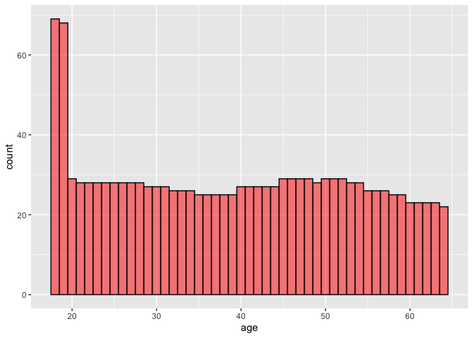<!-- -->

```r
ggplot(data = df, 
       aes(x = bmi)) +
  geom_histogram(binwidth = 1,  color = 'black' , fill = '#66CC99', alpha = 0.5)
```

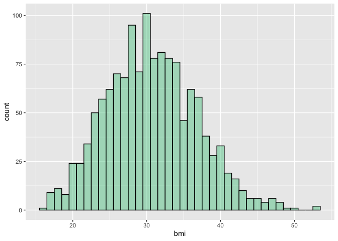<!-- -->

```r
ggplot(data = df, 
       aes(x = charges)) +
  geom_histogram(color = 'black' , fill = 'blue', alpha = 0.5)
```

```
## `stat_bin()` using `bins = 30`. Pick better value with `binwidth`.
```

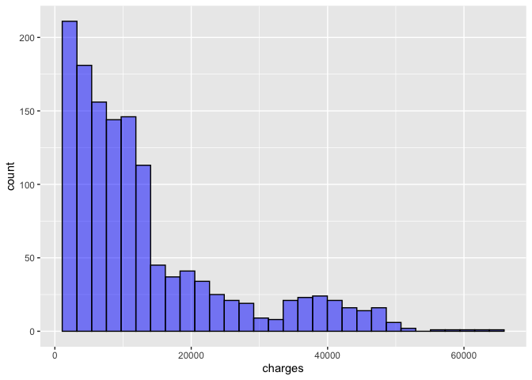<!-- -->
# 3. Нарисуйте график плотности по колонке charges. Отметьте вертикальные линии
средней и медианы на графике. Раскрасьте текст и линии средней и медианы разными цветами. Добавьте текстовые пояснения значения средней и медианы. Подберите тему для графика. Назовите оси.


```r
# Построим график плотности

df %>%
  ggplot(aes(x=charges))+
  geom_density (fill ="blue", alpha = 0.7) 
```

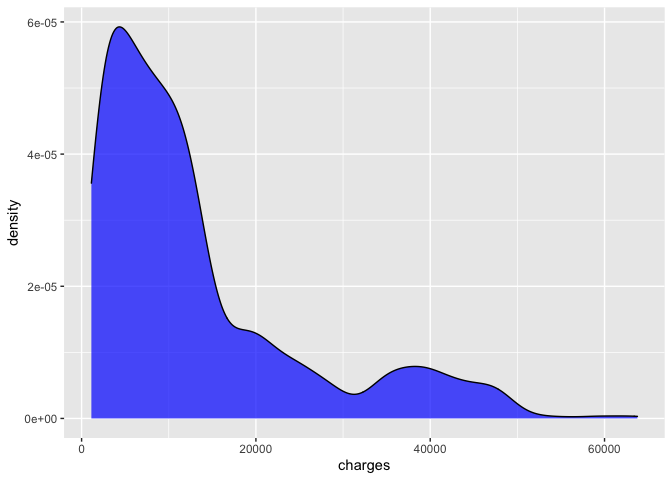<!-- -->

```r
# Найдём среднее
charges_mean <- round(mean(df$charges),0)

# Найдём медиану
charges_median <- round (median(df$charges),1)

# Построим общий график

df %>%
  ggplot(aes(x=charges))+
  geom_density (fill ="blue", alpha = 0.3) +
  xlab("Charges (US Doll)") + 
  ylab("log (Density)") +
  ggtitle("Charges distribution") +
  theme(plot.title = element_text(hjust = 0.3))+
  geom_vline(xintercept = charges_mean, size = 1, color = "red", linetype = "dashed") +
  geom_vline(xintercept = charges_median, size = 1, color = "black", linetype = "dashed") +
  annotate("text", 
           x= charges_mean+5000, 
           y=0.00001, 
           label=paste0("Mean=", charges_mean), color = "red") + 
  annotate("text", 
           x= charges_median-5100, 
           y=0.00001, 
           label=paste0("Median=", charges_median), color = "black")
```

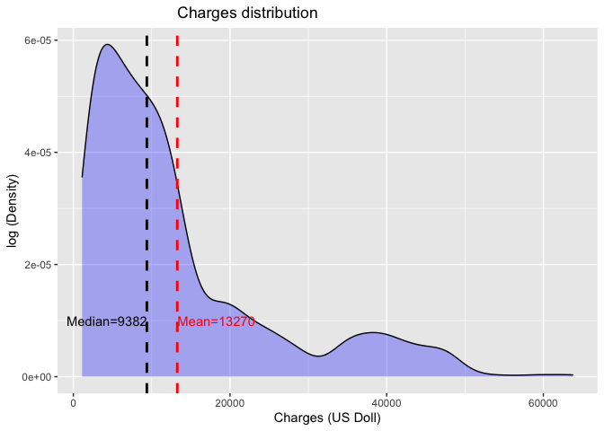<!-- -->

# 4. Сделайте три box_plot по отношению переменных charges и (1) sex (2) smoker (3) region. Подберите тему для графика. Назовите оси.

```r
ggplot(data = df, 
       aes(x = sex, y = charges)) +
  geom_boxplot() +
  theme_linedraw()
```

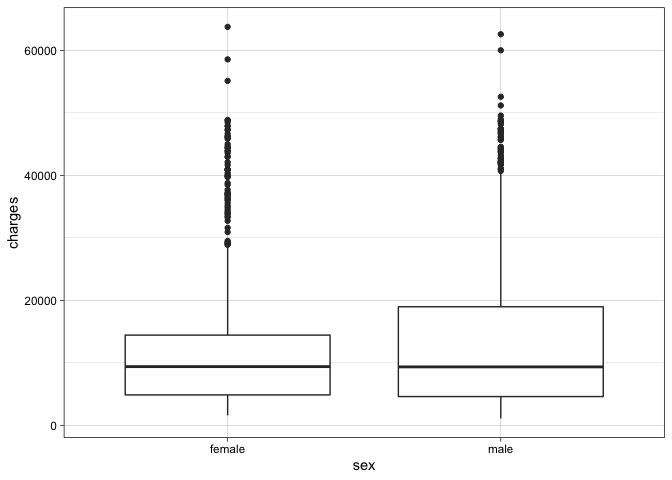<!-- -->

```r
ggplot(data = df, 
       aes(x = smoker, y = charges)) +
  geom_boxplot() +
  theme_linedraw()
```

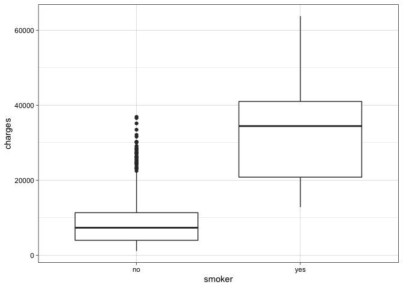<!-- -->

```r
ggplot(data = df, 
       aes(x = region, y = charges)) +
  geom_boxplot() +
  theme_linedraw()
```

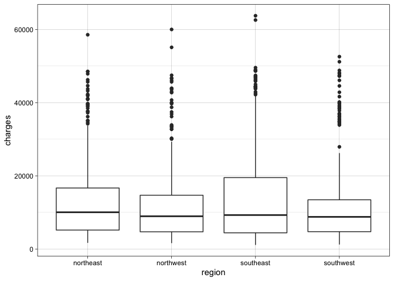<!-- -->
# 5. Объедините графики из заданий 3 и 4 в один так, чтобы сверху шёл один график из задания 3, а под ним 3 графика из задания 4. Сделайте общее название для графика.


```r
scatter <- df %>%
ggplot(aes(x=charges))+
  geom_density (fill ="blue", alpha = 0.3) +
  xlab("Charges (US Doll)") + 
  ylab("log (Density)") +
  theme_minimal()+
  theme(plot.title = element_text(hjust = 0.3))+
  geom_vline(xintercept = charges_mean, size = 1, color = "red", linetype = "dashed") +
  geom_vline(xintercept = charges_median, size = 1, color = "black", linetype = "dashed") +
  annotate("text", 
           x= charges_mean+15000, 
           y=0.0001, 
           label=paste0("Mean=", charges_mean), color = "red", size = 3) + 
  annotate("text", 
           x= charges_median+20000, 
           y=0.00005, 
           label=paste0("Median=", charges_median), color = "black", size = 3)

bar1<- ggplot(data = df, 
       aes(x = sex, y = charges)) +
  geom_boxplot() +
  xlab ("Sex") +
  ylab("Charges") +
  theme_minimal()

bar2<-ggplot(data = df, 
       aes(x = smoker, y = charges)) +
  geom_boxplot() +
  xlab ("Smoker") +
  ylab("Charges") +
  theme_minimal()

bar3<-ggplot(data = df, 
       aes(x = region, y = charges)) +
  geom_boxplot() +
  xlab ("Region") +
  ylab("Charges") +
  theme_minimal()


combine_plot <- ggarrange(NA, scatter, NA, bar1, bar2, bar3,
                          ncol = 3, nrow = 2,
                          widths = c(4, 7, 9),
                          heights = c(4, 4),
                          common.legend = TRUE, legend = "bottom")
combine_plot
```

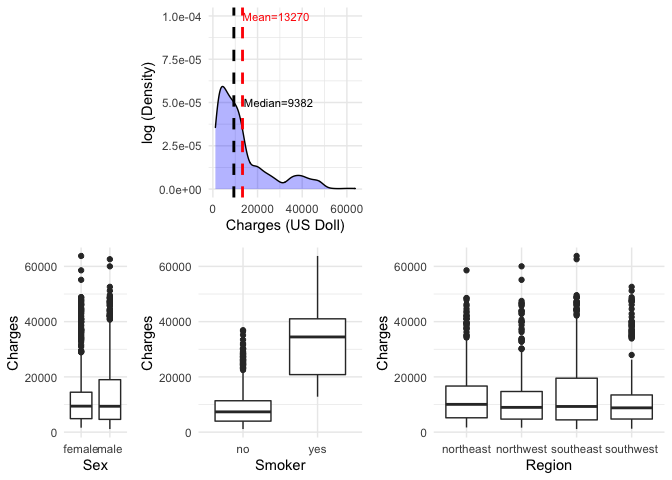<!-- -->

```r
annotate_figure(combine_plot, top = text_grob("Charges distribution", 
               color = "black", face = "bold", size = 14))
```

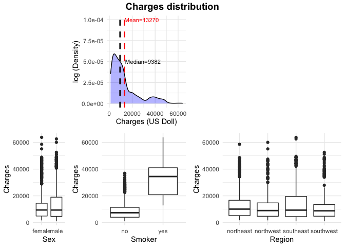<!-- -->

# 6. Сделайте фасет графика из задания 3 по колонке region.


```r
STATS <- df %>% 
  group_by(region) %>% 
  summarize(Mean = mean(charges), Median = median(charges)) %>% 
  pivot_longer(Mean:Median, names_to = "Stat", values_to = "Value")
  
df %>%
  ggplot(aes(x=charges, group = region))+
  geom_density (fill ="blue", alpha = 0.2) +
  xlab("Charges (US Doll)") + 
  ylab("Density (log)") +
  ggtitle("Charges distribution") +
  theme(plot.title = element_text(hjust = 0.5))+
  scale_x_log10() +
  facet_wrap(. ~ region) +
  geom_vline(data = STATS, mapping = aes(xintercept = Value, color = Stat)) +
  theme_minimal()
```

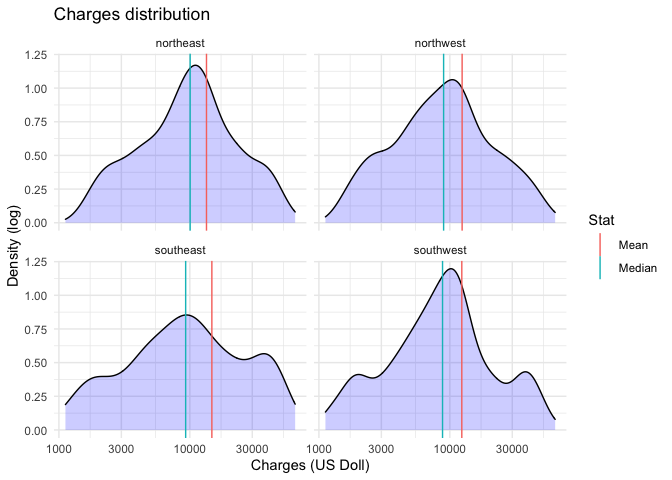<!-- -->
# 7. Постройте scatter plot отношения переменных age и charges. Добавьте названия осей, название графика и тему. Сделайте так, чтобы числа по оси Х отображались 14 шрифтом.


```r
df %>%
  ggplot(aes(x=age, y=charges)) + 
  geom_point(size = 1) +
  labs(title = "Dependence of charges on age") +
  theme(plot.title = element_text(size = 20, hjust = 0.5),
        axis.text.x = element_text(size = 14)) +
  xlab("Age") + 
  ylab("Charges") +
  font("xlab", size = 14) +
  font("ylab", size = 14)
```

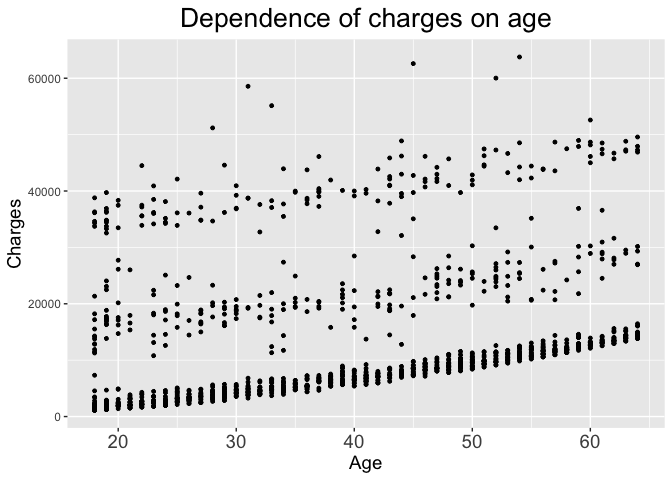<!-- -->
# 8. Проведите линию тренда для предыдущего графика.


```r
df %>%
  ggplot(aes(x=age, y=charges)) + 
  geom_point(size = 1) +
  labs(title = "Dependence of charges on age") +
  theme(plot.title = element_text(size = 20, hjust = 0.5),
        axis.text.x = element_text(size = 14)) +
  xlab("Age") + 
  ylab("Charges") +
  font("xlab", size = 14) +
  font("ylab", size = 14) +
  geom_smooth (method=lm, 
              fullrange = T, 
              se = TRUE, 
              size = 0.5,
              color = "red") 
```

```
## `geom_smooth()` using formula 'y ~ x'
```

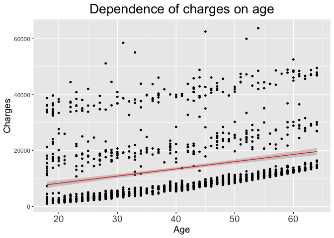<!-- -->

# 9. Сделайте разбивку предыдущего графика по колонке smokers (у вас должно получится две линии тренда для курящих и нет)


```r
  df %>% 
  ggplot(aes(x=age, y=charges, color = smoker, fill = smoker, group = smoker)) + 
  geom_point(alpha = 0.4) +
  labs(title = "Dependence of charges on age") +
  xlab("Age") + 
  ylab("Charges") +
  font("xlab", size = 14) +
  font("ylab", size = 14) +
  theme_light()+
  theme(plot.title = element_text(size = 14, hjust = 0.5),
        axis.text.x = element_text(size = 14)) +
  facet_grid(. ~ smoker) +
  stat_smooth(method='lm', size=0.5, color = 'black', alpha = 0.2, se=TRUE)
```

```
## `geom_smooth()` using formula 'y ~ x'
```

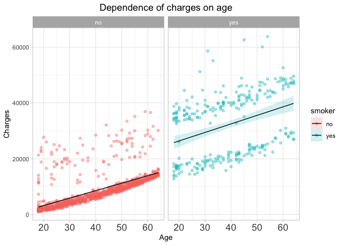<!-- -->

# 10. Сделайте график из заданий 7-9, но вместо переменной age используйте переменную bmi.

```r
  df %>% 
  ggplot(aes(x=bmi, y=charges, color = smoker, fill = smoker, group = smoker)) + 
  geom_point(alpha = 0.2) +
  labs(title = "Dependence of charges on BMI") +
  xlab("BMI") + 
  ylab("Charges") +
  font("xlab", size = 14) +
  font("ylab", size = 14) +
  theme_linedraw() +
  theme(plot.title = element_text(size = 14, face = "bold", hjust = 0.5),
        axis.text.x = element_text(size = 14)) +
  facet_grid(. ~ smoker) +
  stat_smooth(method='lm', size=0.5, color = 'black', alpha = 0.3, se=TRUE)
```

```
## `geom_smooth()` using formula 'y ~ x'
```

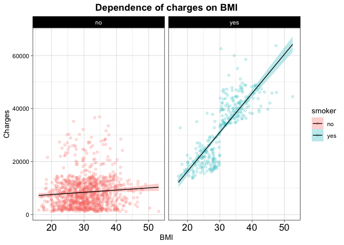<!-- -->

# 11. Отличаются ли затраты на лечение мужчин-курильщиков в зависимости от региона?

```r
# Создаём сабсет из мужчин-курильщиков и для оценки распределения данных построим графики box plot для отображения медианы, квартилей. размаха и выбросов

bar<- df %>%
  filter(sex == 'male' & smoker == 'yes') %>%
  ggplot(
       aes(x = sex, y = charges)) +
  geom_boxplot(color = '#333399', fill = '#3399FF', alpha = 0.5) +
  labs(title = "Dependence of charges on region for smoking men") +
  xlab("Male sex") + 
  ylab("Charges") +
  font("xlab", size = 14) +
  font("ylab", size = 14) +
  theme(plot.title = element_text(size = 14, hjust = 0.5, face = "bold"),
        axis.text = element_text(size = 14, face = "italic"),
        axis.text.x=element_blank()) +
  facet_grid(. ~ region)

bar
```

<!-- -->


# 12. Представить зависимость количества детей от статуса курения у женщин


```r
df %>% 
  filter(sex == 'female') %>%
  ggplot(aes(x=children, color = smoker, fill = smoker, color = 'black', group = smoker)) + 
  geom_bar(binwidth = 1, alpha = 0.7) +
  labs(title = "Dependence of number of children on smoking status") +
  xlab("Number of children") + 
  ylab("Frequency") +
  font("xlab", size = 14) +
  font("ylab", size = 14) +
  theme(plot.title = element_text(size = 14, hjust = 0.5, face = 'bold'),
        axis.text = element_text(size = 14),
        axis.title = element_text(size = 14, face = 'italic')) +
  facet_grid(. ~ smoker) +
  theme_minimal()
```

```
## Warning: Duplicated aesthetics after name standardisation: colour
```

```
## Warning: Ignoring unknown parameters: binwidth
```

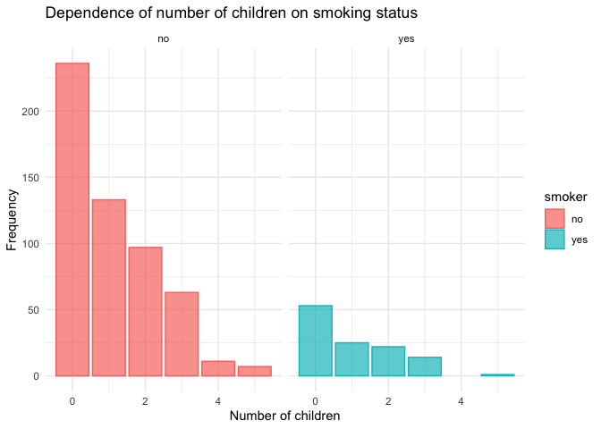<!-- -->

# 13. Как представлена зависимость BMI и charges и распределение BMI и charges в зависимости от region у людей старше 35 лет?

```r
# Создаём подвыборку для людей старше 35 лет и создаём диаграмму рассеяния зависимости charges от age
scatter <- df %>%
  filter(age >= 35) %>%
  ggplot(aes(x=bmi, y=charges)) + 
  geom_point(size = 3, color = '#99CCFF', alpha = 0.5) +
  xlab("BMI") + 
  ylab("Charges (US Doll)") +
  ggtitle("Charges distribution") +
  theme(plot.title = element_text(hjust = 0.3),
        legend.position="bottom") +
  stat_smooth(method='lm', size=0.5, color = 'black', alpha = 0.3, se=TRUE)
  
# Создаём ящичные диаграммы для распределения bmi и charges в зависимости от региона
bar1<- df %>%
  filter(age>=35) %>%
  ggplot( 
       aes(x = region, y = bmi)) +
  geom_boxplot(color = '#000099', fill = '#99CCFF', alpha = 0.5) +
  theme_minimal()+
  xlab ("Region") +
  ylab("BMI") +
  coord_flip()

bar2<- df %>%
  filter(age>=35) %>%
  ggplot( 
       aes(x = region, y = charges)) +
  geom_boxplot(color = '#FF9933',fill = '#FFCC99', alpha = 0.5) +
  xlab ("Region") +
  ylab("Charges") +
  theme_minimal()

# Объединям графики с помощью функции ggarrange

combine_plot <- ggarrange(bar1, NA, scatter, bar2,
                          ncol = 2, nrow = 2,
                          widths = c(2, 2),
                          heights = c(2, 4),
                          common.legend = TRUE, legend = "bottom")
```

```
## `geom_smooth()` using formula 'y ~ x'
## `geom_smooth()` using formula 'y ~ x'
```

```r
combine_plot
```

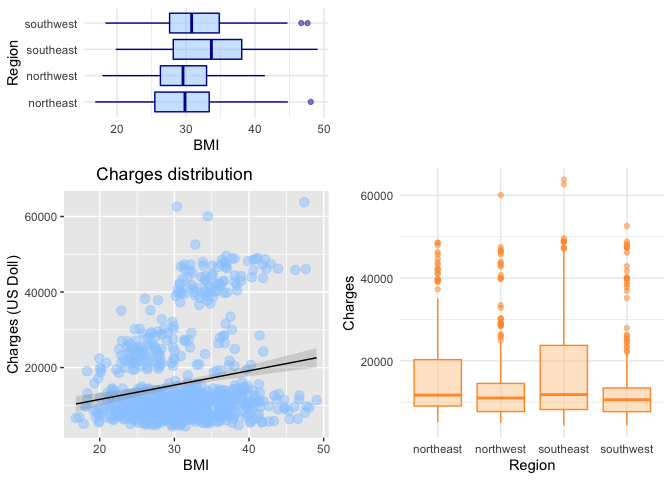<!-- -->

```r
annotate_figure(combine_plot, top = text_grob("Correlation of charges and BMI and their distribution based on the region", 
               color = "black", face = "bold.italic", size = 14))
```

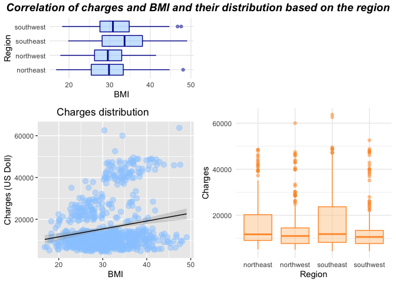<!-- -->


# 14. (это задание засчитывается за два) Приблизительно повторите график:

```r
df <- df %>% 
  mutate(
    age_group = case_when(
      age <=34 ~ "Age: 21-34",
      age >= 35 & age < 50 ~ "Age: 35-49",
      age >= 50 ~ "Age: 50+"
    ))
df$age_group<-as.factor(df$age_group)
levels (df$age_group)<-c("Age: 21-34", "Age: 35-49", "Age: 50+")

summary(df)
```

```
##       age            sex           bmi           children     smoker    
##  Min.   :18.00   female:662   Min.   :15.96   Min.   :0.000   no :1064  
##  1st Qu.:27.00   male  :676   1st Qu.:26.30   1st Qu.:0.000   yes: 274  
##  Median :39.00                Median :30.40   Median :1.000             
##  Mean   :39.21                Mean   :30.66   Mean   :1.095             
##  3rd Qu.:51.00                3rd Qu.:34.69   3rd Qu.:2.000             
##  Max.   :64.00                Max.   :53.13   Max.   :5.000             
##        region       charges           age_group  
##  northeast:324   Min.   : 1122   Age: 21-34:549  
##  northwest:325   1st Qu.: 4740   Age: 35-49:404  
##  southeast:364   Median : 9382   Age: 50+  :385  
##  southwest:325   Mean   :13270                   
##                  3rd Qu.:16640                   
##                  Max.   :63770
```

```r
table(df$age_group)
```

```
## 
## Age: 21-34 Age: 35-49   Age: 50+ 
##        549        404        385
```

```r
ggplot(data=df, 
       aes(bmi, 
           log(charges),
           group = age_group,
           col=age_group,
           linetype = age_group))+
  geom_point(color = '#9966CC', alpha = 0.3)+
  scale_y_continuous(trans='log10') +
  labs(title = "Отношение индекса массы тела к логарифму трат по возрастным группам",
       legend.position="bottom") +
  xlab("BMI") + 
  ylab("log(Charges)") +
  font("xlab", size = 12) +
  font("ylab", size = 12) +
  scale_fill_continuous(guide = guide_legend()) +
  theme(plot.title = element_text(size = 12, hjust = 0.5, face = 'bold'),
        axis.text = element_text(size = 12),
        axis.title = element_text(size = 12, face = 'italic'),
        legend.position="bottom") +
stat_smooth(method="lm", size=1, fill = 'grey', alpha = 0.6, alpha = 0.5)+
  facet_grid(.~age_group, 
             margins = TRUE) 
```

```
## Warning: Duplicated aesthetics after name standardisation: alpha
```

```
## `geom_smooth()` using formula 'y ~ x'
```

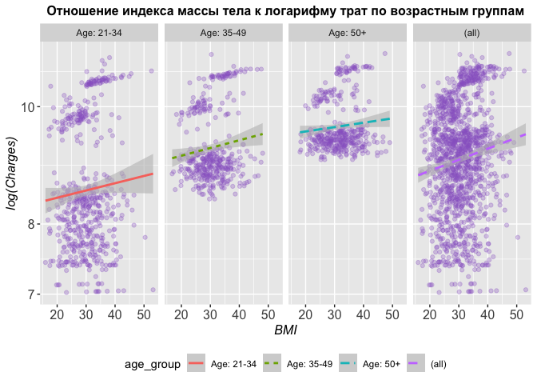<!-- -->

